## 什么是程序

**程序**：计算机执行某些操作或解决某个问题而编写的一系列<u>有序指令的集合</u>

## Java重要特点

1. Java语言是面向对象的（oop）

2. Java语言是健壮的。Java的强类型机制、异常处理、垃圾的自动收集等是Java程序健壮性的重要保证

3. Java语言是跨平台性的(即：一个编译好的 .class 文件可以在多个系统下运行，这种特性称为跨平台性)

   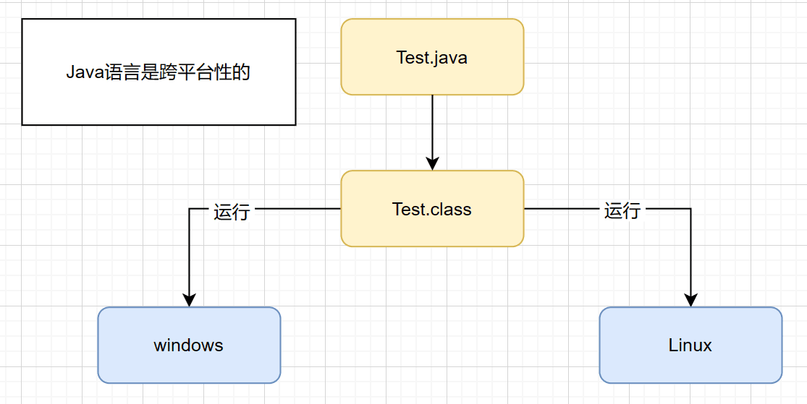

4. Java语言是解释性的

**Java 8** ：LTS（Long-Term-Support）

解释性语言：JavaScript，PHP，Java       编译性语言：C / C++

区别是：解释性语言，编译后的代码，不能直接被机器执行，需要解释器来执行；编译性语言，编译后的代码，可以直接被机器执行，c / c++

## Java运行机制及运行过程

#### Java语言的特点：跨平台性

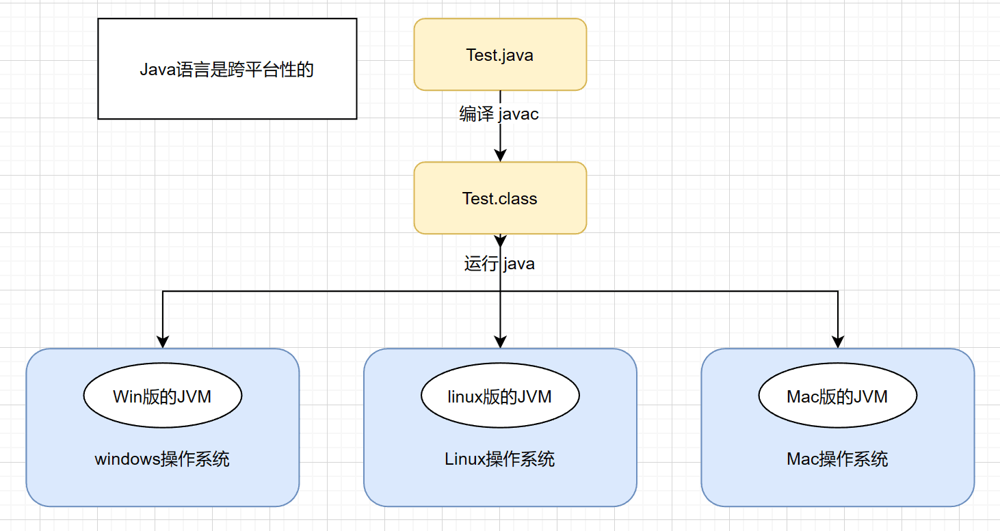

说明：因为有了JVM（虚拟机），同一个Java 程序在三个不同的操作系统中都可以执行，这样就实现了Java 程序的跨平台性

#### Java核心机制-Java虚拟机【JVM    Java Virtual Machine】

1. JVM是一个虚拟的计算机，具有指令集并使用不同的存储区域。负责执行指令，管理数据、内存、寄存器，包含在 <u>JDK</u> 中
2. 对于不同的平台，有不同的虚拟机
3. Java虚拟机机制屏蔽了底层运行平台的差别，实现了 “ 一次<u>编译</u>，到处<u>运行</u>”

## 什么是JDK ，JRE 

#### JDK 基础介绍

1. JDK（Java Development Kit    <u>Java开发工具包</u>）

   JDK = JRE + Java的开发工具【java，javac，javadoc，javap等】

2.  JDK 是提供给Java开发人员使用的，其中包含了Java的开发工具，也包括 JRE 。所以安装了 JDK ，就不用在单独安装 JRE 了

#### JRE 基本介绍

1.  JRE (Java Runtime Environment   Java运行环境)

   JRE = JVM + Java的核心类库【类】

2. 包括Java虚拟机（JVM    Java Virtual Machine）和Java程序所需的核心类库等，如果想要运行一个开发好的Java程序，计算机中只需要安装 JRE 即可

所以：<u>JDK = JVM + JavaSE核心类库 + 开发工具等</u>

## Java开发快速入门

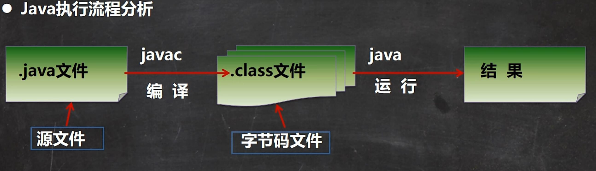

简单程序快速入门

```java
public class Hello {
	public static void main(String[] args){
		System.out.println("Litchi is studying java !");
	}
}
```

cmd运行得出结果

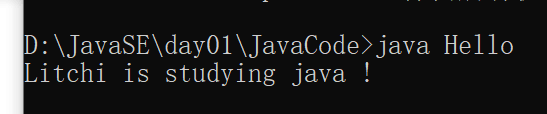

#### 什么是编译

javac Hello.java

1. 有了java源文件,通过编译器将其编译成 JVM 可以识别的字节码文件
2. 在源文件目录下，通过 javac 编译工具对 Hello.java 文件进行编译
3. 如果程序没有错误，没有任何提示，但在当前目录下会出现一个 Hello.class 文件，该文件称为**字节码文件**，也是可以进行执行的 java 的程序

#### 什么是运行

java Hello

1. 有了可执行的 java 程序（Hello.class字节码文件）
2. 通过运行工具 java.exe 对字节码文件进行执行，本质就是 .class 装在到 JVM 机执行

###### Java 程序开发注意事项

对修改后的Hello.java源文件需要重新编译，生成新的 class 文件后，再进行执行，才能生效

#### Java开发注意事项和细节说明

1. Java语言严格区分大小写
2. Java方法由一条条语句构成，每个语句以  ;  结束
3. 大括号都是成对出现的，缺一不可。【习惯，先写 { } 再写代码】
4. 如果源文件包含一个public类，则文件名必须按该类名命名
5. 一个源文件中最多只能有一个public类。其他类的个数不限，也可以将 main 方法写在非 public 类中，然后指定运行非 public 类，这样入口方法就是非 public 类的 main 方法（例：Hello.java文件）

# 如何快速掌握技术或知识点（心得分享）

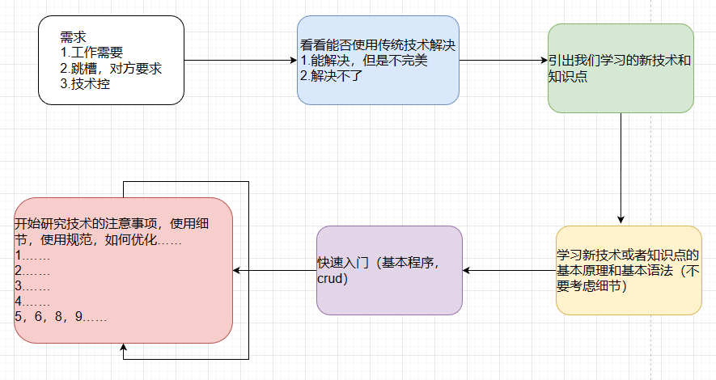

程序员的工资往往决定于最后一部（细节）。而如果将最后一步放到前面，就永远也走不出来，因为最后一步是永无止境的，没有谁是完美的，总有优化的点

## Java 转义字符 

#### 常用的转义字符:

\t ：一个制表位，实现对齐的功能 

\n ：换行符 

\\\\ ：一个\ 

\\\" :  一个" 

\\\' ：一个' 

\r :  一个回车 System.out.println("韩顺平教育\r 北京");

#### 实例:

```java
public class ChangeChar {
	public static void main(String[] args){
//	\t  : 一个制表位，实现对齐的功能
		System.out.println("北京\t天津\t上海");
//	\n  : 换行符
		System.out.println("jack\nsmith\nmary");
//	\\  : 一个\
		System.out.println("C:\\windows\\System32\\\\cmd.exe");
//	\"  : 一个 "
		System.out.println("老韩说：\"要好好学习java，有前途\"");
//	\'  : 一个 '
		System.out.println("老韩说：\'要好好学习java，有前途\'");
//	\r  : 一个回车
//	解读
//	打印出 北京平教育
//	用后面的字符替换最前面的字符
		System.out.println("韩顺平教育\r北京");
	}
}
```

## 初学Java易犯错误

1. 找不到文件

   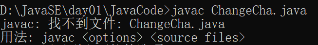

2. 主类名与文件名不一致

   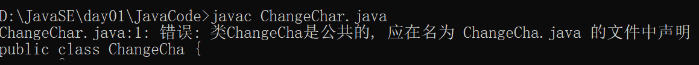

3. 缺少分号

   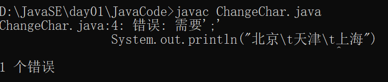

4. 常见错误总结

   学习编程最容易犯的错是语法错误。Java要求你必须按照语法规则编写代码。<u>尝试着去看懂编译器会报告的错误信息。</u>

不好修改的错误其实是 业务错误，环境错误

## 注释（comment）

用于注解说明解释程序的文字就是注释，注释提高了代码的阅读性（可读性）；注释是**一个程序员必须要具有的良好编程习惯**。将自己的思想通过注释先整理出来，再用代码去体现。

示意：

```java
		//示意 => 可读性好
		//下列计算两数之和
		//定义
		int n1 = 10;
		int n2 = 20;
		//两数相加
		int sum = n1 + n2;
		//输出结果
		System.out.println("结果=" + sum);
```

#### Java的注释类型

1. 单行注释
2. 多行注释
3. 文档注释

#### 单行注释

格式：// 注释文字

#### 多行注释

格式：/*  注释文字  */

#### 使用细节

1. 被注释的文字，不会被 JVM 解释执行
2. 多行注释里面不允许有多行注释的嵌套

#### 文档注释

注释内容可以被JDK提供的工具 javadoc 所解析，生成一套以网页文件形式体现的该程序的说明文档

```Java
/**
 *	@author Litchi
 *	@version 1.0
 */
public class JavaDocComment {
	/**
	 * 这是一个main方法
	 * @param args [description]
	 */
	public static void main(String[] args){

	}
}
```

应用实例

javadoc -d 文件夹名 -xx -yy Demo3.java

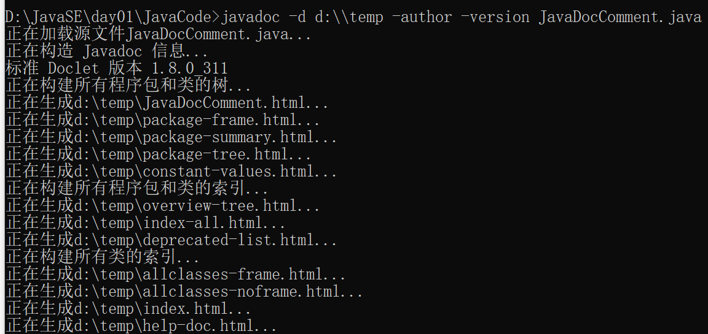

## Java 代码规范

1. 类、方法的注释,要以javadoc的方式来写。
2. 非Java Doc的注释,往往是给代码的维护者看的，着重告述读者为什么这样写，如何修改,注意什么问题等
3. 使用tab操作,实现缩进,默认整体向右边移动，时候用shift+ tab整体向左移动
4. 运算符和=两边习惯性各加一个空格。比如: 2 + 4 * 5 + 345 - 89
5. 源文件使用utf-8编码
6. 行宽度不要超过80字符
7. 代码编写次行风格和行尾风格（推荐）(!!)

## DOS 命令(了解)

#### DOS 介绍

**Dos**： Disk Operating System 磁盘操作系统, 简单说一下 windows 的目录结构。

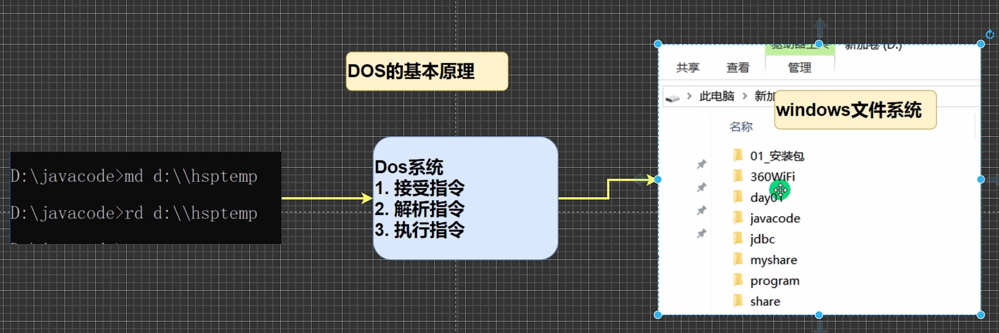

#### 相关的知识补充: **相对路径， 绝对路径**

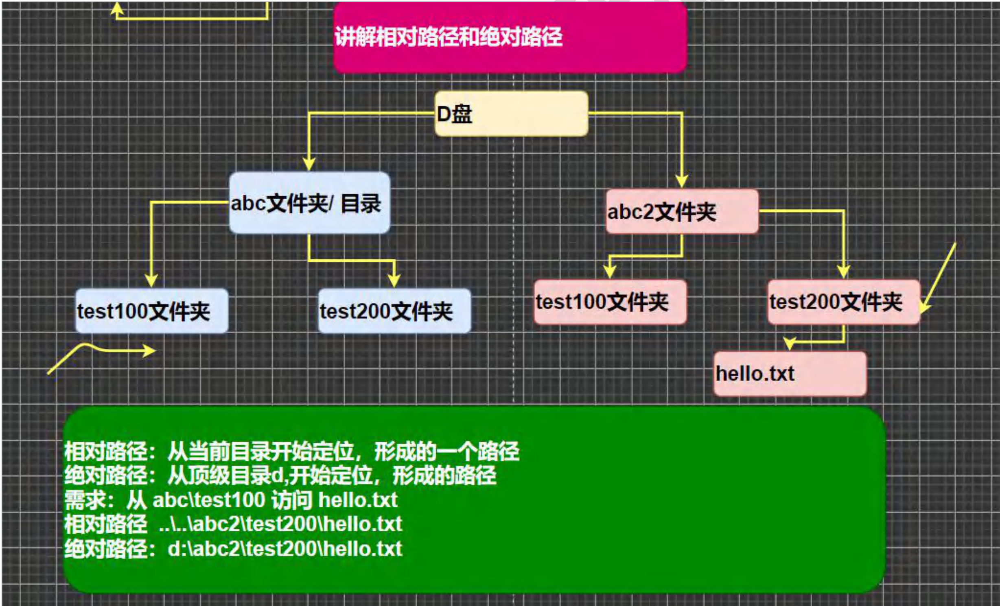

#### 常用的dos命令

1. 查看当前目录是有什么内容dir

   dir    dir d:\abc2\test200

   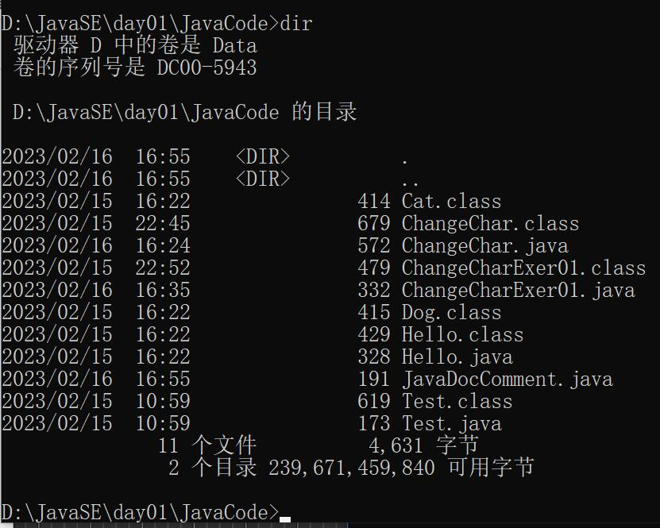

2. 切换到其他盘下：盘符号cd:change directory

   切换到c盘    cd /D c:

3. 切换到当前盘的其他目录下 (使用相对路径和绝对路径演示),..\表示上一级目录

   绝对路径：cd d:\abc2\test200    相对路径cd ..\..\abc2\test200

4. 切换到上一级：

   cd ..

5. 切换到根目录：

   cd \

6. 查看指定的目录下所有的子级目录

   tree

7. 清屏

   cls

8. 退出DOS

   exit

9. 因为后面使用DOS非常少，所以对下面的几个指令，大家了解即可(md[创建目录],rd[删除目录],copy[拷贝文件],del[删除文件],echo[输入内容到文件],type,move[剪切])   =>   学Linux的时候再详细学习 