变量是程序的基本组成单位

不论是使用哪种高级程序语言编写程序，变量都是其程序的基本组成单位

# 变量介绍

变量相当于内存中一个数据存储空间的表示，你可以把变量看做是一个房间的门牌号，通过门牌号我们可以找到房间，而通过变量名可以访问到变量（值）

#### 变量使用注意事项

1. 变量表示内存中的一个存储区域【不同的变量，类型不同，占用的空间大小不同，比如：int 4个字节，double就是8个字节】
2. 该区域有自己的名称【变量名】和类型【数据类型】
3. 变量必须先声明，后使用，即有顺序
4. 该区域的数据可以在**同一类型**范围内不断变化
5. 变量在同一个**作用域**内不能重名
6. 变量 = 数据类型 + 变量名 + 值 ， 这一点请大家注意，变量**三要素**

# +号的使用

1. 当左右两边都是数据类型时，则做加法运算
2. 当左右两边有一方为字符串，则做拼接运算

```java
		System.out.println(100 + 98);//198
		System.out.println("100" + 98);//10098(String)
		//加法运算从左到右
		System.out.println(100 + 3 + "Hello");//103Hello
		System.out.println("Hello" + 100 + 3);//Hello1003
```

# 数据类型⭐

每一种数据都定义了明确的数据类型，在内存中分配了不同大小的内存空间(字节)。

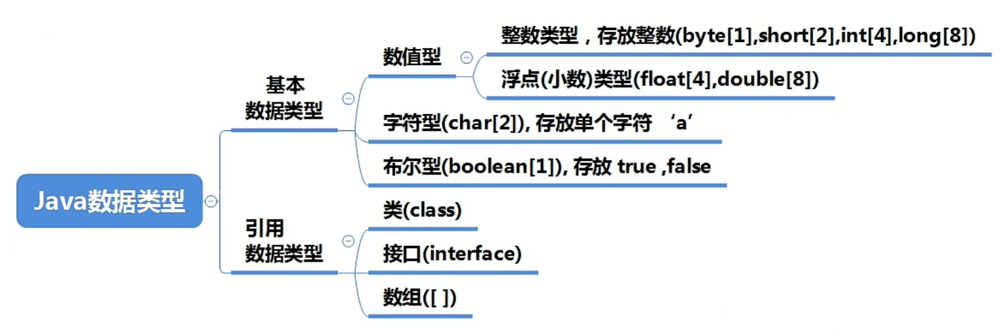

上图说明

1. java数据类型分为两大类，基本数据类型，引用数据类型
2. 基本数据类型有8种，数值型【byte，short，int，long，float，double】字符型【float】布尔型【boolean】
3. 引用类型【类，接口，数组】（String属于类）

### 整数类型

#### 基本介绍

Java的整数类型就是用于存放整数值的，比如12，30，3456等等

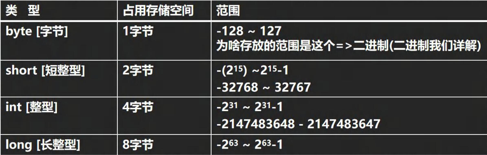

#### 整数的使用细节

1. Java各整数类型有固定的范围和字段长度，不受具体OS【操作系统】的影响，以保证Java程序的可移植性

2. Java的整数常量默认 int 型，声明 long 型常量后面须加 ‘ l ’ 或 ‘ L ’

3. Java程序中变量常声明为int型，除非不足以表示大数，才使用 long

   ```java
   		//Java的整数常量默认 int 型，声明 long 型常量后面须加 ‘ l ’ 或 ‘ L ’
   		int n1 = 1;//对，4个字节
   		//int n2 = 1L;//对不对？不对，1L有8个字节，int n2 这个4字节空间装不下
   		long n3 = 1L;//对
   		long n4 = 1;//对不对？对，4字节的放到 long n4 这个8字节空间肯定可以装得下
   		//但是，还是建议声明 long 型常量后面须加 ‘ l ’ 或 ‘ L ’
   ```

   

4. bit：计算机中的最小存储单位。byte：计算机中基本存储单元。1byte = 8bit

计算机所有数据要加载到内存，才能运行

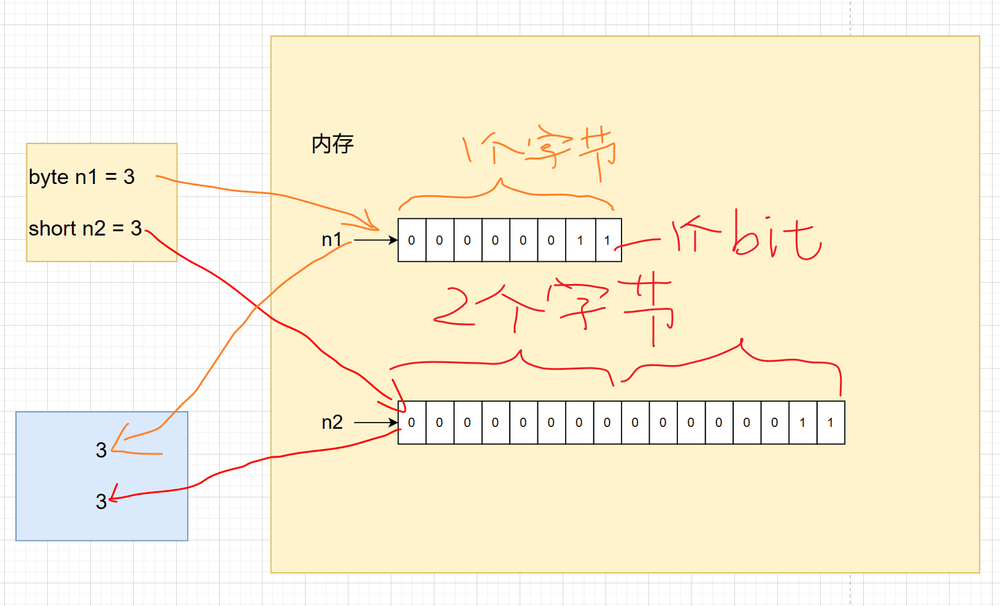

### 浮点类型

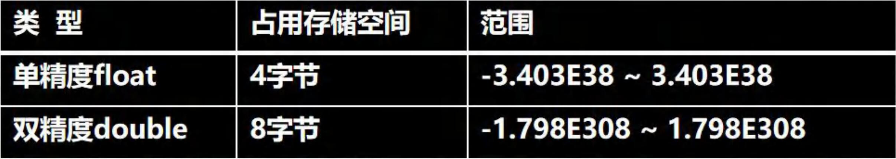

说明一下

1. 关于浮点数在机器中存放形式的简单说明，浮点数 = 符号位 + 指数位 + 尾数位
2. 尾数部分可能丢失，造成精度损失（小数都是近似值）

#### 浮点型使用细节

1. 与整数类型类似，Java浮点类型也有固定的范围和字段长度，不受具体OS的影响【float 4个字节，double 8个字节】

2. Java的浮点型常量（具体值）默认为double型，声明float型常量，须在后面加 ' f ' 或 ' F '，double类型后面 也可以加 d或D，可加可不加

3. 浮点型常量有两种表示形式

   十进制数形式，如：5.12	512.0f	.512	(必须有小数点)

   科学计数法形式，如：5.12e2【5.12*10的2次方】	5.12e-2【5.12 / 10的2次方】

   5.12e2 = 512.0	（必须有小数点！！！因为还是double型，没小数点是int型）

4. 通常情况下，应该使用double型，因为它比float型更精确

   举例说明

   ```java
   		//通常情况下，应该使用double型，因为它比float型更精确
   		double num5 = 2.1234567821;
   		float num6 = 2.1234567821f;
   		System.out.println(num5);
   		System.out.println(num6);
   ```

   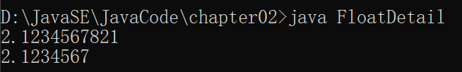

5. 浮点数使用陷阱：2.7 和 8.1 / 3 比较

   ```java
   		// 浮点数使用陷阱：2.7 和 8.1 / 3 比较
   		double num7 = 2.7;
   		double num8 = 8.1/3;//2.7
   		System.out.println(num7);//就是2.7
   		System.out.println(num8);//接近2.7的值
   ```

   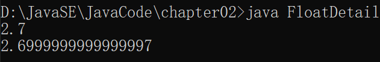

   得到一个重要的使用点：当我们对运算结果是小数的进行相等判断时，要小心

   应该是以两个数的差值的绝对值，在某个精度范围内判断

   ```java
   		if( num7 == num8){
   			System.out.println("相等");
   		}
   		System.out.println(Math.abs(num7 - num8));
   		if (Math.abs(num7 - num8) < 0.000000001) {
   			System.out.println("差值非常小，到我的规定精度，认为相等...");
   		}
   ```

   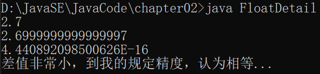

   如果是直接查询得到的小数或者直接赋值，是可以判断相等的。**小数运算得小心**

#### API在线文档

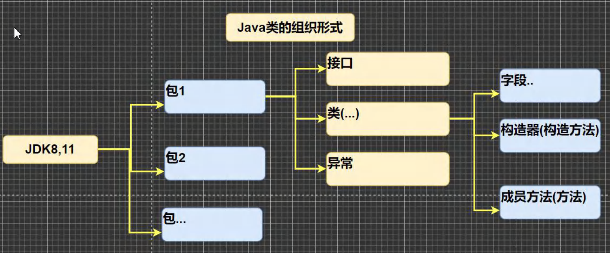

https://www.matools.com

如何使用

1. 按找：包 -> 类 -> 方法	去找
2. 直接索引    去找

### 字符类型

#### 基本介绍

字符类型可以表示**单个字符**，字符类型是char，char是两个字节（可以存放汉字），多个字符我们用字符串String（后面会详细讲解String）

```java
		char n1 = '男';
		char n2 = '\t';
		char n3 = '9';
		char n4 = 97;

		System.out.println(n1);
		System.out.println(n2);
		System.out.println(n3);
		System.out.println(n4);//当输出n4的时候，会输出97表示的字符 => 编码的概念
```

#### 字符类型使用细节

1. 字符常量是用单引号 ' ' 括起来的单个字符。（双引号是字符串！！！不可以用双引号）

   如：char c1 = 'a'; char c2 = '中';

2. Java中还允许使用转义字符  '\\' 来将其后的字符转变为特殊字符型常量。

   如：char c3 = '\n';

3. 在Java中，char的本质是一个整数，在输出时，是Unicode码对应的字符。

   http://tool.chinaz.com/Tools/Unicode.aspx

4. 可以直接给char赋一个整数，然后输出时，会按照对应的Unicode字符输出

   ```java
   char c4 = 'a';
   System.out.println((int)c4);//输出的是'a'对应的数字-->97
   //要输出对应的数字，可以  （int）字符
   ```

5. char 类型是可以进行运算的，相当于一个整数，因为它都有对应的Unicode码

   ```java
   		System.out.println('a' + 3);//输出100
   		System.out.println((char)('a' + 3));//输出d
   ```

#### 字符类型本质讨论

1. 字符型 存储到 计算机中，需要将字符对应的码值（整数）找出来，比如 'a'

   存储：'a' --> 码值 97 --> 二进制（1100001）--> 存储

   读取：二进制（1100001）--> 97 -->  'a' -> 显示

2. 字符和码值的对应关系是通过字符编码表决定的（是规定好的）

### 布尔类型：boolean

1. 布尔类型也叫boolean类型，boolean类型数据只允许取值true和false，无null
2. boolean类型占1个字节
3. boolean类型适用逻辑运算，一般用于程序流程控制

if条件控制语句；

while循环控制语句；

do-while循环控制语句；

for循环控制语句；

```java
		boolean isPass = false;
		if (isPass) {
			System.out.println("success");
		}else{
			System.out.println("Ohh,sorry");
		}
```

# 编码

**介绍一下字符编码表**

1. ASCLL（ASCLL 编码表 一个字节表示，一个128的字符表示，实际上一个字节可以表示256个字符，只用了128个【因为就abcde……+-*/……】）
2. Unicode（Unicode 编码表 固定大小的编码 使用两个字节来表示字符，字母和汉字统一都是占用两个字节。这样浪费空间）
3. utf-8（编码表，大小可变的编码，使用1-6个字节来表示 字母使用1个字节，汉字使用3个字节【可变】）
4. gbk（可以表示汉字，而且范围广，字母使用1个字节，汉字2个字节）
5. big5（繁体中文，台湾，香港）

# 数据类型转换（Convert）

### 自动类型转换（AutoConvert）

#### 介绍

当Java程序在进行赋值或者运算时，精度小的类型自动转换为精度大的数据类型

#### 数据类型按精度（容量）大小排序为

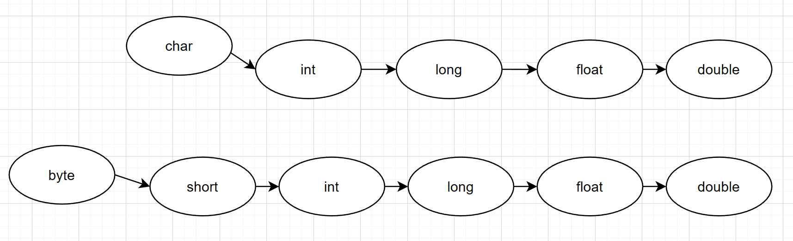

```java
	//演示自动转换
	int num = 'a';//ok char -> int
	double d1 = 80;//ok int -> double
	System.out.println(num);//97
	System.out.println(d1);//80.0
```

#### 自动类型转换注意和细节

1. 有多种类型的数据混合运算时，系统首先自动将所有数据装换成容量最大的那种数据类型，然后再进行计算。

2. 当我们把精度（容量）大的数据类型赋值给精度（容量）小的数据类型时，就会报错。反之就会进行自动类型转换

3. （byte，short）和 char 之间不会进行自动转换 

   ```java
   		char n1 = 1;
   		short n2 = 1;
   		n2 = n1;
   		n1 = n2;
   ```

   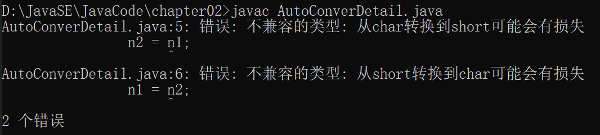

4. byte, short, char   他们三者可以计算，在计算时首先**转换为int类型**

   ```java
   		byte b1 = 1;
   		byte b2 = 2;
   		short s1 = 1;
   
   		short s2 = b1 + s1;//不对，byte + short ==> int
   		int i1 = b1 + s1;
   
   		byte b3 = b1 + b2;//不对，byte运算完 ==> int
   ```

   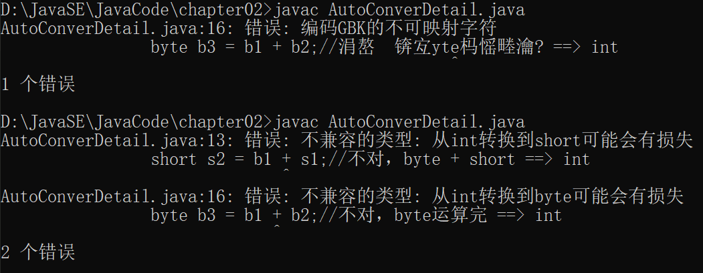

5. boolean 不参与转换

6. 自动提升原则：表达式结果的类型自动提升为 操作数中最大的类型

   ```java
   byte b4 = 1;
   short s3 = 100;
   int num200 = 1;
   double num300 = 1.1;
   
   double num500 = b4 + s3 + num200 + num300;//只能用double类型来，其他一律报错
   ```

### 强制类型转换

自动类型转换的逆过程，将容量大的数据类型转换为容量小的数据类型。使用时要加上强制转换符（），但可能造成精度降低或溢出，格外要注意

```java
//演示强制类型转换
int n1 = (int)1.9;
System.out.println(n1);//1!!!非常恐怖 造成精度损失

int n2 = 2000;
byte b1 = (byte)n2;
System.out.println(b1);//-48!!!造成 数据溢出
```

#### 强制类型转换细节

1. 当进行数据的大小从 大 ---------> 小，就需要强制转换

2. 强制符号只针对于最近的操作数有效，往往会使用小括号提升优先级

   ```java
   //int x = (int)10 * 3.5 + 6 * 1.5; 
   int y = (int)(10 * 3.5 + 6 * 1.5); 
   ```

3. char类型可以保存int的常量值，但不能保存int的变量值，需要强转

   ```java
   char c1 = 100;//OK
   int i1 = 100;
   char c2 = i1;//错误
   char c3 = (char)i1;//ok
   ```

4. byte 和 short 、char类型在进行运算时，当做int类型处理

### 基本数据类型和String类型的转换

在程序开发中，我们经常需要将基本数据类型转换成String类型，或者将String类型转成基本数据类型

1. 基本数据类型转String类型

   语法：将基本类型的值 + ""即可

   ```java
   		int n1 = 100;
   		float f1 = 1.1f;
   		double d1 = 4.5;
   		boolean b1 = true;
   		String s1 = n1 + "";
   		String s2 = f1 + "";
   		String s3 = d1 + "";
   		String s4 = b1 + "";
   		System.out.println(s1 + " " + s2 + " " + s3 + " " + s4);
   ```

2. String类型转基本数据类型

   语法：通过基本类型的**包装类**调用parseXX方法即可

   ```java
   		//解读，使用 基本数据类型对应的包装类的相应方法 得到基本数据类型
   		String s5 = "123";
   		int num1 = Integer.parseInt(s5);
   		double num2 = Double.parseDouble(s5);
   		float num3 = Float.parseFloat(s5);
   		double num4 = Integer.parseInt(s5);
   		boolean num5 = Boolean.parseBoolean("true");
   
   		System.out.println(num1);
   		System.out.println(num2);
   		System.out.println(num3);
   		System.out.println(num4);
   		System.out.println(num5);
   
   		//怎么把字符串转成字符 char -->含义是：把字符串的第一个字符得到
   		System.out.println(s5.charAt(0));//用的的是这个
   		// System.out.println(Char.parseChar(s5));//没有这个方法
   ```

#### 注意事项

1. 在将String类型转成 基本数据类型时，要确保String类型能够转成有效的数据，比如 我们可以把 "123" 转成一个整数，但是不能把 "hello" 转成一个整数

2. 如果格式不正确，就会抛出异常，程序就会终止，这个问题在异常处理章节中，会详讲

   ```java
   		String s = "hello";
   		int i = Integer.parseInt(s);//编译不会有事，运行时会报异常
   		System.out.println(i);
   ```

   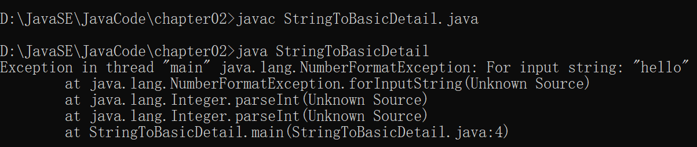

