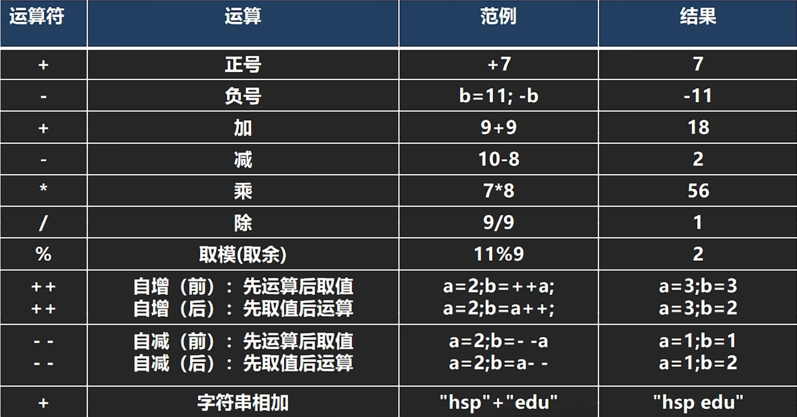
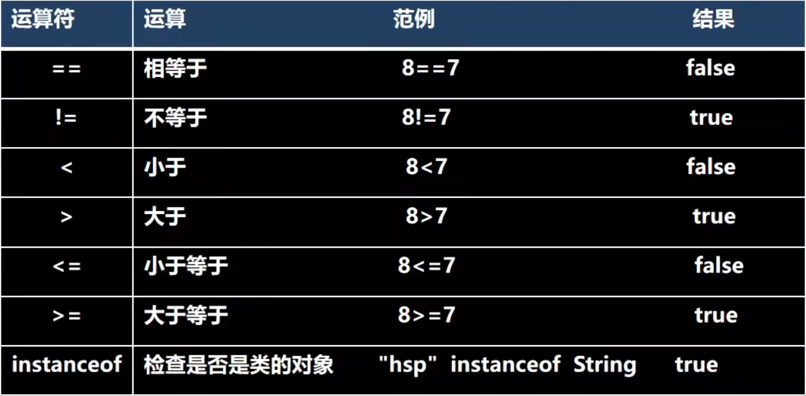
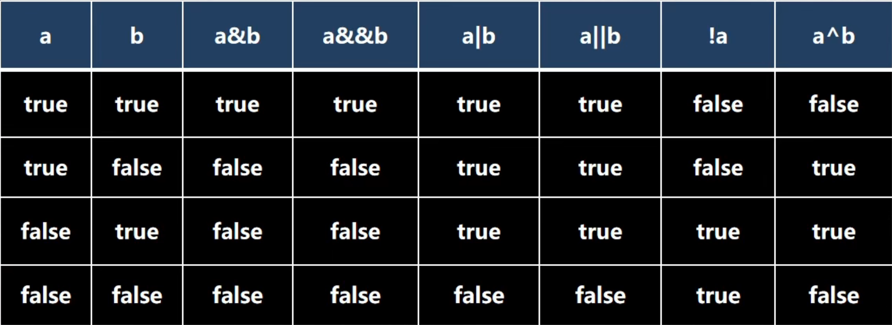
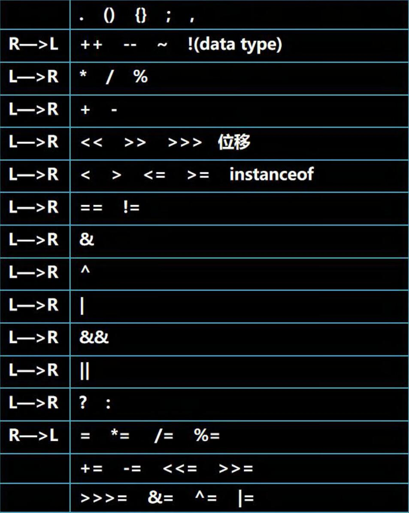
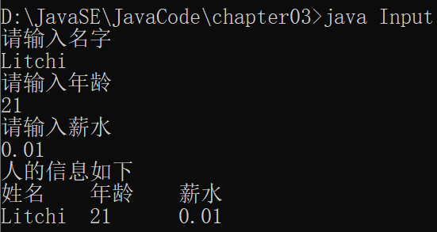

# 运算符介绍

运算符是一种特殊的符号，用以表示数据的运算、赋值和比较等

# 算术运算符

算术运算符对数值类型的变量进行运算的，在java程序中使用的非常多

### 算术运算符一览



```java
		// *（乘）  /（除） 的时候，注意是什么类型，int 还是 double，浮点数运算永远是近似值
		System.out.println(10 / 4);//从数学角度是2.5，但是左右两边都是整数型，所以=2
		System.out.println(10 / 4.0);//2.5

		double d = 10 / 4;
		System.out.println(d);//也是一样的，右边的运算都是整型，但注意结果赋值给double，所以=2.0
```

**浮点数运算永远是近似值**

####  % (取模，取余)

```java
		//  % (取模，取余)
		System.out.println(10 % 3);//1
		System.out.println(-10 % 3);//2//错了，是-1
		System.out.println(10 % -3);//2//错了，是1
		System.out.println(-10 % -3);//2//错了，是-1
		//在 % 的本质 看成一个公式 a % b = a - (int)a / b * b
		//-10 % 3 = -10 - (-10) / 3 * 3 = -10 + 9 = -1
		//10 % -3 = 10 - 10 / (-3) * (-3) = 10 - 9 = 1
		//-10 % -3 = -10 - (-10) / (-3) * (-3) = -10 + 9 = -1
```

在 % 的本质 看成一个公式 **a % b = a - (int)a / b * b**  [int是为了避免小数的情况]

#### ++i    i++ (自增)

当独立使用的时候，完全等价于 i = i + 1；

```java
int i = 10;
i++;//11
++i;//12
System.out.println(i);//12
```

如果作为表达式使用

前++：++i先自增后赋值

后++：i++先赋值后自增

```java
int j1 = 8;
int j2 = 8;
int k1 = ++j1;//等价 j1 = j1 + 1;temp = j1; k1 = j1;
int k2 = j2++;//等价 temp = j2;j2 = j2 + 1; k2 = temp; 

System.out.println(j1);//9
System.out.println(j2);//9
System.out.println(k1);//9
System.out.println(k2);//8
```

#### 算术运算符练习

1.**后++需要注意！！！（i++）**

```java
//后++需要注意！！！
int i = 1;
i = i++;//规则使用临时变量：（1）temp = i;(2) i = i + 1;(3)i = temp;所以是1！！！
System.out.println(i)//2错了，大意失荆州

int j = 1;
j = ++j;// j = j + 1; temp = j; j = temp;
System.out.println(j)//2
```

2.编程思想：1.需求 2.思路分析 3.走代码

```java
		//1.需求
		//假如还有 59 天放假，问：合 xx 个星期零 xx 天
		//2.思路分析
		//（1） 使用int 变量 days 保存 天数
		//（2） 一个星期是7天 星期数weeks：days / 7 零xx天leftDays : days % 7
		//（3）	输出
		//3.走代码
		int days = 12344;
		int weeks = days / 7;
		int leftDays = days % 7;
		System.out.println(days + "天 合" + weeks + "星期零" 
		+ leftDays + "天");
```

```java
		//1.需求
		//定义一个变量保存华氏温度，华氏温度转换摄氏温度的公式为
		//：5/9*(华氏温度-100),请求出华氏温度对应的摄氏温度
		//2.思路分析
		//（1）定义一个double变量huaShi保存华氏温度，一个double变量sheShi保存摄氏温度
		//（2）sheShi = 5 / 9 * (huaShi - 100)
		//		考虑数学公式和 java 语言的特性
		//（3）打印输出
		//3.走代码
		double huaShi = 26;
		double sheShi;
		sheShi = 5.0 / 9 * (huaShi - 100);//不能5 / 9,得 5.0 / 9
		System.out.println(huaShi + "华氏温度对应的摄氏温度为" + sheShi);
```

# 关系运算符【比较运算符】

1. 关系运算符的结果都是boolean型，也就是要么是true，要么是false
2. 关系表达式 经常用在 if结构的条件中或循环结构的条件中

#### 关系运算符一览



#### 快速入门

```java
		int a = 9; //老韩提示: 开发中，不可以使用 a, b,m1……这种简单的命名，老板会对你失望
		int b = 8;
		System.out.println(a > b); //T
		System.out.println(a >= b); //T
		System.out.println(a <= b); //F
		System.out.println(a < b);//F
		System.out.println(a == b); //F
		System.out.println(a != b); //T
		boolean flag = a > b; //T
		System.out.println("flag=" + flag);
```

**开发中，不可以使用 a, b,m1……这种简单的命名，老板会对你失望**

#### 细节说明

1. 关系运算符的结果都是boolean型，也就是要么是true，要么是false
2. 关系运算符组成的表达式，我们称为关系表达式。如：a > b
3. 比较运算符 "==" 不能误写成 "="

# 逻辑运算符

用于连接多个条件（多个关系表达式），最终的结果也是一个boolean值

#### 逻辑运算符一览



### && 和 & 

#### 基本规则

名称 					 	语法 										特点 

短路与&& 				条件 1&&条件 2 					两个条件都为 true，结果为 true,否则 false 

逻辑与& 				   条件 1&条件 2 					   两个条件都为 true，结果为 true,否则 false

#### 使用区别

1. &&短路与：如果第一个条件为 false，则第二个条件不会判断，最终结果为 false，效率高
2. & 逻辑与：不管第一个条件是否为 false，第二个条件都要判断，效率低
3. 开发中， 我们使用的基本是使用短路与&&, 效率高

### || 和 |

#### 基本规则

名称 				语法 							   特点 

短路或|| 		条件 1||条件 2 			两个条件中只要有一个成立，结果为 true,否则为 false 

|逻辑或 		  条件 1|条件 2 	 		 只要有一个条件成立，结果为 true,否则为 false

#### 使用区别

1. ||短路或：如果第一个条件为 true，则第二个条件不会判断，最终结果为 true，效率高
2. | 逻辑或：不管第一个条件是否为 true，第二个条件都要判断，效率低
3. 开发中，我们基本使用 ||

### ! 逻辑非  取反

#### 基本规则

如果条件本身成立，结果为 false，否则为 true

### ^ 逻辑异或

a^b: 叫逻辑异或，当 a 和 b 不同时，则结果为 true, 否则为 false；a、b都是boolean值

#### 小知识

赋值语句作为判断语句时，赋值后的boolean变量作判断条件，如：

```java
boolean x = true;
boolean y = false;
short z = 46;
if((z++ == 46) && (y = true)) z++;
if((x = false) || (++z == 49)) z++;
System.out.println("z = " + z);//50//z还是short类型
```

byte、short和char参与自增或者自检时候，会进行类型转换，不会变成int型

# 赋值运算符

赋值运算符就是将某个运算后的值，赋给指定的变量

基本赋值运算符 =

复合赋值运算符 +=，-=，*=，/=，%=

#### 特点

1. 运算顺序从右往左 	int num = a + b + c;

2. 赋值运算符的左边 只能是变量,右边 可以是变量、表达式、常量值 

   int num = 20; int num2= 78 * 34 - 10; int num3 = a;

3. 复合赋值运算符等价于下面的效果 

   比如：a+=3;等价于 a=a+3; 其他类推

4. 复合赋值运算符会进行类型转换。 

   ```java
   byte b = 2; b+=3; b++;//ok相当于 b = (byte)(b + 3)
   b = b + 3;//不行,变成int型了
   ```

# 三元运算符

条件表达式 ？ 表达式1 : 表达式2；

条件表达式为真，就返回表达式1；为假，就返回表达式2

```java
int a = 10;
int b = 99;
// 解读
// 1. a > b 为 false
// 2. 返回 b--, 先返回 b 的值,然后在 b-1
// 3. 返回的结果是 99
int result = a > b ? a++ : b--;
System.out.println("result=" + result);//99
System.out.println("a=" + a);//10
System.out.println("b=" + b);//98
```

#### 使用细节

1. 表达式 1 和表达式 2 要为可以赋给接收变量的类型(或可以自动转换)(或强制转换)

   ```java
   int a = 3;
   int b = 8;
   int c = a > b ? (int)1.1 : (int)3.4;//可以的
   double d = a > b ? a : b + 3;//可以的，满足 int -> double
   ```

2. 三元运算符可以转成 if--else 语句

##### 练习

```java
//需求，用三元运算符号实现找出三个数最大值
		//思路分析
		//定义三个int 变量 a ,b ,c ;要进行两次对比
		//先 a 跟 b 比较，谁大谁跟 c 比较
		
		int a = 5;
		int b = 9;
		int c = 11;
		// 1.两个三元运算符
		int max1 = a > b ? a : b;
		int max2 = first > c ? first : c;
		System.out.println("最大值为 " + max2);
		//2.一个三元运算符
		// int max = a > b ? a > c ? a : c : b > c ? b : c;
		// System.out.println("最大值为 " + max2);
		// 老韩优化1方案 max1 = a > b ? a : b;，所以直接把first替换
		// int max2 = (a > b ? a : b) > c ? (a > b ? a : b) : c;
		// System.out.println("最大值为 " + max2);
		// 
		// 最终推荐1，比较清晰
```

# 运算符优先级

### 运算符优先级一览（从上往下，从高到低）



1. 运算符有不同的优先级，所谓优先级就是表达式运算中的运算顺序。
2. 只有单目运算符、赋值运算符是从右向左运算的。

不要背，使用多了，就熟悉了

# 标识符的命名规则和规范

### 标识符概念

1. Java 对各种变量、方法和类等命名时使用的字符序列称为标识符

2. 凡是自己可以起名字的地方都叫标识符，如

   int num1 = 90; 	num1就是标识符

### 标识符的命名规则（必须遵守）

1. 由26个英文字母大小写，0-9，_或$ 组成
2. 数字不可以开头。int 3ab = 1; //错误
3. 不可以使用关键字和保留字，但能包含关键字和保留字
4. Java严格区分大小写，长度无限制
5. 标识符不能包含空格

### 标识符命名规范[更加专业]

1. 多单词组成时所有字母都小写：aaa.bbb.ccc //比如 com.hsp.crm

2. 类名、接口名：多单词组成时，所有单词的首字母大写：XxxYyyZzz [大驼峰] 

   比如： TankShotGame

3. 变量名、方法名：多单词组成时，第一个单词首字母小写，第二个单词开始每个单词首字母大写：xxxYyyZzz [小驼峰， 简称 驼峰法] 

   比如： tankShotGame

4. 常量名：所有字母都大写。多单词时每个单词用下划线连接：XXX_YYY_ZZZ 

   比如 ：定义一个所得税率 TAX_RATE

5. 后面我们学习到 类，包，接口，等时，我们的命名规范要这样遵守,更加详细的看文档

### 关键字

关键字的定义和特点 (**不用背**) 

定义：被 Java 语言赋予了特殊含义，用做**专门用途的字符串**（单词） 

特点：关键字中所有字母都为小写

### 保留字

Java 保留字：现有 Java 版本**尚未使用**，但**以后版本可能会作为关键字使用**。自己命名标识符时要避免使用这些保留字 

byValue、cast、future、 generic、 inner、 operator、 outer、 rest、 var 、 goto 、const

# 键盘输入语句

在编程中，需要接受用户输入的数据，就可以使用键盘输入语句来获取

需要一个 扫描器（对象），就是Scanner

1. 导入该类的所在包, java.util.* 
2. 创建该类对象（声明变量） 
3.  调用里面的功能

#### 演示

```java
import  java.util.Scanner;//表示把java.util下的Scanner类导入
public class Input{
	public static void main(String[] args){
		//演示接受用户的输入
		//1. 导入该类的所在包, java.util.* 
		//2. 创建该类对象（声明变量） 
		// myScanner  就是 Scanner 类的对象
		Scanner myScanner = new Scanner(System.in);
		//3.  调用里面的功能
		System.out.println("请输入名字");
		// 当程序执行到 next 方法时，会等待用户输入~~~
		String name = myScanner.next();//接收用户输入字符串
		System.out.println("请输入年龄");
		int age = myScanner.nextInt();//接收用户输入int
		System.out.println("请输入薪水");
		double sal = myScanner.nextDouble();//接受用户输入 double
		System.out.println("人的信息如下");
		System.out.println("姓名\t年龄\t薪水\n" + name 
			+ "\t" + age + "\t" + sal);
	}
}
```



# 二进制⭐

### 进制

对于整数，有四种表示方式： 

1. 二进制：0,1 ，满 2 进 1.以 0b 或 0B 开头。 
2. 十进制：0-9 ，满 10 进 1。 
3. 八进制：0-7 ，满 8 进 1. 以数字 0 开头表示。 
4. 十六进制：0-9 及 A(10)-F(15)，满 16 进 1. 以 **0x** **或** **0X** 开头表示。此处的 A-F 不区分大小写。

### 任何进制转10进制--->按权展开法

0b1010 = 1 * 2^3 + 0 * 2^2 + 1 * 2^1 + 0 * 2^0  = 8 + 2 = 10

### 十进制转任何进制--->短除法

​							余数

10 / 2 = 5			0

5 / 2 = 2			  1

2 / 2 = 1			  0

1 / 2 = 0			  1

然后余数从下往上读 10 = 0b1010					

# 位运算符⭐【需要二进制基础】

### 二进制在运算中的说明

1. 二进制是逢2进位的进位制，0、1是基本算符
2. 现代的计算机技术全部采用的是二进制，因为它只使用0、1两个数字符号数，非常简单方便，易于用带电子方式实现。计算机内部处理的信息，都是采用二进制数来表示的。二进制（Binary）数用0和1两个数字及其组合来表示任何数。进位规则是 "逢2进1"，数字1在不同的位上代表不同的值，按右至左的次序，这个值以二倍递增

### 原码、反码、补码(重点 难点)（背下来 ）

1. 二进制的最高位是符号位: 0 表示 正数, 1 表示 负数
2. 正数的原码，反码，补码都一样(三码合一)
3. 负数的反码 = 它的原码符号位不变，其它位取反(0->1,1->0)
4. 负数的补码 = 它的反码+1，负数的反码 = 负数的补码-1
5. 0的反码,补码都是0
6. java没有无符号数,换言之,java中的数都是有符号的
7. 在计算机运算的时候,都是以**补码的方式来运算**的
8. 当我们看运算结果的时候,要看他的**原码**(重点)

### java 中有 7 个位运算(&、|、^、~、>>、<<和 >>>)

按位与&	   ：	两位全为1，结果为1，否则为0

按位或|		：	两位有一个为1,结果为1，否则为0

按位异或^	 :	  两位一个为0，一个为1,结果为1，否则为0

按位取反~	 :	  0->1 ,1->0

```java
//推导
//1. -2原码			10000000 00000000 00000000 00000010
//2. -2反码			11111111 11111111 11111111 11111101
//3, -2补码			11111111 11111111 11111111 11111110
//4. ~-2操作			00000000 00000000 00000000 00000001 运算后的补码
//5.运算后的原码		 00000000 00000000 00000000 00000001==> 1
System.out.println(~-2);// 1

//推导
//1. 2三码合一		   00000000 00000000 00000000 00000010
//2. ~2操作			11111111 11111111 11111111 11111101 运算后的补码
//3, 运算后的反码		  11111111 11111111 11111111 11111100
//4. 运算后的原码		  10000000 00000000 00000000 00000011 ==> -3
System.out.println(~2);// 3
```

​	所以正整数取反 = 负整数 - 1；如：

​	~99 = -100; 	~-101 = 100;

算术右移 >>：低位溢出,符号位不变,并用符号位补溢出的高位 

算术左移 <<: 符号位不变,低位补 0 

 >>>  逻辑右移也叫无符号右移,运算规则是: 低位溢出，高位补 0 

特别说明：没有 <<< 符号

```java
int a = 1 >> 3;// 1 / 2 / 2 / 2 = 0
int b = 1 << 4;// 1 * 2 * 2 * 2 * 2 = 16
int c = 15 >> 2;// 15 / 2 / 2 = 3
```

