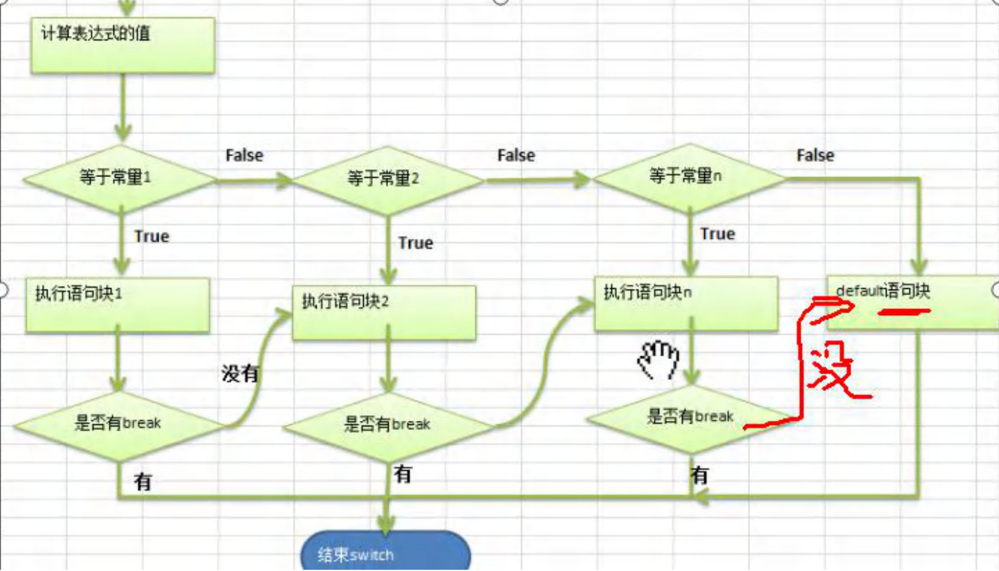
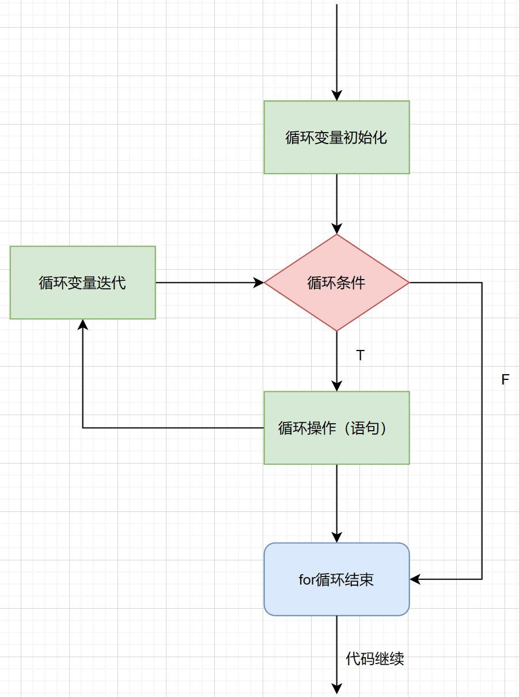
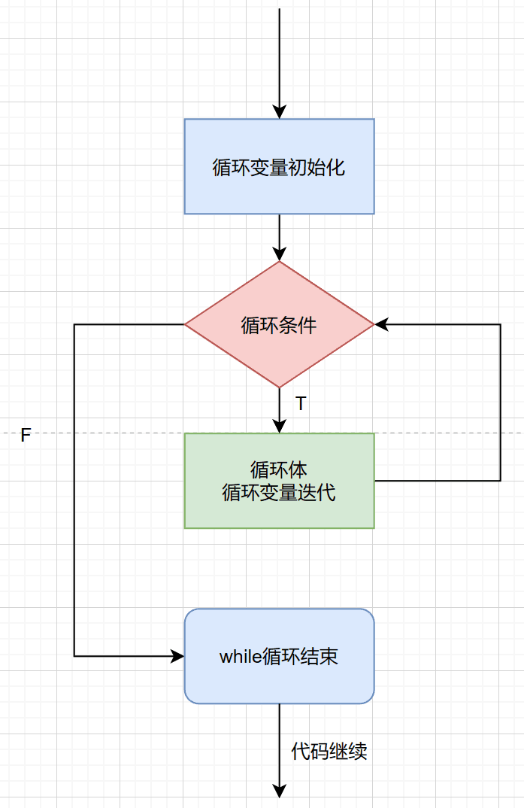
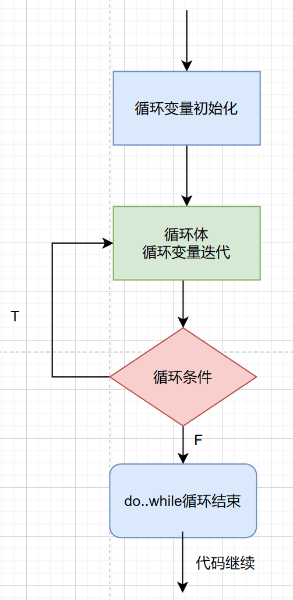
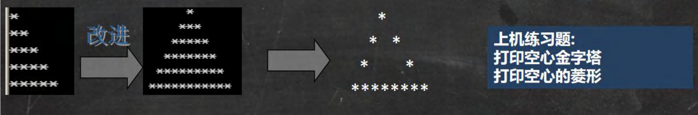

从这一讲开始有编程思想在里面

在程序中，程序运行的流程控制决定程序是如何执行的，是我们必须掌握的，主要有三大流程控制语句

1. 顺序控制
2. 分支控制
3. 循环控制

# 顺序控制

程序从上往下逐行地执行，中间没有任何判断和跳转

```java
//java中定义变量时采用合法的前向引用
public class Test{
	int num1 = 12;
	int num2 = num1 + 1;//ok的
}
//错误形式
public class Test{
	int num2 = num1 + 1;//错误
	int num1 = 12;
}
```

# 分支控制（if，else，swich）

让程序有选择的的执行，分支控制有三种

1. 单分支
2. 双分支
3. 多分支

### 单分支

#### 基本语法

```java
if(条件表达式){
	执行代码块；（可以有多条语句）
}
```

#### 说明

当条件表达式为 true 时，就会执行 { } 的代码。如果为false，就不执行。

特别说明，如果 { } 中只有一条语句，则可以用用 { } 。（但还是建议写上）

#### 快速入门

```java
import java.util.Scanner;
public class If01{
	public static void main(String[] args){
		//需求
		//编写一个程序，可以输入人的年龄，如果该同志的年龄大于18岁，
		//则输出"你年龄大于18岁，要对自己的行为负责，送入监狱"
		//思路分析
		//1.定义一个变量int age保存年龄
		//2.接受用户输入年龄nextInt，保存到age
		//3.判断年龄是否大于18岁
		//走代码
		int age;
		Scanner sc = new Scanner(System.in);
		System.out.println("请输入你的年龄：");
		age = sc.nextInt();
		if (age > 18) {
			System.out.println("你年龄大于18岁，要对自己的行为负责，送入监狱");
		}
		System.out.println("结束");

	}
}
```

### 双分支

#### 基本语法

```java
if(条件表达式){
	执行代码块1；
}else{
	执行代码块2；
}
```

#### 说明

当条件表达式成立，即执行代码块1，否则执行代码块2。同样，如果执行的代码块只有一条语句，则 { }可以省略

#### 快速入门

```java
import java.util.Scanner;
public class If02{
	public static void main(String[] args){
		//需求
		//编写一个程序,可以输入人的年龄,如果该同志的年龄大于 18 岁, 
		//则输出 "你年龄大于 18,要对自己的行为负责, 送入监狱"。否则 ,
		//输出"你的年龄不大这次放过你了."
		//思路分析
		//1.定义一个Sanner接受用户输入数据
		//2.将用户输入的年龄保存到变量int age
		//3.判断
		//走代码
		Scanner sc = new Scanner(System.in);
		System.out.println("请输入你的年龄：");
		int age = sc.nextInt();
		if (age > 18) {
			System.out.println("你年龄大于 18,要对自己的行为负责, 送入监狱");
		}else {
			System.out.println("你的年龄不大这次放过你了");
		}
		System.out.println("结束");
	}
}
```

### 多分支

#### 基本语法

```java
if(条件表达式){
	执行代码块1；
}else if{
	执行代码块2；
}……{
	……；
}else{
	执行代码块n；
}
```

#### 说明

1. 当条件表达式1成立，即执行代码块1
2. 如果表达式1不成立，才去判断表达式2是否成立
3. 如果表达式2成立，就执行代码块2
4. 以此类推，如果所有表达式都不成立，则执行else的代码块
5. 注意，只能有一个执行的入口

#### 特别说明：

1. 多分支 可以没有else，如果所有的条件表达式都不成立，则一个执行入口都没有
2. 如果有else，如果所有的条件表达式都不成立，则默认执行else代码块

#### 快速入门

```java
import java.util.Scanner;
public class If03 {
	//编写一个 main 方法
	public static void main(String[] args) {
		/*
		输入保国同志的芝麻信用分：
		如果：
		信用分为 100 分时，输出 信用极好；
		信用分为(80，99]时，输出 信用优秀；
		信用分为[60,80]时，输出 信用一般；
		其它情况 ，输出 信用 不及格
		请从键盘输入保国的芝麻信用分，并加以判断
		假定信用分数为 int
		*/
		Scanner myScanner = new Scanner(System.in);
		//接收用户输入
		System.out.println("请输入信用分(1-100):");
		//请思考：如果小伙伴输入的不是整数，而是 hello.. //==>这里我们后面可以使用异常处理机制搞定-》老师点一下
		int grade = myScanner.nextInt();
		//先对输入的信用分，进行一个范围的有效判断 1-100, 否则提示输入错误
		if(grade >=1 && grade <= 100) {
			//因为有 4 种情况，所以使用多分支
			if(grade == 100) {
				System.out.println("信用极好");
			} else if (grade > 80 && grade <= 99) { //信用分为(80，99]时，输出 信用优秀；
				System.out.println("信用优秀");
			} else if (grade >= 60 && grade <= 80) {//信用分为[60,80]时，输出 信用一般
				System.out.println("信用一般");
			} else {//其它情况 ，输出 信用 不及格
				System.out.println("信用不及格");
			}
		} else {
			System.out.println("信用分需要在 1-100,请重新输入:)");
		}
	}
}
//先对输入的信用分，进行一个范围的有效判断 1-100, 否则提示输入错误
//请思考：如果小伙伴输入的不是整数，而是 hello.. //==>这里我们后面可以使用异常处理机制搞定-》老师点一下
```

### 嵌套分支

在一个分支结构中又完整的嵌套了另一个完整的分支结构，里面的分支的结构称为内层分支外面的分支结构称为外层分支。建议: 不要超过 3 层 （可读性不好）

#### 快速入门

```java
public class NestedIf {
	//编写一个 main 方法
	public static void main(String[] args) {
		//需求
		//参加歌手比赛，如果初赛成绩大于 8.0 进入决赛，否则提示淘汰。
		//并且根据性别提示进入男子组或女子组。【可以
		//让学员先练习下】, 输入成绩和性别，进行判断和输出信息。
		//思路分析
		//1.定义一个歌手，姓名String name，成绩double grade，性别char gender
		//2.第一个判断有没有过8.0，没有输出
		//3.进入决赛后，判断性别，进入男子组还是女子组
		//走代码
		String name = "Litchi";
		double grade = 8.1;
		char gender = 'w';
		//先对用户信息进行一个范围的有效判断
		if (grade > 10 || grade < 0 || (gender != 'm' && gender != 'w')) {
			System.out.println("信息有问题，请跟相关服务人员练习");
			return;
		}
		if (grade > 8.0) {
			if (gender == 'm') {
				System.out.println(name + " 先生，恭喜您进入决赛");
			} else {
				System.out.println(name + " 女士，恭喜您进入决赛");
			}
		}else{
			System.out.println("很遗憾，" + name + "没有进入决赛");
		}
		System.out.println("继续观赏比赛");
	}
}
//对用户信息进行一个范围的有效判断
//优化，用户信息是用户输入的（接受用户输入信息）
```

### switch分支结构

#### 基本语法

```
switch(表达式){
	case 常量1:
		语句块1;
		break;
	case 常量2:
		语句块2;
		break;
	……
	case 常量n:
		语句块n;
		break;
	default:
		语句块;
}
```

#### 说明

1. switch 关键字，表示switch分支
2. 表达式 对应一个值
3. case 常量1: 当表达式的值等于常量1，就执行 语句块1
4. break: 表示退出 switch
5. 如果case 常量1 匹配，就执行语句块1，如果没有匹配，就继续匹配 case 常量2
6. 如果一个都没有匹配上，执行default

#### switch流程图



#### switch注意事项和细节讨论

1. 表达式数据类型，应和case 后的常量**类型一致**，或者是可以**自动转成**可以相互比较的类型，比如输入的是字符，而常量是 int
2. switch(表达式) 中表达式的返回值必须是：（byte，short，int，char，enum【枚举】，String）
3. case 子句中的值必须是常量，而不能是变量
4. default子句是可选的，当没有匹配的case时，执行default
5. break语句用来在执行完一个case分支后使程序跳出switch语句块；如果没有写break，程序会顺序执行到switch结尾，除非遇到break；（穿透现象）

```java
import java.util.Scanner;
public class SwitchExercise {
	//编写一个 main 方法
	public static void main(String[] args) {
		//根据用于指定月份，
		//打印该月份所属的季节。
		////思路分析
		//1. 创建 Scanner 对象， 接收用户输入
		//2. 使用 int moon 接收
		//3. 使用 switch 来匹配 ,使用穿透来完成，比较简洁
		Scanner sc = new Scanner(System.in);
		System.out.println("请输入现在的月份：");
		int moon = sc.nextInt();
		switch(moon){
			case 1:
			case 2:
			case 3:
				System.out.println("现在是春天，很凉爽");
				break;
			case 4:
			case 5:
			case 6:
				System.out.println("现在是夏天，很热");
				break;
			case 7:
			case 8:
			case 9:
				System.out.println("现在是秋天，很凉爽");
				break;
			case 10:
			case 11:
			case 12:
				System.out.println("现在是冬天，超级凉爽");
				break;
			default:
				System.out.println("请输入正确的月份");
		}
		System.out.println("日子一天一天过着~~~");
	}
}
```

### switch 和 if 的比较

1. 如果**判断的具体数值不多**，而且符合 byte、 short 、int、 char, enum[枚举], String 这 6 种类型。虽然两个语句都可以使用，建议使用 swtich 语句。 
2. 其他情况：对区间判断，对结果为 boolean 类型判断，使用 if，if 的使用范围更广

# 循环控制（for，while，do-while，多重循环）

### for循环控制（！！！）

#### 基本语法

```java
for(循环变量初始值;循环条件;循环变量迭代){
	循环操作（可以多条语句）;
}
```

#### 说明

1. for 关键字，表示循环控制 
2. for 有**四要素**: (1)循环变量初始化(2)循环条件(3)循环操作(4)循环变量迭代 
3. 循环操作 , 这里可以有多条语句，也就是我们要循环执行的代码 
4. 如果 循环操作(语句) 只有一条语句，可以省略 {}, 建议不要省略

#### for循环流程图



#### 注意事项和细节说明

1. 循环条件是返回一个布尔值的表达式 
2. for(;循环判断条件;) 中的初始化和变量迭代可以写到其它地方，但是两边的分号不能省略
3. 循环初始值可以有多条初始化语句，但要求类型一样，并且中间用逗号隔开，循环变量迭代也可以有多条变量迭代语句，中间用逗号隔开

#### <u>编程思想：化繁为简,先死后活</u>

化繁为简：即将复杂的需求，拆解成简单的需求，逐步完成 编程 = 思想 --练习-> 代码
先死后活 : 先考虑固定的值，然后转成可以灵活变化的值

### while循环控制

#### 基本语法

```java
循环变量初始化;
while(循环条件){
	循环体(语句);
	循环变量迭代;
}
```

#### 说明

1. while 循环也有四要素
2. 只是四要素放的位置和for不一样

#### while循环流程图



#### 注意事项和细节说明

1. 循环条件是返回一个布尔值的表达式 
2. while 循环是先判断再执行语句

### do..while 循环控制

#### 基本语法

```java
循环变量初始化;
do{
	循环体(语句);
	循环变量迭代;
}while(循环条件);
```

#### 说明

1. do while 是关键字 ，也有循环四要素, 只是位置不一样 
2. 先执行，再判断，也就是说，一定会至少执行一次 
3. 最后 有一个 分号 ; 

#### do..while循环流程图



#### 注意事项和细节说明

1. 循环条件是返回一个布尔值的表达式 
2. do..while 循环是先执行，再判断， 因此它至少执行一次

### 多重循环控制(难点! 重点!)

#### 介绍

1. 将一个循环放在另一个循环体内，就形成了嵌套循环。其中，for ,while ,do…while 均可以作为外层循环和内层循环。【建议一般使用两层，最多不要超过 3 层, 否则，代码的可读性很差】 
2. 实质上，**嵌套循环就是把内层循环当成外层循环的循环体**。当只有内层循环的循环条件为 false 时，才会完全跳出内层循环，才可结束外层的当次循环，开始下一次的循环[听不懂，走案例]。 
3. 设外层循环次数为 m 次，内层为 n 次，则内层循环体实际上需要执行 m*n 次。

#### 经典的打印金字塔

思路



```java
		//需求
		//空心金字塔
		int layer = 30;//层数

		for (int i = 1; i <= layer; i++) {//i 表示层数
			//在输出*之前，还有输出 对应空格 = 总层数-当前层
			for (int j = 1; j <= layer - i; j++) {
				System.out.print(" ");
			}
			//控制打印每层的*个数
			for (int j = 1; j <= i * 2 - 1; j++) {
				//当前行的第一个位置是*,最后一个位置也是*, 最后一层全部 *
				if (j == 1 || j == i * 2 - 1 || i == layer) {
					System.out.print("*");
				}else{//其他情况输出空格
					System.out.print(" ");
				}
			}
			System.out.println();
```

# break

#### 基本介绍

**break** **语句用于终止某个语句块的执行**，一般使用在 switch 或者循环 [for , while , do-while]中

#### 看下面一个需求

随机生成 1-100 的一个数，直到生成了 97 这个数，看看你一共用了几次? 

提示使用 (int)(Math.random() * 100) + 1

```java
		//思路分析：
		//循环，但是循环的次数不知道. -> break ,当某个条件满足时，终止循环
		//通过该需求可以说明其它流程控制的必要性，比如 break
		while(true){
			int number = (int)(Math.random() * 100) + 1;
			System.out.println(number);
			if (number == 97) {
				break;
			}
		}
```

#### 注意事项和细节说明：

1. break 语句可以指定退出哪层

2. label1 是标签，名字由程序员指定

   ```
   label1:{	……
   label2:		{	……
   label3:			{	……
   					break label2;
   					……
   				}
   			}
   		}
   ```

   

1. break 后指定到哪个label 就退出到哪里
2. 在实际的开发中，尽量不要使用标签
3. 如果没有指定 break，默认退出最近的循环体

#### 实际案例

```java
		//需求
		//实现登录验证，有 3 次机会，如果用户名为"丁真" ,密码"666"提示登录成功，
		//否则提示还有几次机会，请使用 for+break完成
		// 思路分析
		// 1. 创建Scanner 对象接收用户输入
		// 2. 定义String name ; String passwd; 保存用户名和密码
		// 3. 最多循环3 次[登录3 次]，如果满足条件就提前退出
		Scanner sc = new Scanner(System.in);
		String userName = "";
		String passWord = "";
		for (int i = 0; i < 3; ++i) {
			System.out.println("请输入用户名：");
			userName = sc.next();
			System.out.println("请输入密码：");
			passWord = sc.next();
			// if (userName.equals("丁真") && passWord.equals("666")) {
			if ("丁真".equals(userName) && "666".equals(passWord)) {//这样子比较好【避免空指针】
				//具体字符串写在前面
				System.out.println("==============================");
				System.out.println("恭喜你，登录成功！！！");
				break;
			}
			System.out.println("登录失败，您还剩 " + (2 - i) + " 次机会");
		}
		System.out.println("欢迎下次光临");
```

# continue

#### 基本介绍

1. continue 语句用于结束本次循环，继续执行下一次循环。
2. continue 语句出现在多层嵌套的循环语句体中时，可以通过标签指明要跳过的是哪一层循环, 这个和前面的标签的使用的规则一样.

#### 快速入门

```java
int i = 1;
while(i <= 4){
	i++;
	if(i == 2){
		continue;
	}
	System.out.println("i = " + i);
}
//打印输出 1  3  4
```

#### 说明

跟break一样，也是可以使用 label 标签

# return

#### 基本介绍

return 使用在方法，表示跳出所在的方法，在讲解方法的时候，会详细的介绍，这里我们简单的提一下。**注意**：如果return 写在main 方法，退出程序..

