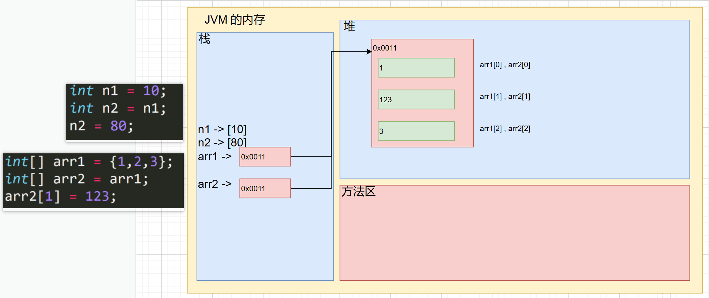

# 数组⭐

### 数组介绍

数组可以存放多个**同一类型**的数据。数组也是一种数据类型，是引用类型。 即：数(数据)组(一组)就是一组数据

快速入门：Array01.java

### 数组的使用

#### 使用方式1-动态初始化1

##### 数组的定义

```java
int a[] = new int[5];
int[] a = new int[5];
```

##### 数组的引用

数组名【下标/索引/index】如：

你要使用 a数组 的第三个数 a[2], 数组的下标从 0 开始

#### 使用方式2-动态初始化2

先声明数组 

​	语法:数据类型 数组名[]; 也可以 数据类型[] 数组名; 

​	int a[]; 或者 int[] a; 

创建数组 

​	语法: 数组名=new 数据类型[大小]; 

​	a = new int[10];//这个时候才分配内存空间

#### 使用方式3-静态初始化

语法：数据类型 数组名[ ] = { 元素值，元素值……}

如：double[] chickens = {3, 5, 1, 3.4, 2, 50};

或 double[] chickens = new double[]{3, 5, 1, 3.4, 2, 50};

### 数组使用注意事项和细节

1. 数组是多个相同类型数据的组合，实现对这些数据的统一管理 

2. 数组中的元素可以是任何数据类型，包括基本类型和引用类型，但是不能混用。 

3. 数组创建后，如果没有赋值，有默认值 int 0，short 0, byte 0, long 0, float 0.0,double 0.0，char \u0000，boolean false，String null 

4. 使用数组的步骤 1. 声明数组并开辟空间 2 给数组各个元素赋值 3 使用数组 

5. 数组的**下标是从** **0** **开始的**。 

6. 数组下标必须在指定范围内使用，否则报：下标越界异常，比如

   int [] arr=new int[5]; 则有效下标为 0-4

7. 数组属于引用类型，数组型数据是对象(object)

### 数组赋值机制⭐

1. 基本数据类型赋值，这个值就是具体的数据，而且相互不影响。 

2. 数组在默认情况下是引用传递，赋的值是地址。 

   看一个案例，并分析数组赋值的内存图(**重点, 难点.** )。

   ```java
   		//基本数据类型赋值，赋值方式为 值传递 / 值拷贝
   		//n2的变化，不会影响到n1的值
   		int n1 = 10;
   		int n2 = n1;
   		n2 = 80;
   		
   		System.out.println("n1 = " + n1);//80
   		System.out.println("n2 = " + n2);//80
   		
   		//数组在默认情况下是引用传递，赋的值
   		//是地址，赋值方式为 引用传递（引用拷贝）
   		//是一个地址
   		int[] arr1 = {1,2,3};
   		int[] arr2 = arr1;
   		arr2[1] = 123;
   
   		for (int i: arr1){
   			System.out.print(i + "\t");// 1       123     3
   		}
   ```

    

### 数组拷贝

```java
		//需求
		//编写代码 实现数组拷贝（内容复制）
		//要求数据空间是独立的
		int[] arr1 = {10, 20, 30, 33};
		//思路分析
		//定义一个等长的数组  arr1.length
		//循环遍历数组，让arr2的每个元素 等于 
		//arr1 的每个元素
		//测试改变arr2的值，打印输出
		int[] arr2 = new int[arr1.length];
		for (int i = 0; i < arr1.length; ++i) {
			arr2[i] = arr1[i];
		}

		arr2[1] = 200;
		System.out.println("=====arr1=====");
		for (int i : arr1) {
			System.out.print(i + "\t");
		}

		System.out.println("\n=====arr2=====");
		for (int i : arr2) {
			System.out.print(i + "\t");
		}
```

### 数组反转

```java
		//需求
		//把数组的元素内容反转
		int[] arr = {11, 22, 33, 44, 55, 66, 11, 88, 101};
		//思路分析
		//遍历数组（一半），定义一个让第一个和最后一个颠倒
		//实现 temp = arr[0];arr[0] = arr[5];arr[5] = temp;
		//打印输出
		int temp;
		int len = arr.length;
		for (int i = 0; i < len / 2; ++i) {
			temp = arr[i];
			arr[i] = arr[len - 1 - i];
			arr[len - 1 - i] = temp;
		}

		System.out.println("=====arr=====");
		for (int i : arr) {
			System.out.print(i + "\t");
		}
```

### 数组添加/扩容

```java
		//需求
		//实现动态的给数组添加元素效果，实现对数组扩容
		int[] arr = {1, 2, 3};
		int n = 6;
		//思路分析
		//定义一个数组，长度 = arr的长度 + 1
		//复制arr数组到新数组，然后将n赋值给最后一个元素
		//将arr地址改成新的数组地址
		//打印输出
		int len = arr.length;
		int[] arr1 = new int[len + 1];
		for (int i = 0; i < len; ++i) {
			arr1[i] = arr[i];	
		}
		arr1[len] = n;
		arr = arr1;

		System.out.println("=====arr=====");
		for (int i : arr) {
			System.out.print(i + "\t");
		}
```

数组的扩容还是比较麻烦的，学到**数据结构和算法的链表**后，就会轻松很多

# 排序

排序是将多个数据，依指定的顺序进行排列的过程。

#### 内部排序

指将需要处理的所有数据都加载到内部存储器中进行排序。包括(交换式排序法、选择式排序法和插入式排序法)；

#### 外部排序

数据量过大，无法全部加载到内存中，需要借助外部存储进行排序。包括(合并排序法和直接合并排序法)【大数据】

### 冒泡排序法

（这里只讲解冒泡排序，更多的排序在学到**数据结构和算法的算法**会拓展）

冒泡排序（Bubble Sorting）的基本思想是：通过对待排序序列从后向前（从下标较大的元素开始），依次比较相邻元素的值，若发现逆序则交换，使值较大的元素逐渐从前移向后部，就象水底下的气泡一样逐渐向上冒。

```java
		//需求
		//我们将五个无序：24,69,80,57,13 使用
		//冒泡排序法将其排成一个从小到大的有序数列。
		int[] arr = {24, 69, 80, 57, 13, 1, 20};
		//思路分析
		//遍历数组，arr【前】跟arr【后】比较
		//大了往后调换，小了不做处理
		//print
		int temp;
		//问题，这只是一次冒泡，需要多次冒泡
		for (int i = 0; i < arr.length - 1; ++i) {
			for (int j = 0; j < arr.length - 1; ++j) {
				if (arr[j] < arr[j + 1]) {
					continue;
				}
				temp = arr[j];
				arr[j] = arr[j + 1];
				arr[j + 1] = temp;
			}
		}
		

		System.out.println("=====arr=====");
		for (int i : arr) {
			System.out.print(i + "\t");
		}
```

#### 总结冒泡排序特点

1. 我们一共有 n 个元素
2. 一共进行 n - 1 轮排序，可以看成是外层循环
3. 每1轮排序可以确定一个数的位置，比如第一轮排序确定最大数，第二轮排序，确定第二大的数
4. 当进行比较时，如果前面的数小于后面的数，就交换
5. 每轮比较次数在减少 4 -> 3 -> 2 -> 1

# 查找

在 java 中，我们常用的查找有两种: 

1. 顺序查找 SeqSearch.java 
2. 二分查找【二分法，我们放在算法讲解】

```java
		//需求
		String[] arr = {"白眉鹰王", "金毛狮王", "紫衫龙王", "青翼蝠王"};
		//有一个数列：白眉鹰王、金毛狮王、紫衫龙王、青翼蝠王猜数游戏：从键盘中任意输入一个
		//名称，判断数列中是否包含此名称【顺序查找】要求: 如果找到了，就提示找到，并给出下标值。
		//思路分析
		//1.定义一个Scanner对象，接受用户输入
		//2.遍历数组，逐个对比
		//3.找到后，输出找到了，并且在输出它是第几个。
		System.out.println("=====arr=====");
		for (String i : arr) {
		System.out.print(i + "\t");
		}
		System.out.println();

		Scanner sc = new Scanner(System.in);
		System.out.println("你要查询的字符串：");
		String search = sc.next();
		for (int i = 0; i < arr.length; ++i) {
			if (search.equals(arr[i])) {
				System.out.println(search + " 是字符串数组的第 " + (i + 1) + " 个");
				System.out.println("谢谢您的使用");
				return;
			}
		}
		System.out.println("sorry");
```

# 多维数组-二维数组

( 多维数组我们只介绍二维数组 )

1. 从定义形式上看 int[]\[]

2. 可以这样理解，原来的一维数组的每个元素是一维数组, 就构成二维数组

### 使用方式1：动态初始化

语法：类型[ ]\[ ] 数组名 = new 类型[ ]\[ ]   如：

```java
int[][] a = new int[2][3];
```

### 使用方式2：动态初始化

先声明：类型 数组名[ ]\[ ];

再定义（开辟空间） 数组名 = new 类型[大小]\[大小]

赋值（有默认值，比如 int 类型的就是 0）

### 使用方式3：动态初始化-列数不确定

```java
		//需求
		//动态 创建下面二位数组，并输出
		//{{1}，{2，2}，{3，3，3}}
		//思路分析
		//1.要动态，所以定义时候只说明外层层数，不说明元素个数
		int len = 10;
		int[][] arr = new int[len][];
		//2.遍历数组，给数据开拓空间
		for (int i = 0; i < len; ++i) {
			arr[i] = new int[i + 1];
			//3.遍历数组赋值
			for (int j = 0; j < arr[i].length; ++j) {
				arr[i][j] = i + 1;
			}	
		}
		//4.打印输出
		for (int[] i : arr) {
			for (int j : i) {
				System.out.print(j + "\t");
			}
			System.out.println();
		}
```

### 使用方式4：静态初始化

定义 类型 数组名[ ]\[ ] = {{值1, 值2, ……}，{值1, 值2, ……}，{值1, 值2, ……}，……};

使用即可[ 固定方式访问 ]

### 杨辉三角

```java
		//需求
		//打印输出10行
		//1
		//1 1
		//1 2 1
		//1 3 3 1
		//1 4 6 4 1
		//……
		//思路分析
		//动态 初始化 二维数组
		int len = 10;
		int[][] arr = new int[len][];
		//遍历数组，开拓空间
		for (int i = 0; i < len; ++i) {
			arr[i] = new int[i + 1];
			arr[i][0] = 1;
			//遍历数组赋值
			for (int j = 1; j < arr[i].length; ++j) {
				if (j == arr[i].length - 1) {
					arr[i][j] = 1;
					continue;
				}
				arr[i][j] = arr[i - 1][j - 1] + arr[i - 1][j];
			}
		}

		//打印输出
		for (int[] i : arr) {
			for (int j : i) {
				System.out.print(j + "\t");
			}
			System.out.println();
		}
```

### 二维数组使用细节和注意事项

1. 一维数组的声明方式有: 

   int[] x 或者 int x[]

2. 二维数组的声明方式有: 

   **int[]\[] y** **或者** **int[] y[]** **或者** **int y[]\[]**

3. 二维数组实际上是由多个一维数组组成的，它的各个一维数组的长度可以相同，也可以不相同。比如： map[][] 是一个二维数组 int map [][] = {{1,2},{3,4,5}} 由 map[0] 是一个含有两个元素的一维数组 ，map[1] 是一个含有三个元素的一维数组构成，我们也称为列数不等的二维数组