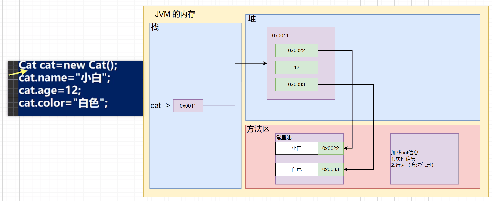
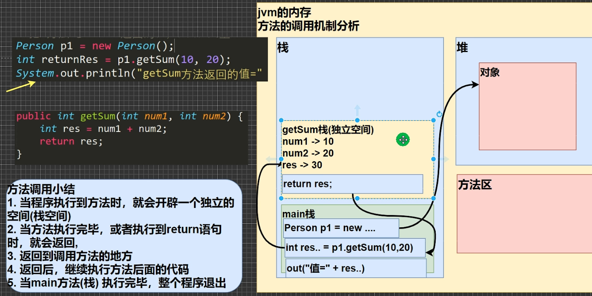

# 类与对象

### 案例

```java
public class Object01{
	public static void main(String[] args){
		/*
		张老太养了两只猫猫:一只名字叫小白,今年 3 岁,白色。
		还有一只叫小花,今年 100 岁,花色。请编写一个程序，当用户输入小猫的名字时，
		就显示该猫的名字，年龄，颜色。如果用户输入的小猫名错误，
		则显示 张老太没有这只猫猫。
		第 184页
		*/
		
		//单独变量来解决 => 不利于数据的管理(你把一只猫的信息拆解了)
		//第1只猫的信息
		// String cat1Name = "小白";
		// int cat1Age = 3;
		// String car1Color = "白色";

		// //第2只猫的信息
		// String cat1Name = "小花";
		// int cat1Age = 100;
		// String car1Color = "花色";

		// 数组 ===>(1)数据类型体现不出来(2) 只能通过[下标]获取信息，造成变量名字和内容
		// 的对应关系不明确(3) 不能体现猫的行为
		// String[] cat1 = {"小白", "3", "白色"};
		// String[] cat2 = {"小花", "100", "花色"};
		

		//使用 OOP 面向对象解决
		//实例化一只猫
		Cat cat1 = new Cat();
		cat1.name = "小白";
		cat1.age = 3;
		cat1.color = "白色";

		//实例化一只猫
		Cat cat2 = new Cat();
		cat2.name = "小花";
		cat2.age = 100;
		cat2.color = "花色";

		System.out.println(cat1.toToString());
		System.out.println(cat2.toToString());
	}
}

//定义一个猫类 Cat -> 自定义的数据类型
class Cat{
	String name;
	int age;
	String color;

	String toToString(){
		return "cat[name=" + name 
				+ ";age=" + age 
				+ ";color=" + color 
				+ "]";
	}
}
```

### 类和对象的区别和联系

1. 类是抽象的，概念的，代表一类事物,比如人类,猫类.., 即它是数据类型. 
2. 对象是具体的，实际的，代表一个具体事物, 即 是实例. 
3. 类是对象的模板，对象是类的一个个体，对应一个实例

### 对象在内存中存在形式



### 属性/成员变量

#### 基本介绍 

1. 从概念或叫法上看： 成员变量 = 属性 = field(字段) （即 成员变量是用来表示属性的，授课中，统一叫 属性)
2. 属性是类的一个组成部分，一般是基本数据类型,也可是引用类型(对象，数组)。比如我们前面定义猫类 的 int age 就是属性

#### 注意事项和细节说明

1. 属性的定义语法同变量，示例：访问修饰符 属性类型 属性名; 

   访问修饰符 :这里简单的介绍访问修饰符： 控制属性的访问范围 

   有四种访问修饰符 public, proctected, 默认, private ,后面我会详细介绍 

2. 属性的定义类型可以为任意类型，包含基本类型或引用类型 

3. 属性如果不赋值，有默认值，规则和数组一致。具体说: int 0, short 0, byte 0, long 0,  float 0.0, double 0.0, char \u0000, boolean false, String null

### 如何创建对象

1. 先声明再创建 

   Cat cat ; //声明对象 cat 

   cat = new Cat(); //创建 

2. 直接创建 

   Cat cat = new Cat();

### 如何访问属性

基本语法 

对象名.属性名; 

案例演示赋值和输出 

cat.name ; 

cat.age; 

cat.color;

### 类和对象的内存分配机制

#### Java 内存的结构分析

1. 栈： 一般存放基本数据类型(局部变量) 
2. 堆： 存放对象(Cat cat , 数组等) 
3. 方法区：常量池(常量，比如字符串)， 类加载信息

#### Java 创建对象的流程简单分析

```java
Person p = new Person();
p.name = “jack”;
p.age = 10
```

1. 先加载 Person 类信息(属性和方法信息, 只会加载一次) 
2. 在堆中分配空间, 进行默认初始化(看规则) 
3. 把地址赋给 p , p 就指向对象 
4. 进行指定初始化， 比如 p.name =”jack” p.age = 10

# 成员方法

### 方法的调用机制原理：(重要!-示意图!!!)



### 成员方法的好处

1. 提高代码的复用性
2. 可以将实现的细节封装起来，然后供其他用户来调用即可

### 成员方法的定义

```java
访问修饰符 返回数据类型 方法名（形参列表..） {//方法体
	语句；
	return 返回值;
}
```

1. 形参列表：表示成员方法输入 cal(int n) ， getSum(int num1, int num2)
2. 返回数据类型：表示成员方法输出, void 表示没有返回值
3. 方法主体：表示为了实现某一功能代码块
4. return 语句不是必须的。

访问修饰符 (作用是控制 方法使用的范围)
如果不写默认访问，[有四种: public, protected, 默认, private], 具体在后面说

### 注意事项和使用细节

#### 成员方法

1. 一个方法最多有一个返回值 [思考，如何返回多个结果 返回数组 ]
2. 返回类型可以为任意类型，包含基本类型或引用类型(数组，对象)
3. 如果方法要求有返回数据类型，则方法体中最后的执行语句必须为 return 值; 而且要求返回值类型必须和 return的值类型一致或兼容
4. 如果方法是 void，则方法体中可以没有 return 语句，或者 只写 return 

#### 形参列表

1. 一个方法可以有0个参数，也可以有多个参数，中间用逗号隔开，如：getSum(int n1, int n2)
2. 参数类型可以为任意类型，包含基础类型或引用类型，如：printArr(int[]\[] map)
3. 调用带参数的方式时，一定对应着参数列表传入相同类型或兼容类型的参数（自动类型转换）
4. 方法定义时的参数称为形式参数，简称形参；方法调用时的参数称为实际参数，简称实参，实参和形参的类型要一致或兼容、个数、顺序必须一直

#### 方法调用细节

1. 同一个类中的方法调用：直接调用即可。
2. 跨类中的方法A类调用B类方法：需要通过对象名调用。比如 对象名.方法名(参数)。
3. 特别说明一下：跨类的方法调用和方法访问修饰符相关，后面会详讲

# 成员方法传参机制

方法的传参机制对我们今后的编程**非常重要**，一定要搞的清清楚楚明明白白。

1. 基本数据类型，传递的是值（值拷贝），形参的任何改变不影响实参！
2. 引用类型传递的是地址（传递的是值，但是值是地址），可以通过形参影响实参

### 拷贝对象

```java
public class MethodExercise02{
	public static void main(String[] args){
		//需求
		//编写一个方法 copyPerson，可以复制一个 Person 对象，
		//返回复制的对象。克隆对象， 注意要求得到新对象和原
		//来的对象是两个独立的对象，只是他们的属性相同
		Person p1 = new Person();
		p1.name = "Litchi";
		p1.age = 21;
		//思路分析
		//2.实现复制
		Person p2;
		MyTools tools = new MyTools();
		p2 = tools.copyPerson(p1);
		// //3.修改p1属性，打印输出验证
		// p1.age += 1;
		// System.out.println("p1 name=" + p1.name + "; age=" + p1.age);
		// System.out.println("p2 name=" + p2.name + "; age=" + p2.age);
		//3.可以同 对象比较看看是否为同一个对象
		System.out.println(p1 == p2);//false
	}
}

class Person{
	//这里仅用两个为例子
	String name;
	int age;
}

class MyTools{
	//1.定义一个copyPerson方法
	public Person copyPerson(Person p){
		Person copyP = new Person();
		copyP.name = p.name;
		copyP.age = p.age;
		return copyP;
	}
}
```

# 方法递归调用(非常非常重要，比较难)

### 基本介绍

简单的说: **递归就是方法自己调用自己**,每次调用时传入不同的变量.递归有助于编程者解决复杂问题,同时可以让代码变得简洁

### 递归能解决什么问题？

1. 各种数学问题如：8皇后问题，汉诺塔，阶乘问题，迷宫问题，球和篮子的问题（google编程大赛）
2. 各种算法中也会使用到递归，比如快排，归并排序，二分查找，分治算法等
3. 将用栈解决问题-->递归代码比较简洁

### 快速入门

```java
public class Recursion01{
	public static void main(String[] args){
		T t1 = new T();
		t1.test(20);
		System.out.println(t1.factorial(4));
	}
}

class T{
	public void test(int n){
		if (n > 2) {
			test(n - 1);
		}
		System.out.println("n = " + n);
	}

	//阶乘 factorial
	public int factorial(int n){
		if(n == 1)return 1;
		return factorial(n - 1) * n;
	}
}
```

### 递归重要规则

1. 执行一个方法时，就创建一个新的受保护的独立空间（栈空间）
2. 方法的局部变量是独立的，不会相互影响，比如 n 变量
3. 如果方法中使用的是引用类型变量（比如数组，对象），就会共享该引用类型的数据
4. 递归必须向退出递归的条件逼近，负责就是无限递归，出现StackOverflowError，死龟了
5. 当一个方法执行完毕，或者遇到return，就会返回，遵守谁调用，就将结果返回给谁，同时当方法执行完毕或者返回时，该方法也就执行完毕

### 老鼠出迷宫

```java
public class MiGong{
	public static void main(String[] args){
		//需求
		//自治一个迷宫
		int[][] map = {
			{2, 2, 2, 2, 2, 2, 2, 2},
			{2, 0, 0, 0, 0, 2, 0, 2},
			{2, 0, 0, 2, 0, 2, 0, 2},
			{2, 2, 2, 2, 0, 0, 0, 2},
			{2, 0, 0, 0, 0, 0, 0, 2},
			{2, 0, 2, 2, 2, 2, 2, 2},
			{2, 0, 0, 0, 0, 0, 0, 2},
			{2, 2, 2, 2, 2, 2, 2, 2}
		};
		//让站在1的小老鼠出迷宫
		//盲目开始，毫无头绪，所以还是得思路
		//思路每次先往右走，走不通，就走下，走不通就走上，走不通就走左
		//走到以前走过的直接算走不通
		//可以走是0不可以走的是2，1
		//设置开始位置，和结束位置，走过的就变1，当终点也变1，就结束
		T2 t = new T2();
		t.miGong(map, 1, 1);
		for (int[] i: map) {
			for (int j: i) {
				System.out.print(j);
			}
			System.out.println();
		}
	}
}

class T2{
	public boolean miGong(int[][] map, int i,int j){
		if (map[6][6] == 1) {
			return true;
		} 
		//else if(map[i][j + 1] == 0){
		// 	map[i][j + 1] = 1;
		// 	miGong(map, i, j + 1);
		// 	return true;
		// }else if(map[i + 1][j] == 0){
		// 	map[i + 1][j] = 1;
		// 	miGong(map, i + 1, j);
		// 	return true;
		// }else if(map[i - 1][j] == 0){
		// 	map[i - 1][j] = 1;
		// 	miGong(map, i - 1, j);
		// 	return true;
		// }else if(map[i][j - 1] == 0){
		// 	map[i][j - 1] = 1;
		// 	miGong(map, i, j - 1);
		// 	return true;
		// }else{
		// 	return false;
		// }
		else{
			if (map[i][j] == 0) {
				map[i][j] = 1;
				//这个是下右左上，不同策略，情况不同
				if (miGong(map, i + 1, j)) {
					return true;
				} else if(miGong(map, i, j + 1)){
					return true;
				} else if(miGong(map, i, j - 1)){
					return true;
				} else if(miGong(map, i - 1, j)){
					return true;
				}else{
					map[i][j] = 3;
					return false;
				}
			}else{
				return false;
			}
		}
	}
}
```

### 汉诺塔

```java
public class HanoiTower{
	public static void main(String[] args){
		//需求
		Tower t = new Tower();
		t.move(5, 'A', 'B', 'C');
	}
}

class Tower{
	//方法
	//num 表示要移动的个数, a, b, c 分别表示 A 塔，B 塔, C 塔
	public void move(int num, char a, char b, char c){
		//如果只有一个盘 num = 1
		if (num == 1) {
			System.out.println(a + "->" + c);
		}else{
			//把它看成两个，最下面一个，和上面的一堆
			//1.先移动上面所有的盘到 b, 借助 c
			//2.把最下面的这个盘，移动到 c
			//3.再把 b 塔的所有盘，移动到 c ,借助 a
			move(num - 1, a, c, b);
			System.out.println(a + "->" + c);
			move(num - 1, b, a, c);
		}
	}
}
```

# 重载(overload)

### 基本介绍

java 中允许同一个类中，多个同名方法的存在，但要求 形参列表不一致！ 

比如：System.out.println();   out 是 PrintStream 类型

### 重载的好处

1. 减轻了起名的麻烦
2. 减轻了记名的麻烦

### 注意事项和使用细节

1. 方法名：必须相同
2. 形参列表：必须不同（形参类型或个数或顺序，至少有一样，参数名无要求）
3. 返回类型：无要求

# 可变参数

### 基本介绍

java 允许将同一个类中**多个同名同功能**但**参数个数不同**的方法，封装成一个方法。就可以通过可变参数实现

### 基本语法

访问修饰符 返回类型 方法名(数据类型... 形参名) { } 

### 快速入门

```java
public class VarParameter01{
	public static void main(String[] args){
		LitchiMethod m = new LitchiMethod();
		System.out.println(m.sum());
		System.out.println(m.sum(1, 4, 20));
		int[] arr = {3,6,9,10};
		System.out.println(m.sum(arr));
	}
}

class LitchiMethod{
	//可以计算 2 个数的和，3 个数的和 ， 4. 5， 。。
	//可以使用方法重载
	// public int sum(int n1, int n2) {//2 个数的和
	// return n1 + n2;
	// }
	// public int sum(int n1, int n2, int n3) {//3 个数的和
	// return n1 + n2 + n3;
	// }
	// public int sum(int n1, int n2, int n3, int n4) {//4 个数的和
	// return n1 + n2 + n3 + n4;
	// }
	//.....
	//1. int... 表示接受的是可变参数，类型是 int ,即可以接收多个 int(0-多)
	//2. 使用可变参数时，可以当做数组来使用 即 nums 可以当做数组
	//3. 遍历 nums 求和即可
	public int sum(int... nums) {
		//System.out.println("接收的参数个数=" + nums.length);
		int res = 0;
		for(int i = 0; i < nums.length; i++) {
			res += nums[i];
		}
		return res;
	}
}
```

### 注意事项和使用细节

1. 可变参数的实参可以为0个或任意多个

2. 可变参数的实参可以为数组

3. 可变参数的本质就是数组

4. 可变参数可以和普通类型的参数一起放在形参列表，但必须保证可变参数在最后

   ```java
   public void f1(double... nums, int n){}//错误的，可变参数得放后面
   public void f2(int n， double... nums){}//ok
   ```

5. 一个形参列表中只能出现一个可变参数

# 作用域

### 基本使用

面向对象中，变量作用域是**非常重要**知识点，相对来说不是特别好理解。

### 注意事项和细节使用

1. 属性和局部变量可以重名，访问时遵循就近原则

2. 在同一作用域中，比如在同一个成员方法中，两个局部变量不能重名

3. **属性声明周期较长**，伴随着对象的创建而创建，伴随着对象的销毁而销毁，局部变量，**生命周期较短**，伴随它的代码块的执行而创建，伴随着代码块的结束而销毁。即在一次方法调用过程中

4. 作用域不同

   全局变量/属性：可以被本类使用，或其他类使用（通过对象调用）

   局部变量：只能在本类中对应的方法中使用

5. 修饰符不同

   全局变量/属性可以加修饰符

   局部变量不可以加修饰符

# 构造方法/构造器

### 基本语法

```java
[修饰符] 方法名(形参列表){
	方法体;
}
```

1. 构造器的修饰符可以默认， 也可以是 public protected private 
2. 构造器没有返回值 
3. 方法名 和类名字必须一样 
4. 参数列表 和 成员方法一样的规则 
5. 构造器的调用, 由系统完成

### 基本介绍

构造方法又叫构造器(constructor)，是类的一种特殊的方法，它的主要作用是完成对**新对象的初始化**。它有几个特点：

1. 方法名和类名相同 
2. 没有返回值 
3. 在创建对象时，系统会自动的调用该类的构造器完成**对象的初始化**。

### 注意事项和使用细节

1. 一个类可以定义多个不同的构造器，即构造器重载
2. 构造器名和类名要相同
3. 构造器没有返回值
4. 构造器是完成对象的初始化，并不是创建对象
5. 在创建对象时，系统自动的调用该类的构造方法
6. 如果程序员没有定义构造器，系统会自动给类生成一个默认无参构造器（也叫默认构造器），比如Dog(){},使用**javap指令** 反编译看看
7. 一旦定义了自己的构造器，默认的构造器就覆盖了，就不能再使用默认的无参构造器，除非显示的定义一下（**这点很重要**）

# this

### 基本介绍

java虚拟机会给每个对象分配 this，代表当前对象。

### this 的注意事项和使用细节

1. this 关键字可以用来访问本类的属性、方法、构造器 
2. this 用于区分当前类的属性和局部变量 
3. 访问成员方法的语法：this.方法名(参数列表); 
4. 访问构造器语法：this(参数列表); **注意只能在构造器中使用(即只能在构造器中访问另外一个构造器, 必须放在第一条语句)** 
5. this 不能在类定义的外部使用，只能在类定义的方法中使用。

