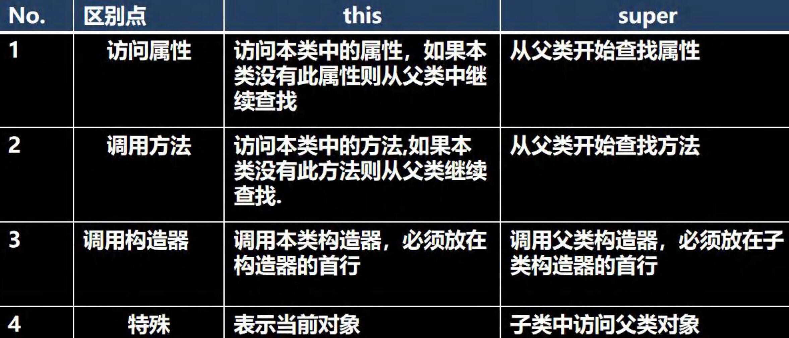

# Intellij IDEA

### IDE(集成开发环境) -IDEA

### IDEA介绍

1. IDEA 全称 Intellij IDEA
2. 在业界被公认为最好的 Java 开发工具
3. IDEA 是JetBradins 公司的产品，总部位于捷克的首部布拉格
4. 除了支持 Java 开发，还支持 HTML, CSS, PHP, MySql, Python等等

### IDE（集成开发环境）-Eclipse

### Eclipse 介绍

1. Eclipse 是一个开放源代码的、基于 Java 的可扩展开发平台。 
2. 最初是由 IBM 公司耗资 3000 万美金开发的下一代 IDE 开发环境 
3. 2001 年 11 月贡献给开源社区 
4. Eclipse 是目前最优秀的 Java 开发 IDE 之一

### IDE(集成开发环境) -IDEA的使用

#### 模板

file -> settings -> editor -> Live templates -> **查看**有哪些模板快捷键 / 可以自己**添加模板**

**模板可以高校的完成开发，提高速度**

# 包

### 包的三大作用

1. 区分相同名字的类
2. 当类很多时，可以很好的管理类【看 Java API 文档】
3. 控制访问范围

### 包的本质分析（原理）

包的本质：实际上就是创建不同的文件夹来保存类文件

### 包的命名

#### 命名规则

只能包含数字、字母、下划线、小圆点，但不能用数字开头，不能是关键字或保留字

#### 命名规范

一般是小写字母+小圆点

com.公司名.项目名.业务模块名

如：com.hspedu.oa.model; com.hspedu.oa.controller;

### 常用包

java中常用的包有：

- java.lang.* 	   // lang 包是基本包，默认引入，不需要再引入
- java.util.*         //  util 包，系统提供的工具包，工具类，如Scanner
- java.net.*         //  网络包，网络开发
- java.awt.*        //  是做java的界面开发，GUI

### 如何引入包

语法：import 包;

我们引入一个包的主要目的是要使用该包下的类

比如 import java.util.Scanner; 就只是引入一个类Scanner。

import java.util.*; 表示将java.util 包所有都引入

##### 建议

我们需要使用到哪个类，就导入哪个类即可，不建议使用 *导入

### 注意事项和使用细节

1. package 的作用是声明当前类所在的包，需要放在类的最上面，一个类中最多只有一句package
2. import 指令 位置放在package的下面，在类定义前面，可以有多句且没有顺序要求。

# 访问修饰符

### 基本介绍

java 提供四种访问控制修饰符号，用于控制方法和属性(成员变量)的访问权限（范围）:

1. 公开级别:用 **public** 修饰,对外公开 
2. 受保护级别:用 **protected** 修饰,对子类和同一个包中的类公开 
3. 默认级别:没有修饰符号,向同一个包的类公开. 
4. 私有级别:用 **private** 修饰,只有类本身可以访问,不对外公开.

### 4种访问修饰符的访问范围


### 使用的注意事项（背下来）

1. 修饰符可以用来修饰类中的属性，成员方法以及类
2. 只有默认的和public才能修饰类！并且遵循上述访问权限的特点
3. 因为没有学习继承，因此关于在子类中的访问权限，我们讲完子类后，在回头讲解
4. 成员方法的访问规则和属性完全一样

# 封装⭐

### 基本介绍

封装（**encap**sulation）就是把抽象出的数据【**属性**】和对数据的操作【**方法**】封装在一起，数据被保护在内部，程序的其他部分只有通过被授权的操作【**方法**】，才能对数据进行操作。

### 封装的理解和好处

1. 隐藏实现细节：方法（连接数据库）<--调用（传入参数..）
2. 可以对数据进行验证，保证安全合理

### 封装的实现步骤 (三步)

1. 将属性进行私有化 private【不能直接进行修改】
2. 提供一个公共的 （public）set方法，用于对属性判断并赋值
3. 提供一个公共的（public）get方法，用于获取属性的值

### 将构造器和 setXxx 结合

```java
public Person(String name, int age, double salary) {//构造器
		//set 方法
        setName(name);
        setAge(age);
        setSalary(salary);
    }
```

# 继承⭐

### 继承基本介绍和示意图

继承可以解决代码复用,让我们的编程更加靠近人类思维.当多个类存在相同的属性(变量)和方法时,可以从这些类中抽象出父类,在父类中定义这些相同的属性和方法，所有的子类不需要重新定义这些属性和方法，只需要通过 extends 来声明继承父类即可。画出继承的示意图


### 继承给编程带来的便利

1. 代码的复用性提高了 
2. 代码的扩展性和维护性提高了

### 继承的深入讨论/细节问题

1. 子类继承了所有的属性和方法，非私有的属性和方法可以在子类直接访问, 但是**私有属性和方法不能在子类直接访问**，要通过父类提供公共的方法去访问 

2. 子类必须调用父类的构造器， 完成父类的初始化 

3. 当创建子类对象时，不管使用子类的哪个构造器，默认情况下总会去调用父类的无参构造器，如果父类没有提供无参构造器，则必须在子类的构造器中用 super 去指定使用父类的哪个构造器完成对父类的初始化工作，否则，编译不会通过

4. 如果希望指定去调用父类的某个构造器，则显式的调用一下 : super(参数列表) 

5. super 在使用时，必须放在构造器第一行(super 只能在构造器中使用) 

6. super() 和 this() 都只能放在构造器第一行，因此这两个方法不能共存在一个构造器 

7. java 所有类都是 Object 类的子类, Object 是所有类的基类. 

8. 父类构造器的调用不限于直接父类！将一直往上追溯直到 Object 类(顶级父类) 

9. 子类最多只能继承一个父类(指直接继承)，即 java 中是单继承机制。 

   思考：如何让 A 类继承 B 类和 C 类？ 【A 继承 B， B 继承 C】 

10. 不能滥用继承，子类和父类之间必须满足 is-a 的逻辑关系

### 继承的本质分析(重要)

#### 案例

```java
/**
 * 讲解继承的本质
 */
public class ExtendsTheory {
    public static void main(String[] args) {
        Son son = new Son();//内存的布局
        //?-> 这时请大家注意，要按照查找关系来返回信息
        //(1) 首先看子类是否有该属性
        //(2) 如果子类有这个属性，并且可以访问，则返回信息
        //(3) 如果子类没有这个属性，就看父类有没有这个属性(如果父类有该属性，并且可以访问，就返回信息..)
        //(4) 如果父类没有就按照(3)的规则，继续找上级父类，直到 Object... System.out.println(son.name);//返回就是大头儿子
        //System.out.println(son.age);//返回的就是 39
        //System.out.println(son.getAge());//返回的就是 39
        System.out.println(son.hobby);//返回的就是旅游
    }
}

class GrandPa { //爷类
    String name = "大头爷爷";
    String hobby = "旅游";
}

class Father extends GrandPa {//父类
    String name = "大头爸爸";
    private int age = 39;

    public int getAge() {
        return age;
    }
}

class Son extends Father { //子类
    String name = "大头儿子";
}
```

#### 子类创建的内存布局


# 多态⭐

### 多[多种]态[状态]基本介绍

方法或对象具有多种形态。是面向对象的第三大特征，多态是建立在封装和继承基础之上的。

### 多态的具体体现

#### 方法的多态

重写和重载就体现多态

### 对象的多态 (核心，困难，重点)

重要的几句话（记住，背下来）：

1. 一个对象的编译类型和运行类型可以不一致
2. 编译类型在定义对象时，就确定了，不能改变
3. 运行类型是可以变化的
4. 编译类型看定义时 = 号 的左边，运行类型看 = 号 的右边

### 多态注意事项和细节讨论

#### 1.多态的**前提是**：两个对象(类)存在继承关系

#### 2.多态的向上转型

1. 本质：父类的引用指向了子类的对象

2. 语法：父类类型 引用名 = new 子类类型();

3. 特点：编译类型看左边，运行类型看右边

   可以调用父类中的所有成员（需遵守访问权限）

   不能调用子类中特有成员

   最终运行效果看子类的具体实现

#### 3.多态向下转型

1. 语法：子类类型 引用名 = （子类类型）父类引用;
2. 只能强转父类的引用，不能强转父类的对象
3. 要求父类的引用必须指向的是当前目标类型的对象
4. 当向下转型后，可以调用子类类型中的所有成员

#### 4.属性没有重写之说！属性的值看<u>编译类型</u>

#### 5.instanceOf 比较操作符，用于判断对象的<u>运行类型</u>是否为 XX 类型或 XX 类型的子类型

### java的动态绑定机制（非常非常重要）

1. 当调用对象方法的时候，该方法会和该对象的内存地址/运行类型绑定
2. 当调用对象属性时，没有动态绑定机制，哪里声明，哪里使用

### 多态的应用

#### 多态数组

数组的定义类型为父类类型，里面保存的实际元素类型为子类类型

#### 多态参数

方法定义的形参类型为父类类型，实参类型允许为子类类型

# Super

### 基本介绍

super 代表父类的引用，用于**访问父类的属性、方法、构造**器

### 基本语法

1. 访问父类的属性，但不能访问父类的private属性

   super.属性名；

2. 访问父类的方法，但不能访问父类的private方法

   super.方法名(参数列表);

3. 访问父类的构造器

   super(参数列表)；

   只能放在构造器的第一句，只能出现一句！

### super 给编程带来的便利/细节

1. 调用父类的构造器的好处（分工明确，父类属性由父类初始化，子类的属性由子类初始化）
2. 当子类中有父类的成员（属性和方法）重名时，为了访问父类的成员，必须通过super。如果没有重名，使用super、this、直接访问是一样的效果
3. super的访问不限于直接父类，如果爷爷类和本类中有同名的成员，也可以使用super去访问爷爷类的成员；如果多个基类（上级类）中都有同名的成员，使用super访问遵循就近原则。A -> B -> C,当然也需要遵循访问权限的相关规则

### super 和 this 的比较



# overwrite 方法重写/覆盖

### 基本介绍

简单的说：方法覆盖（重写）就是子类有一个方法，和父类的某个方法的名称、返回类型、参数一样，那么我们就说子类的这个方法重写（覆盖）了父类的方法

### 注意事项和使用细节

1. 子类的方法的形参列表，方法名称，要和父类方法的形参列表，方法名称完全一样

2. 子类方法的返回类型和父类方法的返回类型一样，或者父类返回类型的子类，如：

   父类的放回类型是 Object，子类方法返回类型是 String

3. 子类方法不能缩小父类方法的访问权限

### 重写和重载做一个比较


# Object类详情

### equals 方法

#### ==和 equals 的对比 [面试题]

==是一个比较运算符

1. ==：既可以判断基本类型，又可以判断引用类型

2. ==：如果判断基本类型，判断的是值是否相等

3. ==：如果判断引用类型，判断的是地址是否相等，即判定是不是同一个对象

4. equals：是Object类中的方法，只能判断引用类型

5. 默认判断的是地址是否相等，子类中往往重写该方法，用于判断内容是否相等，如：

   Integer， String【看看String 和 Integer 的 equals 源代码】

### hashCode 方法

返回该对象的哈希码值。支持此方法是为了提高哈希表（例如 java.util.hashtable 提供的哈希表）的性能

实际上，由 Object 类定义的 hashCode 方法确实会针对不同的对象返回不同的整数（这一版是通过将该对象的内部地址转换成一个整数来实现的，但是 Java 编程语言不需要这种实现技巧）

#### 小结

1. 提高具有哈希结构的容器的效率！ 
2. 两个引用，如果指向的是同一个对象，则哈希值肯定是一样的！ 
3. 两个引用，如果指向的是不同对象，则哈希值是不一样的 
4. 哈希值主要根据地址号来的！， 不能完全将哈希值等价于地址。
5. 案例演示[HashCode_.java]: obj.hashCode() [测试：A obj1 = new A(); A obj2 = new A(); A obj3 = obj1] 
6. 后面在集合，中 hashCode 如果需要的话，也会重写, 在讲解集合时，老韩在说如何重写 hashCode()

### toString 方法

默认返回：全类名+@+哈希值的十六进制，【查看 Object 的 toString 方法】 

1. 子类往往重写 toString 方法，用于返回对象的属性信息
2. 重写 toString 方法，打印对象或拼接对象时，都会自动调用该对象的 toString 形式
3. 当直接输出一个对象时，toString 方法会被默认的调用, 比如 System.out.println(monster)； 就会默认调用 monster.toString()

### finalize 方法

1. 当对象被回收时，系统自动调用该对象的 finalize 方法。子类可以重写该方法，做一些释放资源的操作【演示】
2. 什么时候被回收：当某个对象没有任何引用时，则 jvm 就认为这个对象是一个垃圾对象，就会使用垃圾回收机制来销毁该对象，在销毁该对象前，会先调用 finalize 方法。
3. 垃圾回收机制的调用，是由系统来决定(即有自己的 GC 算法), 也可以通过 System.gc() 主动触发垃圾回收机制

在实际开发中，几乎不会运用 finalize , 所以更多就是为了应付面试.

# 断点调试（debug）

### 一个实际需求

1. 在开发中，新手程序员在查找错误时，这时老程序员就会温馨提示，可以用断点调试，一步一步的看原码执行的过程，**从而发现错误**所在
2. **重要提示**：在断点调试 过程中，是运行状态，是以对象的 运行类型来执行的

### 基本介绍

1. 断点调试是指在程序的某一行设置一个断点，调试时，程序运行到这一行就会停住，然后你可以一步一步往下调试，调试过程中可以看各个变量当前的值，出错的话，调试到出错得代码行即显示错误，停下。进行分析从而找到这个Bug
2. 断点调试是程序员必须掌握的技能
3. 断点调试也能帮助我们查看 Java 底层源代码的执行过程，提高程序员的 Java 水平

### 断点调试的快捷键

1. F7(跳入) 
2. F8(跳过) 
3. shift+F8(跳出) 
4. F9(resume,执行到下一个断点) 

F7：跳入方法内 

F8: 逐行执行代码. 

shift+F8: 跳出方法

### 如何进入 jdk 源码

1. 使用 force step int ：alt + shift + F7

2. 配置一下就好了

   Setting --> Build, Execution, Deployment --> Debugger --> Stepping

   把 Do not step into classes 中的 java.*  ,  javax.*  取消勾选，其他的随意

   就可以进入源码了

### 小技巧

断点可以在 debug 过程中，动态的下断点

不但可以给自己代码动态下断点，还可以给系统代码动态下断点

# 项目练习

chapter08  com.litchi.smallchange;

### 学到技巧

日期格式化

```
	System.out.println(new Date());
	//可以用于日期的格式化
    SimpleDateFormat sdf = new SimpleDateFormat("yyyy-MM-dd HH:mm");
    System.out.println(sdf.format(new Date());
```

### 编程思想

1. 判断条件（分支、循环），找出不正确条件，然后给出提示，结束代码

   如：判断收益金额正确

   ```java
   if(fee > 0)
   	操作语句(对金额进行增删改查)；
   else
   	提示语句；
   	退出代码；
   ```

   ```java
   if(fee <= 0)
   	提示语句;
   	退出代码;
   操作语句(对金额进行增删改查)；
   //可读行更强
   ```

2. 一段代码，完成一个小功能，尽量不要混在一起

   如：判断用户输入为 y （退出程序）n（继续执行程序）其他（继续判断输入）

   ```java
   		char key;
   
           do {
               System.out.println("是否退出 y/n ?");
               key = sc.next().charAt(0);
               if (key == 'y'){
               	loop = false;
               	break;
               } else if (key == 'n'){
               	break;
               }
           } while (true);
   ```

   ```java
   		char key;
   
           do {
               System.out.println("是否退出 y/n ?");
               key = sc.next().charAt(0);
               if (key == 'y' || key == 'n')
                   break;
           } while (true);
   
           if (key == 'y')
               loop = false;
   		//代码更清晰，可读性更强
   ```

   