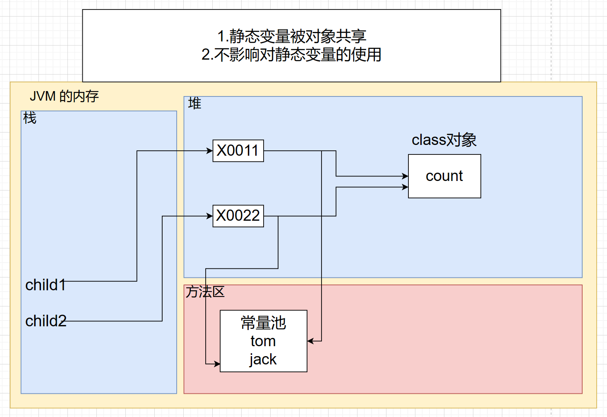

# 类变量和类方法⭐

### 基本介绍

类变量也叫静态变量/静态属性，是该类的所有对象共享的变量，任何一个该类的对象去访问它时，取到的都是相同的值，同样任何一个该类的对象去修改它时，修改的也是同一个变量。

### 如何访问类变量

类名.类变量名 [推荐]

对象名.类变量名

### 类变量使用注意事项和细节讨论

1. 什么时候需要用类变量

   当我们需要让某个类的所有对象都共享一个变量时，就可以考虑使用类变量(静态变量) : 比如，定义学生类，统计所有学生共交多少钱

2. 类变量与实例变量（普通属性）区别

   类变量是该类的所有对象共享的，而实例变量是每个对象独享的

3. 加上static称为类变量或静态变量，否则称为实例变量/普通变量/非静态变量

4. 类变量可以通过 类名.类变量名 或者 对象名.类变量名 来访问，但 java 设计者推荐我们使用 类名.类变量名方式访问【**前提是** 满足访问修饰符的访问权限和范围】

5. 实例变量不能通过 类名.类变量名 方式访问

6. 类变量是在类加载时就初始化了，也就说，即使你没有创建对象，只要类加载了，就可以使用类变量了

7. 类变量的生命周期是随类的加载开始，随着类消亡而销毁

### 类变量内存布局

#### 相关文章

[(30 封私信 / 80 条消息) java中的静态变量和Class对象究竟存放在哪个区域？ - 知乎 (zhihu.com)](https://www.zhihu.com/question/59174759/answer/163207831)



Java8以前的版本，静态变量在方法区的静态域

Java8以后的版本，静态变量在堆的class对象中

### 类方法经典的使用场景

当方法中不涉及到任何和对象相关的成员，则可以将方法设计成静态方法，提高开发效率，如：

utils工具类中的方法，Math类、Arrays类、Collections集合类

#### 小结

在程序员实际开发，往往会将一些通用的方法，设计成静态方法，这样我们不需要创建对象就可以使用了，比如打印一维数组，冒泡排序，完成某个计算任务 等..

### 类方法使用注意事项和细节讨论

1. 类方法和普通方法都是随着类的加载而加载，将结构信息存储在方法区：

   类方法中无this的参数

   普通方法中隐含着this的参数

2. 类方法可以通过类名调用，也可以通过对象名调用

3. 普通方法和对象有关，需要通过对象名调用，比如对象名.方法名(参数)，不能通过类名调用

4. 类方法中不允许使用和对象有关的关键字，比如this和super。普通方法(成员方法)可以

5. 类方法(静态方法)中 只能访问 静态变量 或静态方法

6. 普通成员方法，既可以访问 非静态成员，也可以访问静态成员

小结：静态方法，只能访问静态的成员；非静态的方法，可以访问静态成员和非静态成员（必须遵守访问权限）

# 理解main方法语法

### 深入理解 main 方法

解释main方法的形式：public static void main(String[] args){}

1. main方法时虚拟机调用
2. java虚拟机需要调用类的main()方法，所以该方法的访问权限必须是public
3. java虚拟机在执行main()方法时不必创建对象，所以该方法必须是static
4. 该方法接收String类型的数组参数，该数组中保存执行java命令时传递给所运行的类得到参数
5. java 执行的程序 参数1 参数2 参数3

### 特别提示

1. 在main()方法中，我们可以直接调用main方法所在类的静态方法或静态属性
2. 但是，不能直接访问该类中的非静态成员，必须创建该类的一个实例对象后，才能通过这个对象去访问类中的非静态成员

# 代码块

### 基本介绍

代码化块又称为**初始化块**，属于类中的成员[即 是类的一部分]，类似于方法，将逻辑语句封装在方法体中，通过{}包围起来

但和方法不同，没有方法名，没有返回，没有参数，只有方法体，而且不用通过对象或类显示调用，而是加载类时，或创建对象时隐式调用

### 基本语法

```t&#39;x&#39;t
[修饰符]{
	代码
};
```

说明注意：

1. 修饰符 可选，要写的话，也只能写 static
2. 代码块分为两类，使用 static 修饰的叫静态代码块，没有static修饰的，叫普通代码块/非静态代码块
3. 逻辑语句可以为任何逻辑语句（输入、输出、方法调用、循环、判断等）
4. ；号可以写上，也可以省略

### 代码块的好处

1. 相当于另外一种形式的构造器(对构造器的补充机制)，可以做初始化的操作
2. 场景：如果多个构造器中都有重复的语句，可以抽取到初始化块中，提高代码的复用性

### 代码块使用注意事项和细节讨论

1. static 代码块也叫静态代码块，作用就是对类进行初始化，而且它随着**类的加载**而执行，并且**只会执行一次**。如果是普通代码块，每创建一个对象，就执行。

2. 类什么时候被加载【**重要背！**】

   - 创建对象实例时（new）
   - 创建子类对象实例，父类也会被加载
   - 使用类的静态成员时（静态属性，静态方法）

3. 普通的代码块，在创建对象实例时，会被隐式的调用

   被创建一次，就会调用一次

   如果只是使用类的静态成员，普通代码块并不会执行

   小结：

   - static代码块是类加载时，执行，只会执行一次
   - 普通代码块是在创建对象时调用的，创建一次，调用一次
   - 类加载的三种情况，需要记住

4. 创建一个对象时，在一个类 调用顺序是：(**重点，难点**)：

   - 调用静态代码块和静态属性初始化（注意：静态代码块和静态属性初始化调用的优先级一样，如果有多个静态代码块和多个静态变量初始化，则按他们定义的顺序调用）
   - 调用普通代码块和普通属性的初始化（注意：普通代码块和普通属性初始化调用的优先级一样，如果有多个普通代码块和多个普通属性初始化，则按定义顺序调用）
   - 调用构造器

   上面说的执行顺序一定要记住：理解的记住

5. 构造器 的最前面其实隐含了 super() 和调用普通代码块

6. 我们看一下创建子类对象时（继承关系），他们的静态代码块，静态属性初始化，普通代码块，普通属性初始化，构造方法的调用顺序如下：

   - 父类的静态代码块和静态属性（优先级一样，按定义顺序执行）
   - 子类的静态代码块和静态属性（优先级一样，按定义顺序执行）
   - 父类的普通代码块和普通属性初始化（优先级一样，按定义顺序执行）
   - 父类的构造方法
   - 子类的普通代码块和普通属性初始化（优先级一样，按定义顺序执行）
   - 子类的构造器方法

7. 静态代码块只能直接调用静态成员（静态属性和静态方法），普通代码块可以调用任意成员。学习比较麻烦，工作比较轻松

# 单例设计模式

### 什么是设计模式

1. 静态方法和属性的经典使用
2. 设计模式是在大量的实践中总结和理论化之后优选的代码结构、编程风格、以及解决问题的思考方法。设计模式就像经典的棋谱，不同的棋局，我们用不同的棋谱，免去我们自己再思考和摸索

### 什么是单例模式

单例（单个的实例）

1. 所谓类的单例设计模式，就是采取一定的方法保证在整个的软件系统中，对某个类只能存在一个对象实例，并且该类只提供一个取得其对象实例的方法

2. 单例模式有两种：
   - 饿汉式
   
   - 懒汉式
   - 步骤如下
     1. 构造器私有化
     2. 类的内部创建对象
     3. 向外暴露一个静态的公共方法

### 饿汉式 VS 懒汉式

1. 二者最主要的区别在于创建对象的**时机不同**：饿汉式是在类加载就创建了对象实例，而懒汉式是在使用时才创建
2. 饿汉式不存在线程安全问题，懒汉式存在线程安全问题（后面学习线程后，会完善一把）
3. 饿汉式存在浪费资源的可能。因为如果一个程序员一个对象实例都没有使用，那么饿汉式创建的对象就浪费了，懒汉式是使用时才创建，就不存在这个问题
4. 在我们 JavaSE标准类中，java.lang.Runtime就是经典的单例设计模式

# final 关键字

### 基本介绍

final 可以修饰类、属性、方法和局部变量

在某些情况下，程序员可能有以下需求，就会使用到final：

1. 当不希望类被继承时，可以用final修饰
2. 当不希望父类的某个方法被子类覆盖/重写(override)时，可以用final关键字修饰
3. 当不希望类的某个属性的值被修改，可以用final修饰
4. 当不希望某个局部变量被修改，可以使用final修饰

### final 使用注意事项和细节讨论

1. final修饰的属性又叫常量，一般用于 XX_XX_XX 来修饰
2. final修饰的属性在定义时，必须赋初值，并且以后不能再修改，赋值可以再如下位置之一【选择一个位置赋初值即可】：
   - 定义时：如 public final double TAX_RATE = 0.08
   - 在构造器中
   - 在代码块中
3. 如果final修饰的属性是静态的，则初始化的位置只能是
   - 定义时
   - 在静态代码块 不能在构造器中赋值
4. final类不能继承，但是可以实例化对象
5. 如果类不是fianl类，但是含有final方法，则方法虽然不能重写，但是可以被继承
6. 一般来说，如果一个类已经是final类了，就没有必要再将方法修饰成final方法
7. final不能修饰构造方法
8. final 和 static 往往搭配使用，效率更高，不会导致类加载，底层编译器做了优化处理
9. 包装类（Integer, Double, Float, Boolean 等都是final类），String也是final类

# 抽象类

### 解决之道-抽象类快速入门

当父类的一些方法不能确定时，可以用abstract关键字来修饰该方法，这个方法就是抽象方法，用abstract来修饰该类就是抽象类

我们看看如何把Animal做成抽象类，并让子类Cat类实现

```java
abstract class Animal{
	String name;
	int age;
	abstract public void cry();
}
```

### 基本介绍

1. 用abstract关键字来修饰一个类时，这个类就叫抽象类
2. 用abstract关键字来修饰一个方法时，这个方法就是抽象方法
3. 抽象类的价值更多作用是在于设计，是设计者设计好后，让子类继承并实现抽象类
4. 抽象类，是考官比较爱问的知识点，在框架和设计模式使用较多

### 抽象类使用的注意事项和细节讨论

1. 抽象类不能被实例化
2. 抽象类不一定要包含abstract方法。也就是说，抽象类可以没有abstract方法
3. 一旦类包含了abstract方法，则这个类必须声明为abstract
4. abstract只能修饰类和方法，不能修饰属性和其他的
5. 抽象类可以有任意成员【**抽象类本质还是类**】，比如：非抽象方法、构造器、静态属性等等
6. 抽象方法不能有主体，即不能实现【不能有操作代码】【花括号都不能有】
7. 如果一个类继承了抽象类，则它必须实现抽象类的所有抽象方法，除非它自己声明为abstract类
8. 抽象方法不能使用private、final 和 static来修饰，因为这些关键字都是和重写相违背的

### 抽象类最佳实践-模板设计模式

#### 基本介绍

抽象类体现的就是一种模板设计模式的设计，抽象类作为多个子类的通用模板，子类在抽象类的基础上进行扩展、改造，但子类总体上会保留抽象类的行为方式

#### 模板设计模式能解决的问题

1. 当功能内部一部分实现是确定，一部分实现是不确定的。这时可以把不确定的部分暴露出去，让子类去实现
2. 编写一个抽象父类，父类提供了多个子类的通用方法，并把一个或多个方法留给其他子类实现，就是一种设计模式

#### 案例：

有多个类，完成不同的任务job，需要统计得到各自完成任务的时间

```java
abstract public class Template {//抽象类-模板类
    public abstract void job();//抽象方法

    public void calculateTime(){//实现方法，调用job方法
        long start = System.currentTimeMillis();
        job();//动态绑定机制
        long end = System.currentTimeMillis();
        System.out.println("任务执行时间 = " + (end - start));
    }
}
```

# 接口⭐

### 基本介绍

接口就是给出一些没有实现的方法，封装到一起，到某个类要使用的时候，在根据具体情况把这些方法写出来。语法：

```java
interface 接口名{
	//属性
	//抽象方法
}
class 类名 implements 接口{
	自己属性；
	自己方法；
	必须实现的接口的抽象方法；
}
```

**小结**：接口是更加抽象的抽象的类，抽象类里的方法可以有方法体，接口里的所有方法都没有方法体【jdk7.0】。接口体现了程序设计的多态和高内聚低耦合的设计思想

特别说明：jdk8.0后接口类可以有静态方法，普通方法（需要使用default关键字修饰），也就是说接口中可以有方法的具体实现

### 深入讨论

对初学者讲，理解接口的概念不算太难，难的是不知道什么时候使用接口，下面我举例几个应用场景：

1. 说现在要制造战斗机，武装直升机。专家只需要把飞机需要的功能/规格定下来即可，然后让别的人具体实现就可
2. 说现在有一个项目经理，管理三个程序员，功能开发一个软件，为了控制和管理软件，项目经理可以定义一些接口，然后由程序员具体实现。

### 注意事项和细节

1. 接口不能被实例化

2. 接口中所有的方法是public方法，接口中抽象方法，可以不用abstract修饰。

   void aaa();

   实际上是 abstract void aaa();

3. 一个普通类实现接口，就必须将该接口的所有方法都实现

4. 抽象类实现接口，可以不用实现接口的方法

5. 一个类同时可以实现多个接口

6. 接口中的属性，只能是final的，而且是 public static final 修饰符。比如：

   int a = 1；实际上是 public static final int a = 1; (必须初始化)

7. 接口中属性的访问形式：接口名.属性名

8. 接口不能继承其他类，但是可以继承多个别的接口

9. 接口的修饰符 只能是 public 和默认，这点和类的修饰符是一样的

### 实现接口 vs 继承类

继承的价值主要在于：解决代码的**复用性和可维护性**

接口的价值主要在于：设计，设计好各种规范（方法），让其它类去实现这些方法。即更加的灵活..

接口比继承更加灵活

接口比继承更加灵活，继承是满足 is - a 的关系，而接口只需满足 like - a 的关系

接口在一定程度上实现代码解耦[即：接口规范性 + 动态绑定机制]

### 接口的多态特性

1. 多态参数

   在前面的Usb接口案例，UsbInterface usb ，既可以接收手机对象，又可以接收相机对象，就体现了 接口 多态（接口应用可以指向实现了接口的类的对象）

2. 多态数组

3. 接口存在**多态传递**现象

# 内部类⭐

定义在外部类局部位置(方法中/代码块) :

(1) 局部内部类（有类名）

 (2) **匿名内部类** （没有类名，重点！！！！）

定义在外部类的成员位置 上：

(1) 成员内部类（没有static修饰）

 (2) 静态内部类（使用static修饰）

### 基本介绍

一个类的内部又完整的嵌套了另一个类结构。被嵌套的类称为内部类(inner class)，

嵌套其他类的类称为外部类(outer class)。是我们类的第五大成员【思考：类的五大成员是哪些？[属性、方法、构造器、代码块、内部类]】，内部类最大的特点就是可以直接访问私有属性，并且可以体现类与类之间的包含关系，注意：内部类是学习的难点，同时也是重点，后面看底层源码时，有大量的内部类

### 基本语法

```java
class Outer{	//外部类
	class Inner{	//内部类
	}
}
class Outer{	//外部其他类
}
```

### 局部内部类的使用

说明：局部内部类是定义在外部类的局部位置，比如方法中，并且有类名

1. 可以直接访问外部类的所有成员，包含私有的

2. 不能添加访问修饰符，因为它的地位就是一个局部变量。局部变量是不能使用修饰符的。但是可以使用final 修饰，因为局部变量也可以使用final

3. 作用域：仅仅在定义它的方法或代码块中

4. 局部内部类 --- 访问 ---> 外部类的成员【访问方式：直接访问】

5. 外部类 --- 访问 ---> 局部内部类的成员

   访问方式：创建对象，再访问（注意：必须再作用域内）

   ​			记住：（1）局部内部类定义在方法中/代码块

   ​						（2）作用域在方法体或者代码块中

   ​						（3）本质仍然是一个类

6. 外部其他类 --- 不能访问 ---> 局部内部类（因为 局部内部类地位是一个局部变量）

7. 如果外部类和局部内部类的成员重名时，默认遵循就近原则，如果想访问外部类的成员，则可以使用（外部类名.this.成员）去访问

### 匿名内部类的使用(重要!!!!!!!)

(1)本质是类（2）内部类（3）该类没有名字（4）同时还是一个对象

说明：匿名内部类是定义在外部类的局部位置，比如方法中，并且没有类名

1. 匿名内部类的基本语法

   new 类或接口(参数列表){

   ​	类体

   };
   
2. 匿名内部类的语法比较奇特，请大家注意，因为匿名内部类即是一个类的定义，同时它本身也是一个对象，因此从语法上看，它既有定义类的特征，也有创建对象的特征，对前面代码分析可以看出这个特点，因此可以调用匿名内部类的方法

3. 可以直接访问外部类的成员，包含私有的

4. 不能添加访问修饰符，因为它的地位就是一个局部变量

5. 作用域：仅仅在定义它的方法或代码块中

6. 匿名内部类 --- 访问 ---> 外部类的成员【访问方式：直接访问】

7. 外部类 --- 访问 ---> 匿名内部类的成员【对象名.成员名】

8. 外部其他类 --- 不能访问 ---> 匿名内部类（因为 匿名内部类地位是一个局部变量）

9. 如果外部类和匿名内部类的成员重名时，默认遵循就近原则，如果想访问外部类的成员，则可以使用（外部类名.this.成员）去访问

#### 匿名内部类的最佳实践

当做实参直接传递，简洁高效

```java
public class InnerClassExercise01 {
    public static void main(String[] args) {
        f1(new IL() {
            @Override
            public void show() {
                System.out.println("这是一副名画...");
            }
        });
        //传统写法
        f1(new LImpl());
    }

    //静态方法，形参是接口类型
    public static void f1(IL il){
        il.show();
    }
}

interface IL{
    void show();
}

// 类 -> 实现IL => 编程领域(硬编码)
class LImpl implements IL{
    @Override
    public void show() {
        System.out.println("这是传统方法的名画");
    }
}
```

匿名内部类涉及到：（1）继承（2）多态（3）动态绑定（4）内部类

### 成员内部类的使用

说明：成员内部类是定义在外部类的成员位置，并且没有static修饰

1. 可以直接访问外部类的所有成员，包含私有的
2. 可以添加任意访问修饰符（public、protect、默认、private）,因为它的地位就是一个成员
3. 作用域：和外部类的其他成员一样，为整个类体，比如前面的案例，在外部类的成员方法中创建成员内部类对象，再调用
4. 成员内部类 --- 访问 ----> 外部类成员【访问方式：直接访问】
5. 外部类 --- 访问 ----> 成员内部类【访问方式：创建对象，再访问】
6. 外部其他类 --- 访问 ----> 成员内部类
7. 如果外部类和内部类的成员重名时，内部类访问的话，默认遵循就近原则，如果想访问外部类的成员，则可以使用（外部类名.this.成员）去访问

### 静态内部类的使用

说明：静态内部类是定义在外部类的成员位置，并且有static修饰

1. 可以直接访问外部类的所有静态成员，包含私有的，但不能直接访问非静态成员
2. 可以添加任意访问修饰符（public、protect、默认、private）,因为它的地位就是一个成员
3. 作用域：同其他的成员，为整个类体
4. 静态内部类 --- 访问 ----> 外部类静态成员【访问方式：直接访问所有静态成员】
5. 外部类 --- 访问 ----> 静态内部类【访问方式：创建对象，再访问】
6. 外部其他类 --- 访问 ----> 静态内部类
7. 如果外部类和静态内部类的成员重名时，静态内部类访问的话，默认遵循就近原则，如果想访问外部类的成员，则可以使用（外部类名.成员）去访问

#### 小结

（1）内部类有四种：局部内部类，匿名内部类，成员内部类，静态内部类

（2）重点还是掌握 **匿名内部类的使用**

​				new 类/接口(参数列表){

​					//。。。。

​				};

（3）成员内部类，静态内部类 是放在外部类的成员位置，本质就是一个成员

（4）其他细节看笔记。。。。