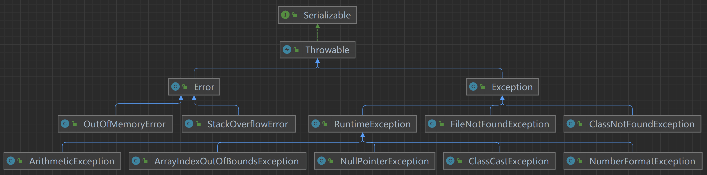
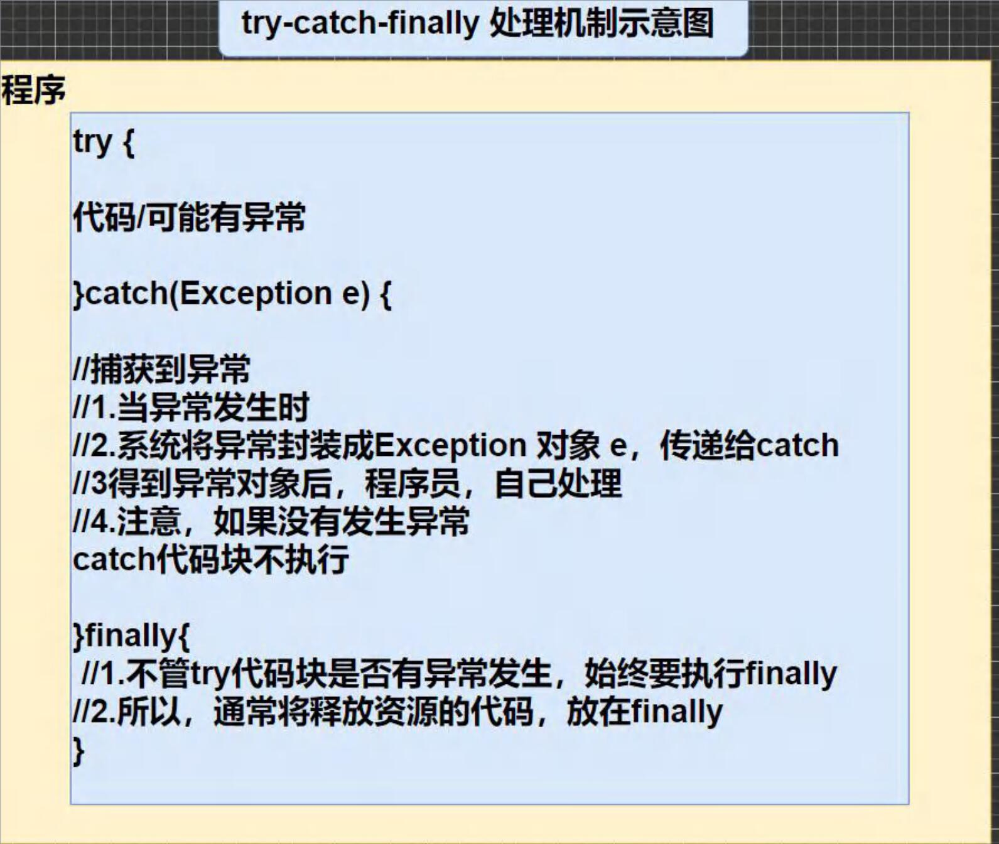
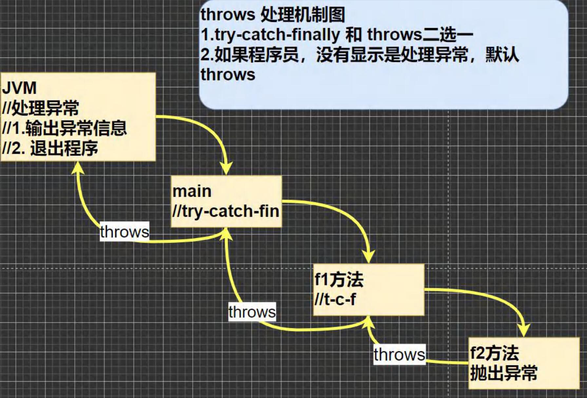
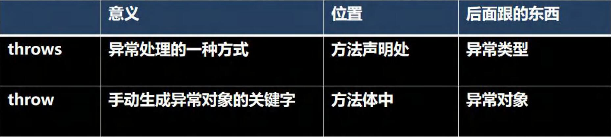

# 异常的概念

看运行下面的代码，看看有什么问题--> 引出异常和异常处理机制

```java
public static void main(String[] args) {
    int num1 = 10;
    int num2 = 0;
    int res = num1 / num2;
    System.out.println("程序继续运行....");
}
```

### 异常介绍

#### 基本概念

Java语言中，将程序执行中发生的不正确情况称为"异常"。（开发过程中的语法错误和逻辑错误不是异常）

- 执行过程中所发生的异常时间可分为两大类
  1. Error（错误）：Java虚拟机无法解决的严重问题。如：JVM系统内部错误，资源耗尽等严重情况。比如：StackOverflowError [栈溢出]和OOM（out of memory），Error 是严重错误，程序会崩溃
  2. Exception：其他因编译错误或偶然的外在因素导致的一般性问题，可以使用针对性的代码进行处理。例如空指针访问，试图读取不存在的文件，网络连接中断等等，Exception分为两大类：**运行时异常**[程序运行时，发生的异常]和**编译时错误**[编译时，编译器检查出的异常]

# 异常体系图⭐



### 异常体系图的小结

1. 异常分为两大类，运行时异常和编译时异常
2. 运行时异常，编译器检查不出来。一般是指编程时的逻辑错误，是程序员应该避免其出现的异常。java.lang.RuntimeException类及它的子类都是运行时异常
3. 对于运行时异常，可以不作处理，因为这类异常很普遍，若全处理可能会对程序的可读性和运行效率产生影响
4. 编译时异常，是编译器要求必须处置的异常

# 常见的运行异常

1. NullPointerException 空指针异常 
2. ArithmeticException 数学运算异常 
3. ArrayIndexOutOfBoundsException 数组下标越界异常 
4. ClassCastException 类型转换异常 
5. NumberFormatException 数字格式不正确异常[]

### 常见的运行时异常举例

1. NullPointerException 空指针异常

   当应用程序试图在需要对象的地方使用 null 时，抛出该异常

2. ArithmeticException 数学运算异常

   当出现异常的运算条件时，抛出此异常。例如，一个整数“除以零”时

3. ArrayIndexOutOfBoundsException 数组下标越界异常

   用非法索引访问数组时抛出的异常。如果索引为负或大于等于数组大小，则该索引为非法索引

4. ClassCastException 类型转换异常

   当试图将对象强制转换为不是实例的子类时，抛出该异常。

5. NumberFormatException 数字格式不正确异常

   当应用程序试图将字符串转换成一种数值类型，但该字符串不能转换为适当格式时，抛出该异常 => 使用异常我们可以确保输入是满足条件数字.

# 常见的编译异常

1. SQLException	操作数据库时，查询表可能发生异常
2. IOException        操作文件时，发生的异常
3. FileNotFoundException        当操作一个不存在的文件时，发生异常
4. ClassNotFoundException      加载类，而该类不存在时，异常
5. EOFException      操作文件，到文件末尾，发生异常
6. IllegalArguementException   参数异常

# 异常处理⭐

### 基本介绍

异常处理就是当异常发生时，对异常处理的方式

### 异常处理的方式

1. try-catch-finally

   程序员在代码中捕获发生的异常自行处理

2. throws

   将发生的异常抛出，交给调用者（方法）来处理，最顶级的处理者就是JVM

### 示意图





### try-catch 方式处理异常-注意事项

1. 如果异常发生了，则异常发生后面的代码不会执行，直接进入到catch块.
2. 如果异常没有发生,则顺序执行try的代码块,不会进入到catch.
3. 如果希望不管是否发生异常，都执行某段代码(比如关闭连接,释放资源等)则使用如下代码- finally {}
4. 可以有多个catch语句，捕获不同的异常(进行不同的业务处理),要求父类异常在后,子类异常在前，比如(Exception在后，NullPointerException在前)，如果发生异常，只会匹配一个
5. 可以进行try-finally 配合使用，这种用法**相当于没有捕获异常**，因此程序会直接崩掉/退出。应用场景，就是执行一段代码，不管是否发生异常，都必须执行某个业务逻辑

#### try-catch小结

1. 如果没有出现异常，则执行try 块中所有语句，不执行catch块中语句，如果有finally，最后还需要执行finally里面的语句
2. 如果出现异常，则try块中异常发生后，剩下的不再执行。将执行catch块中的语句，如果有finally，最后还需要执行finally里面的语句

### throws 方式处理异常-注意事项

1. 对于编译异常，程序中必须处理，比如try-catch或者 throws
2. 对于运行时异常,程序中如果没有处理，默认就是throws的方式处理
3. 子类重写父类的方法时，对抛出异常的规定:子类重写的方法，所抛出的异常类型要么和父类抛出的异常一致,要么为父类抛出的异常的类型的子类型
4. 在throws 过程中，如果有方法try-catch,就相当于处理异常，就可以不必throws

# 自定义异常

### 基本概念

当程序中出现了某些“错误”，但该错误信息并没有在Throwable子类中描述处理,这个时候可以自己设计异常类,用于描述该错误信息。

### 自定义异常的步骤

1. 定义类:自定义异常类名(程序员自己写)继承Exception或RuntimeException
2. 如果继承Exception,属于编译异常
3. 如果继承RuntimeException,属于运行异常(一般来说，继承RuntimeException)

# throw和throws的对比

### 一览表

