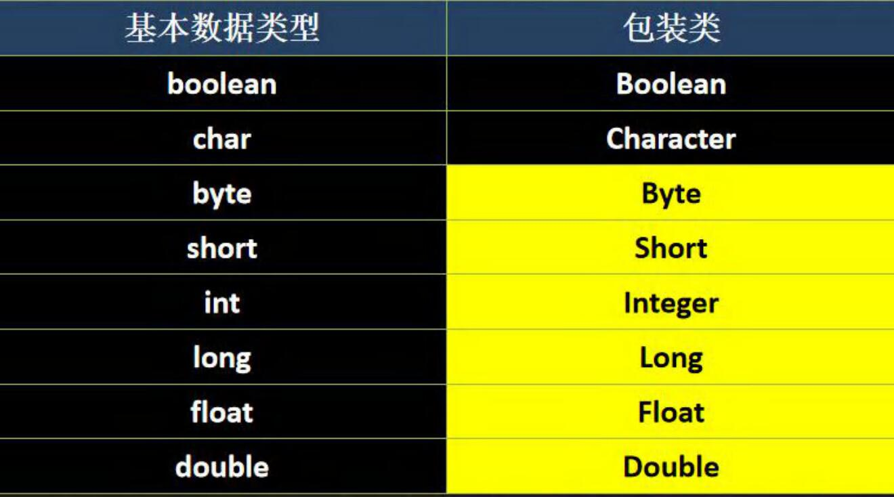
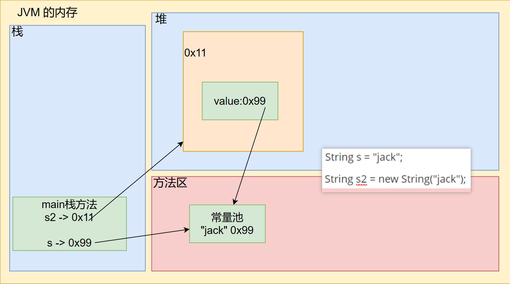
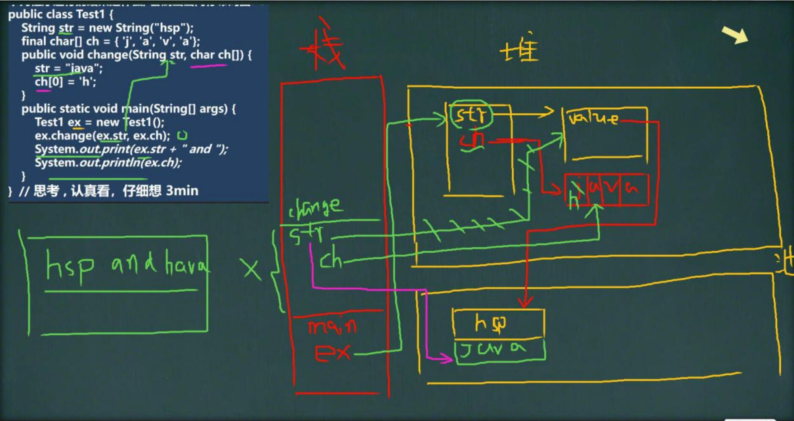

# 包装类

### 包装类的分类

针对八种基本数据类型相应的引用类型—包装类

有了类的特点，就可以调用类中的方法

如图:（黄色的那几个的父类是Number）



### 包装类和基本数据的转换

演示包装类和基本数据类型的相互转换,这里以int 和 Integer演示。

1. jdk5前的手动装箱和拆箱方式，装箱:基本类型->包装类型,反之，拆箱
2. jdk5 以后(含jdk5)的自动装箱和拆箱方式
3. 自动装箱底层调用的是valueOf方法, 比如Integer.valueOf()
4. 自动拆箱底层调用的是intValue方法
5. 其它包装类的用法类似,不一一举例

```java
		//演示 int <--> Integer 的装箱和拆箱
        //手动装箱 int -> Integer
        int n1 = 100;
        Integer integer1 = new Integer(n1);
        Integer integer2 = Integer.valueOf(n1);

        //手动拆箱 Integer -> int
        int i = integer1.intValue();

        //自动装箱 和 自动拆箱
        int n2 = 200;
        //自动装箱
        Integer integer3 = n2;//底层使用的是Integer.valueOf(n2);
        //自动拆箱
        int n3 = integer3;//底层仍然使用的是intValue()方法
```

### 包装类型和 String 类型的相互转换

```java
		//包装类（Integer） -> String
        Integer i = 100;//自动装箱
        //方式1
        String str1 = i + "";
        //方式2
        String str2 = i.toString();
        //方式3
        String str3 = String.valueOf(i);

        //String -> 包装类
        String str4 = "12345";
        Integer i2 = Integer.parseInt(str4);//自动装箱
        Integer i3 = new Integer(str4);//构造器
```

### Integer 类和 Character 类的常用方法

```java
		System.out.println(Integer.MAX_VALUE);//返回最小值
        System.out.println(Integer.MIN_VALUE);//返回最大值

        System.out.println(Character.isDigit('a'));//判断是不是数字
        System.out.println(Character.isLetter('a'));//判断是不是字母
        System.out.println(Character.isUpperCase('a'));//判断是不是大写
        System.out.println(Character.isLowerCase('a'));//判断是不是小写
        System.out.println(Character.isWhitespace('a'));//判断是不是空格

        System.out.println(Character.toUpperCase('a'));//转成大写
        System.out.println(Character.toLowerCase('A'));//转成小写
```

大致了解一下，需要使用的时候再去查

### Integer创建机制

```java
		Integer i = new Integer(1);
        Integer j = new Integer(1);
        System.out.println(i == j); // False
        //所以，这里主要是看范围 -128~127 就是直接返回
        Integer m = 1;//底层 Integer.valueOf(1); -> 阅读源码
        Integer n = 1;//底层 Integer.valueOf(1); -> 阅读源码
        System.out.println(m == n);  //True
        //所以，这里主要是看范围 -128~127 就是直接返回
        //否则就 new Integer(xx);
        Integer x = 128;//底层 Integer.valueOf(128); -> 阅读源码
        Integer y = 128;//底层 Integer.valueOf(128); -> 阅读源码
        System.out.println(x == y);  //False
```

# String⭐

一个类实现了 Serializable， 说明 可以串行化，可以用于网路传输

一个类实现了 Comparable， 说明 它的对象可以相互比较（比较大小）

### String 类的理解和创建对象

1. String 对象用于保存字符串，也就是一组字符序列
2. 字符串常量对象是用双引号括起来的字符序列。例如："你好"、"12.97"、"boy" 等
3. 字符串的字符使用Unicode字符编码，一个字符（不区分字母还是汉字）占两个字节
4. String类较常用构造器(其他看手册):
   - String s1 = new String();
   - String s2 = new String(String original);
   - String s3 = new String(char[] a);
   - String s4 = new String(char[] a, int startIndex, int count);

### 创建 String 对象的两种方式

1. 方式一 : 直接赋值     String s = "jack";
2. 方式二 : 调用构造器 String s2 = new String("jack");

### 两种创建 String 对象的区别

1. 方式一:先从常量池查看是否有"hsp"数据空间,如果有，直接指向;如果没有则重新创建,然后指向。S最终指向的是常量池的空间地址

2. 方式二:先在堆中创建空间，里面维护了value属性，指向常量池的hsp空间如果常量池没有"hsp"，重新创建，如果有，直接通过value指向。最终指向的是堆中的空间地址。

3. 画出两种方式的内存分布图

   

```java
		System.out.println(s == s2);//false//s2 地址在堆，s 地址在常量池
        System.out.println(s == s2.intern());//true //s2.intern()返回常量池地址
```

### 字符串的特性

1. String是一个final类， 代表不可变的字符序列

2. 字符串是不可变的。一个字符串对象-旦被分配， 其内容是不可变的

3. 编译器不是傻，会做优化，判断创建的常量池对象，是否有引用指向

   String a = "hello" + "abc";  => String a = "helloabc";

4. 底层是StringBuilder sb = new StringBuilder();

   sb.append(a);sb.append(b);sb是在堆中，并且append是在原来的字符串的基础上追加。

   ```java
   		String a = "hello";
           String b = "abc";
           //1.先创建一个 StringBuilder()
           //2.执行 sb.append("hello")
           //3.执行 sb.append("abc")
           //4.String c = sb.toString()
           //最后其实 c 指向堆中的对象（String）value[] -> 池中"helloabc"
           String c = a + b;//变量相加地址在堆中//自己下断点看看
   		String d = "helloabc";//常量相加地址在常量池中
           System.out.println(c == d);//false
   ```

**学习思路一定尽量看源码学习**

 5.数组传递是传递地址

```java
class Test{
	//    String str = new String("hsp");
    String str = "hsp";
    final char[] ch = {'j', 'a', 'v', 'a'};

    public void change(String str, char ch[]) {
        str = "java";
        ch[0] = 'h';
    }

    public static void main(String[] args) {
        Test ex = new Test();
        ex.change(ex.str, ex.ch);
        System.out.print(ex.str + " and ");
        System.out.println(ex.ch);
        //hsp and hava
    }
}
```



### String 类的常见方法

#### 说明

String类是保存字符串常量的。每次更新都需要重新开辟空间，效率较低,因此java设计者还提供了**StringBuilder**和 **StringBuffer** 来增强String的功能,并提高效率。[后面我们还会详细介绍 StringBuilder 和 StringBuffer]

#### String 类的常见方法一览[告诉你怎么用，就可以，不用背，后面要用再查]

- equals                             //区分大小写，判断内容是否相等
- equalslgnoreCase          //忽略大小写的判断内容是否相等
- length                              //获取字符的个数,字符串的长度
- indexOf                           //获取字符或字符串在字符串中第1次出现的索引,索引从0开始,如果找不到,返回-1
- lastIndexOf                    //获取字符或字符串在字符串最后一次出现的索引，索引从0开始，如果找不到，返回 -1
- substring                        //截取指定范围的子串
- trim                                 //去前后空格
- charAt                            //获取某索引处的字符,注意不能使用Str[index]这种方式.

### String 类的常见方法2一览

- toUpperCase                 //转换成大写
- toLowerCase 
- concat                             //拼接字符串
- replace                           //替换字符串中的字符或字符串
- split                                 //分割字符串,对于某些分割字符，我们需要 转义比如 | \\ 等
- toCharArray                  //转成字符数组
- compareTo                    //比较两个字符串的大小，如果前者大,则返回正数，后者大，则返回负数，如果相等，返回0
- format                             //拼接字符串（看源码就行）或者了解C语言就行

# StringBuffer⭐

### 基本介绍

- java.lang.StringBuffer 代表可变的字符序列，可以对字符串内容进行增删
- 很多方法与String想同，但StringBuffer是可变长度的
- StringBuffer是一个容器

### String VS StringBuffer

1. String保存的是字符串常量，里面的值不能更改，每次String类的更新实际上就是更改地址，效率较低//private final char value[];
2. StringBuffer保存的是字符串变量,里面的值可以更改，每次StringBuffer的更新实际上可以更新内容，不用每次更新地址，效率较高

### String and StringBuffer相互转换

```java
		// String --> StringBuffer
        String str = "Hello tom";
        //方式1 使用构造器
        //注意：返回的才是StringBuffer对象，对str 本身没有影响
        StringBuffer stringBuffer = new StringBuffer(str);
        //方式2 使用的是append方法
        StringBuffer stringBuffer1 = new StringBuffer();
        stringBuffer1 = stringBuffer1.append(str);

        //StringBuffer --> String
        StringBuffer stringBuffer2 = new StringBuffer("litchi");
        //方式1 使用StringBuffer提供的 toString方法
        String s = stringBuffer2.toString();
        //方式2 使用构造器来搞定
        String s1 = new String(stringBuffer2);
```

### StringBuffer类的常见方法

1. 增 append
2. 删 delete(start, end)
3. 改 replace(start, end, string)//将start --- end 间的内容换掉，不含end
4. 查 indexOf //查找子串在字符串第1次出现的索引，如果找不到返回 -1
5. 插 insert
6. 获取长度 length

# StringBuilder⭐

### 基本介绍

1. 一个可变的字符序列。此类提供一个与StringBuffer 兼容的API,但不保证同步(StringBuilder不是线程安全)。该类被设计用作 StringBuffer的一个简易替换,**用在字符串缓冲区被单个线程使用的时候**。如果可能,建议优先采用该类，因为在大多数实现中，它比 StringBuffer 要快[后面测]。
2. 在 StringBuilder 上的主要操作是append和insert 方法，可重载这些方法,以接受任意类型的数据。

### StringBuilder 常用方法

StringBuilder 和 StringBuffer 均代表可变的字符序列，方法是一样的，所以使用和StringBuffer一样

### String、StringBuffer 和 StringBuilder 的比较

1. StringBuilder 和 StringBuffer非常类似，均代表可变的字符序列，而且方法也一样

2. String:不可变字符序列,效率低,但是复用率高。

3. StringBuffer:可变字符序列、效率较高(增删)、线程安全,看源码

4. StringBuilder:可变字符序列、效率最高、线程不安全

5. String使用注意说明:

   string s="a";//创建了一个字符串

   S+= "b";//实际上原来的"a"字符串对象已经丢弃了，现在又产生了一个字符串s+"b”(也就是"ab")。如果多次执行这些改变串内容的操作，会导致大量副本字符串对象存留在内存中，降低效率。如果这样的操作放到循环中，会极大影响程序的性能 => **结论:如果我们对String 做大量修改，不要使用String**

### String、StringBuffer 和 StringBuilder 的选择

### 使用原则，结论：

1. 如果字符串存在大量的修改操作,一般使用 StringBuffer 或Stringuilder
2. 如果字符串存在大量的修改操作,并在单线程的情况,使用 StringBuilder
3. 如果字符串存在大量的修改操作,并在多线程的情况,使用 StringBuffer
4. 如果我们字符串很少修改,被多个对象引用，使用String,比如配置信息等

# Math

### 基本介绍

Math 类包含用于执行基本数学运算的方法，如初等指数、对数、平方根和三角函数

### 方法一览(均为静态方法)

1. abs 绝对值
2. pow 求幂
3. ceil 向上取整，返回 >= 该参数的最小整数
4. floor 向下取整，返回 <= 该参数的最大整数
5. round 四舍五入 Math.floor(该参数 + 0.5)
6. sqrt 求开方
7. random 求随机数
8. max,min 求最大值，最小值

思考：请写出获取 a - b 之间的一个随机整数

```java
(int)(a) <= x <= (int)(a + Math.random() * (b - a + 1))
```

# Date、Calendar、LocalDate...

### 第一代日期类

1. Date ：精确到毫秒，代表特定的瞬间
2. SimpleDateFormat：格式和解析日期的类SimpleDateFormat格式化和解析日期的具体类。它允许进行格式化（日期 -> 文本）、解析（文本 -> 日期）和规范化

```java
		//1.获取当前系统时间
        //2.这里的Date 类是在java.util包
        //3.默认输出的日期格式是国外的方式，因此通常需要对格式进行转换
        Date d1 = new Date();//获取当前系统时间
        System.out.println("当前日期 = " + d1);
        Date d2 = new Date(9234567);//通过来指定毫秒数得到时间
        System.out.println(d2);//获取某个时间对应的毫秒数

        //1.创建 SimpleDateFormat对象，可以指定相应的格式
        //2.这里的格式使用的字母是规定好，不能乱写
        SimpleDateFormat sdf = new SimpleDateFormat("yyyy年MM月dd日 hh:mm:ss E");
        String format = sdf.format(d1);
        System.out.println("当前日期 = " + format);

        //1.可以把一个格式化的String 转成对应的 Date
        //2.得到Date 仍然在输出时，还是国外的形式，如果希望指定格式输出，需要转换
        //3.在把 String -> Date, 使用的 sdf 格式需要和你给的 String 的格式一样，否则会抛出转换异常
        String s = "1996年01月01日 10:20:30 星期一";
        Date parse = sdf.parse(s);
        System.out.println("parse = " + sdf.format(parse));
```

### 第二代日期类

1. Calendar类（日历）
2. Calendar 类是一个抽象类，它为特定瞬间与一组诸如YEAR、MONTH、DAY_OF_MONTH、HOUR等日历室段之间的转换提供了一些方法，并为操作日历字段（例如获得下星期的日期）提供了一些方法。

### 第三代日期类

#### 前面两代日期类的不足分析

JDK1.0中包含了一个java.util.Date类，但是它的大多数已经在JDK1.1引入Calendar类之后被弃用了。

而Calendar也存在问题是：

1. 可变性：像日期和时间这样的类应该是不可变的
2. 偏移性：Date中的年份是从1900开始，而月份都从0开始
3. 格式化：格式化只对Date有用，Calendar则不行
4. 此外，它们也不是线程安全的；不能处理闰秒等（每隔2天，多出1s）

#### 常见方法

LocalDate(日期/年月日)、LocalTime(时间/时分秒)、LocalDateTime(日期时间/年月日时分秒) JDK8加入

LocalDate只包含日期，可以获取日期字段

LocalTime只包含时间，可以获取时间字段

LocalDateTime包含日期+时间，可以获取日期和时间字段

```java
		LocalDateTime ldt = LocalDateTime.now();//LocalDate.now();//LocalTime.now();
        System.out.println(ldt);
        System.out.println("年=" + ldt.getYear());
        System.out.println("月=" + ldt.getMonthValue());
        System.out.println("月=" + ldt.getMonth());
        System.out.println("日=" + ldt.getDayOfMonth());
        System.out.println("时=" + ldt.getHour());
        System.out.println("分=" + ldt.getMinute());
        System.out.println("秒=" + ldt.getSecond());

		//2. 使用 DateTimeFormatter 对象来进行格式化
        // 创建 DateTimeFormatter 对象
        DateTimeFormatter dateTimeFormatter = DateTimeFormatter.ofPattern("yyyy-MM-dd 			HH:mm:ss");
        String format = dateTimeFormatter.format(ldt);
        System.out.println("格式化的日期=" + format);

		//提供 plus 和 minus 方法可以对当前时间进行加或者减
        //看看 890 天后，是什么时候 把 年月日-时分秒
        LocalDateTime localDateTime = ldt.plusDays(890);
        System.out.println("890 天后=" + dateTimeFormatter.format(localDateTime));
        //看看在 3456 分钟前是什么时候，把 年月日-时分秒输出
        LocalDateTime localDateTime2 = ldt.minusMinutes(3456);
        System.out.println("3456 分钟前 日期=" + 								  dateTimeFormatter.format(localDateTime2));
```

#### Instant 时间戳

类似于Date

提供了一系列与Date类转换的方式

```java
        //1.通过 静态方法 now() 获取表示当前时间戳的对象
        Instant now = Instant.now();
        System.out.println(now);
        //2. 通过 from 可以把 Instant 转成 Date
        Date date = Date.from(now);
        //3. 通过 date 的 toInstant() 可以把 date 转成 Instant 对象
        Instant instant = date.toInstant();
```

# System

### System 类常见方法

1. exit 退出当前程序
2. arraycopy:复制数组元素，比较适合底层调用，一般使用Arrays.copyOf 完成复制数组
3. currentTimeMillens：返回当前时间距离1970-1-1 的毫秒数
4. gc：运行垃圾回收机制 System.gc()；

# Arrays

Arrays里面包含了一系列静态方法，用于管理或操作数组(比如 排序 和 搜索)

1. toString 返回数组的字符串形式

   Arrays.toString(arr)

2. sort 排序 (自然排序和定制排序) Integer[] arr = {1, -1, 7, 0, 89};

   ArraysSortCustom.java

3. binarySearch 通过二分搜索法进行查找，要求必须排好序

4. copyOf 数组元素的复制

5. fill 数组元素的填充

6. equals 比较两个数组元素内容是否完全一致

7. asList 将一组值，转换成list

# BigInteger 和 BigDecimal

### 应用场景

1. BigInteger适合保存比较大的整形
2. BigDecimal适合保存精度更高的浮点型（小数）

### BigInteger 和 BigDecimal 常见方法

1. add 加
2. subtract 减
3. multiple 乘
4. divide 除