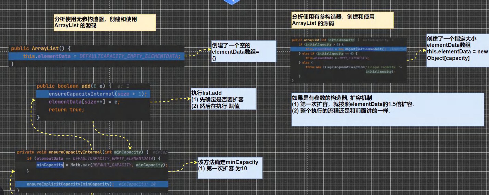

# 集合

### 集合的理解和好处

前面我们保存多个数据使用的是**数组**，那么数组有不足的地方，我们分析一下

#### 数组

1. 长度开始时必须指定，而且一旦指定，不能更改
2. 保存的必须为同一类型的元素
3. 使用数组进行增加/删除元素--比较麻烦

#### 集合

1. 可以**动态保存**任意多个对象，使用比较方便！
2. 提供了一系列方便的操作对象的方法：add、remove、set、get等
3. 使用集合添加，删除新元素的示意代码--简洁了

# 集合框架体系⭐

Java 的集合类很多，主要分为两大类，如图 ：[背下来]


# Collection

### Collection 接口实现类的特点

public interface Collection<E> extends Iterable<E>

1. collection实现子类可以存放多个元素，每个元素可以是Object
2. 有些Collection的实现类,可以存放重复的元素，有些不可以
3. 有些Collection的实现类，有些是有序的(List)，有些不是有序(Set)
4. Collection接口没有直接的实现子类,是通过它的子接口Set和 List来实现的

### Collection 接口常用方法（以实现子类 ArrayList 来演示）

1. add:添加单个元素
2. remove:删除指定元素
3. contains:查找元素是否存在
4. size:获取元素个数
5. isEmpty:判断是否为空
6. clear:清空
7. addAll:添加多个元素
8. containsAll:查找多个元素是否都存在
9. removeAll：删除多个元素

### Collection 接口遍历元素方式 1-使用 Iterator(迭代器)

#### 基本介绍

1. Iterator对象称为迭代器,主要用于遍历Collection集合中的元素。

2. 所有实现了Collection接口的集合类都有一个iterator()方法，用以返回一个实现了lterator接口的对象,即可以返回一个迭代器。

3. lterator的结构.[看一张图]

   

4. Iterator仅用于遍历集合,Iterator本身并不存放对象。

提示：在调用 iterator.next() 方法之前必须要调用 iterator.hasNext() 进行检测。若不调用，且下一条记录无效，直接调用 it.next() 会抛出NoSuchElementException异常

### Collection 接口遍历对象方式 2-for 循环增强

#### 基本介绍

增强for循环，可以代替iterator迭代器，特点：增强for就是简化版的iterator，本质一样。只能用于遍历集合或数组          //增强for，底层仍然是迭代器

#### 基本语法

```txt
for(元素类型 元素名：集合名或数组名){
	//操作代码；
}
```

# List

### List 接口和常用方法

#### 基本介绍

List 接口是 Collection 接口的子接口

1. List集合类中元素有序(即添加顺序和取出顺序一致)、且可重复

2. List集合中的每个元素都有其对应的顺序索引，即支持索引。

3. List容器中的元素都对应一个整数型的序号记载其在容器中的位置,可以根据序号存取容器的中元素

4. JDK API中 List 接口的实现类由：很多很多很多

   常用的有：ArrayList、LinkedList 和 Vector

#### List 接口的常用方法

- add                 在index位置插入ele元素
- addAll             在index位置开始将eles中的元素添加进来
- get                   获取index位置的元素
- indexOf           返回obj在集合中首次出现的位置
- lastIndexOf    返回obj在集合中最后一次出现的位置
- remove           移除指定index位置的元素，并返回此元素
- set                   设置指定index位置的元素为ele，相当于替换
- subList           返回从fromIndex到toIndex位置的子集合

# ArrayList⭐底层结构和源码分析

### ArrayList 的注意事项

1. permits all elements, including null ,ArrayList可以加入null,并且多个
2. ArrayList是由数组来实现数据存储的[后面解读源码]
3. ArrayList 基本等同于Vector（多线程考虑用这个）,除了ArrayList是线程不安全(执行效率高)看源码.在多线程情况下,不建议使用ArrayList

### ArrayList 的底层操作机制源码分析(**<u>重点，难点</u>**.)

1. ArrayList 中维护了一个Object类型的数组 elementData。

   **transient** Object[] elementData;  // **transient 表示瞬间，短暂的，表示该属性不会被序列化**

2. 当创建 ArrayList 对象时，如果使用的是无参构造器，则初始 elementData 容量为0，第一次添加，则扩容elementData 为 10，如需要再次扩容，则扩容 elementData 为 1.5 倍

3. 如果使用的是指定大小的构造器，则初始化 element 容量为指定大小，如果需要扩容，则直接扩容 elementData 为 1.5 倍

建议：自己去 debug 一把我们的 ArrayList 的创建和扩容的流程




# Vector⭐

### Vector 的基本介绍

1. Vector 类的定义说明

   ```java
   public class Vector<E>
       extends AbstractList<E>
       implements List<E>, RandomAccess, Cloneable, java.io.Serializable
   ```

2. Vector 底层也是一个对象数组，protected Object[] elementData;

3. Vector 是线程同步的，即线程安全，Vector类的操作方法带有 **synchronized**

4. 在开发中，需要线程同步安全时，考虑使用 Vector

### Vector 和 ArrayList 的比较


# LinkedList

### LinkedList 的全面说明

1. LinkedList 底层实现了双向**链表**和双端**队列**特点
2. 可以添加任意元素（元素可以重复），包括null
3. 线程不安全，没有实现同步

### LinkedList 的底层操作机制

1. LinkedList 底层维护了一个双向链表
2. LinkedList 中维护了两个属性 first 和 last 分别指向 首节点 和 尾节点
3. 每个节点 （Node对象），里面又维护了 prev，next，item三个属性，其中通过 prev 指向前一个，通过next 指向后一个节点。最终实现双向链表
4. 所以 LinkedList 的元素的**添加和删除**，不是通过数组完成的，相对来说效率较高
5. 模拟一个**简单**的双向链表 LinkedList01.java

### ArrayList 和 LinkedList 的比较


如何选择 ArrayList 和 LinkedList

1. 如果我们改查的操作多，选择 ArrayList
2. 如果我们增删的操作多，选择 LinkedList
3. 一般来说，在程序中，80% ~ 90% 都是查询，因此大部分情况下会选择 ArrayList
4. 在一个项目中，根据业务灵活选择，也可能这样，一个模块使用的是 ArrayList，另外一个模块是 LinkedList，也就是说，要根据业务来进行选择

# Set

### Set 接口基本介绍

1. 无序（添加和取出的顺序不一致)，没有索引
2. 不允许重复元素，所以最多包含一个null
3. JDK API中Set接口的实现类有很多，常用的有：HashSet、LinkedHashSet 和 TreeSet

### Set 接口的常用方法

和 List 接口一样, Set 接口也是 Collection 的子接口，因此，常用方法和 Collection 接口一样

### Set 接口的遍历方式

同 Collection 的遍历方式一样，因为 Set 接口是 Collection 接口的子接口

1. 可以使用迭代器
2. 增强for
3. **不能使用**索引的方式来获取

# HashSet⭐

### HashSet 的全面说明

1. HashSet 实现了 Set 接口

2. HashSet 实际上是 HashMap，看下源码

   ```java
   public HashSet() {
   	map = new HashMap<>();
   }
   ```

3. 可以存放 null 值，但是只能有一个 null

4. HashSet 不保证元素是有序的，取决于 hash 后，再确定索引的结果。（即，不保证存放元素的顺序和取出顺序一致）

5. 不能有重复元素/对象。在前面 Set 接口使用已经讲过

### HashSet 底层机制说明

#### 分析 HashSet 底层是 HashMap，HashMap 底层是（数组 + 链表 + 红黑树）

为了让大家真正理解，模拟简单的 数组 + 链表结构 	HashSetStructure.java

为什么不直接用数组，因为效率较低

####  分析 HashSet 的添加元素底层是如何实现（ hash() + equals() ）

1. HashSet 底层是 HashMap
2. 添加一个元素时，先得到 hash 值 --会转成 --> 索引值
3. 找到存储数据表 table，看这个索引位置是否已经存放的有元素
4. 如果没有，直接加入
5. 如果有，调用 equals 比较，如果相同，就放弃添加；如果不相同，则添加到最后
6. 在 Java8 中，如果一条链表的元素个数到达 TREEIFY_THRESHOLD(默认是 8 )，并且 table 大小 >= MIN_TREEIFY_CAPACITY(默认 64) 就会进化树话（红黑树）


Debug源码 + 图解

#### 分析 HashSet 的**<u>扩容</u>**和<u>转成红黑树机制</u></u>

1. HashSet 底层是 HashMap ,第一次添加时, table 数组扩容到16，临界值( threshold )是16*加载因子(LoadFactor)是0.75 = 12
2. 如果table 数组使用到了临界值12,就会扩容到16**2=32,新的临界值就是32*0.75 = 24,依次类推
3. 在Java8中，如果一条链表的元素个数到达 TREEIFY THRESHOLD(默认是8)并且table的大小 >= MIN_TREEIFY_CAPACITY(默认 64 ),就会进行树化(红黑树)，**否则仍然采用数组扩容机制**

# LinkedHashSet

### LinkedHashSet 的全面说明

1. LinkedHashSet  是 HashSet 的子类
2. LinkedHashSet 底层是一个 LinkedHashMap，底层维护了一个数组+双向链表
3. LinkedHashSet 根据元素的 hashCode 值来决定元素的存储位置,同时使用链表维护元素的**次序**(图),这使得元素看起来是以插入顺序保存的.
4. LinkedHashSet 不允许添重复元素


# Map [很实用]

### Map 接口实现类的特点 [很实用]

注意：这里讲的是 JDK8 的 Map 接口特点

1. Map 与 Collection 并列存在(两个都是集合的大类)。用于保存具有映射关系的数据:Key-Value
2. Map 中的 key 和 value 可以是任何引用类型的数据，会封装到 HashMap$Node 对象中
3. Map 中的 key 不允许重复，**原因和 HashSet 一样，前面分析过源码.**
4. Map 中的 value 可以重复
5. Map 的 key 可以为 null, value 也可以为 null，注意 key 为 null, 只能有一个,value 为 null ,可以多个.
6. 常用 String 类作为 Map 的 key
7. key 和 value之间存在单向一对一关系，即通过指定的 key 总能找到对应的 value
8. Map 存放数据的 key - value 示意图，一堆 k - v 是放在一个 HashMap$Node 中的，有因为 Node 实现了 Entry 接口，有些书上也说 一对 k-v 就是一个 Entry 


### Map 接口常用方法

- put：添加
- remove：根据键删除映射关系
- get：根据键获取值
- size：获取元素个数
- isEmpty：判断个数是否为 0
- clear：清除 k-v
- containsKey：查找键是否存在

### Map 接口遍历方法

比 List 和 Set 复杂点，但是基本原理一样

1. containsKey：查找键是否存在
2. keySet：获取所有的键
3. entrySet：获取所有关系 k-v
4. values：获取所有值

# HashMap⭐

### HashMap 小结

1. Map接口的常用实现类:HashMap、Hashtable和Properties。
2. HashMap是 Map接口使用频率最高的实现类。
3. HashMap是以 key-val对的方式来存储数据(HashMap$Node类型)
4. key不能重复,，但是值可以重复,允许使用null键和null值。
5. 如果添加相同的key,则会覆盖原来的key-val,等同于修改.(key不会替换，val会替换)
6. 与HashSet一样,不保证映射的顺序,因为底层是以hash表的方式来存储的.(jdk8的hashMap底层数组+链表+红黑树)
7. HashMap没有实现同步，因此是线程不安全的，方法没有做同步互斥的操作,没有synchronized

### HashMap 底层机制及源码剖析


扩容机制 [和 HashSet 相同]

1. HashMap 底层维护了 Node 类型的数组 table,默认为 null
2. 当创建对象时，将加载因子( loadfactor )初始化为0.75.
3. 当添加 key-val 时,通过 **key** 的哈希值得到在 table 的索引。然后判断该索引处是否有元素,如果没有元素直接添加。如果该索引处有元素，继续判断该元素的 key 和准备加入的 key 相是否等，如果相等，则直接替换 val; 如果不相等需要判断是树结构还是链表结构，做出相应处理。如果添加时发现容量不够，则需要扩容。
4. 第1次添加，则需要扩容 table 容量为16,临界值( threshold )为12 (16*0.75)
5. 以后再扩容，则需要扩容table容量为原来的2倍(32)，临界值为原来的2倍，即24，依次类推.
6. 在Java8中,如果一条链表的元素个数超过 TREEIFY_THRESHOLD(默认是8),并且table的大小 >= MIN_TREEIFY_CAPACITY(默认64),就会进行树化(红黑树)

# Hashtable

### 基本介绍

1. 存放的元素是键值对：即 K-V
2. Hashtable 的建和值都不能为 null
3. Hashtable 使用方法基本上和 HashMap 一样
4. Hashtable 是线程安全的，HashMap 是线程不安全的
5. 简单看下底层结构（debug）

### Hashtable 和 HashMap 对比


# Properties

### 基本介绍

1. Properties 类继承自 Hashtable 类并且实现了 Map 接口，也是使用一种键值对的形式来保存数据。
2. 它的使用特点和 Hashtable 类似 
3. Properties **还可以用于** 从xxx.properties文件中，加载数据到 Properties 类对象,并进行读取和修改
4. 说明:工作后 xxx.properties 文件通常作为配置文件，这个知识点在 IO 流举例，有兴趣可自己去找找文章看看

### 基本使用

```java
		//1.Propertier 继承 Hashtable
        //2.可以通过 k-v 存放数据，当然 key 和 value 不能为null
        Properties properties = new Properties();
        //增
        properties.put("john", 100);//k-v
//        properties.put(null, 100);//抛出 空指针异常
//        properties.put("john", null);//抛出 空指针异常
        properties.put("lucy", 100);//k-v
        properties.put("lic", 100);//k-v
        properties.put("lic", 88);//替换v

        System.out.println("properties=" + properties);

        //查 通过 k 获取对应值
        System.out.println(properties.get("lic"));
        properties.getProperty("lic");//自己debug去
        System.out.println(properties.getProperty("lic"));

        //删除
        properties.remove("lic");
        System.out.println("properties=" + properties);

        //修改
        properties.put("john", "约翰");//就是替换v
        System.out.println("properties=" + properties);
```

# 总结-开发中如何选择集合实现类(记住)

在开发中，选择什么集合实现类，主要取决于**业务操作特点**，然后根据集合实现类特性进行选择,分析如下:

1. 先判断存储的类型(一组对象[单列]或一组键值对[双列])

2. 一组对象[单列] : Collection 接口

   ​		  允许重复 : List

   ​				增删多 : LinkedList [底层维护了一个双向链表]

   ​				改查多 : ArrayList [底层维护 Object 类型的可变数组]

   ​		 不允许重复 : Set

   ​				无序 : HashSet [底层是 HashMap，维护了一个哈希表 即(数组+链表+红黑树)]

   ​				排序 : **TreeSet** [老韩举例说明] 

   ​				插入和取出顺序一致 : LinkedHashSet [底层 LinkedHashMap 的底层 HashMap]，维护数组 + 双向链表

3. 一组键值对[双列] : Map

   ​		 键无序 : HashMap [底层是 : 哈希表 jdk7 : 数组+链表 , jdk8 : 数组 + 链表 + 红黑树]

   ​		 键排序 : **TreeMap** [老韩举例说明] 

   ​		 键插入和取出顺序一致 : LinkedHashMap

   ​		 读取文件 Properties

# TreeSet

(最大特点就是可排序) 

TreeSet_.java

底层是 TreeMap

# TreeMap

(最大特点就是可排序) 

TreeMap_.java

# Collections

### 基本介绍

1. Collections 是一个操作 Set、List 和 Map 等集合的工具类
2. Collections 中提供了一系列静态的方法对集合元素进行排序、查询和修改等操作

### 排序操作：（均为 static 方法)

- reverse(List) : 反转 List中元素的顺序
- shuffle(List) : 对 List集合元素进行随机排序
- sort(List) : 根据元素的自然顺序对指定 List 集合元素按升序排序
- sort(List, Comparator) : 根据指定的 Comparator产生的顺序对 List集合元素进行排序
- swap(List, int, int) : 将指定list集合中的i处元素和j处元素进行交换

### 查找、替换

- Object max(Collection) : 根据元素的自然顺序，返回给定集合中的最大元素
- Object max(Collection, Comparator) : 根据Comparator 指定的顺序,返回给定集合中的最大元素
- Object min(Collection)
- Object min(Collection, Comparator)
- int frequency(Collection, Object) : 返回指定集合中指定元素的出现次数
- void copy(List dest.List src) : 将src中的内容复制到dest中
- boolean replaceAll(List list, Object oldVal, Object newVal) : 使用新值替换List 对象的所有旧值

# Homework

//这题稍不注意，就掉进陷阱了

已经：Person类按照 id 和 name 重写了 hashCode 和 equals 方法，问下面代码输出什么？

```java
		//这题稍不注意，就掉进陷阱了
        HashSet set = new HashSet();
        Person p1 = new Person(1001, "AA");
        Person p2 = new Person(1002, "BB");
        set.add(p1);
        set.add(p2);
        p1.name = "CC";//首先p1在传入set的时候，hash值是(1001,"AA")去算的
        set.remove(p1);//这里删掉的是hash值(1001, "CC")，set里面没有，所以没有删掉！！！！！
        System.out.println(set);//2
        set.add(new Person(1001, "CC"));//加得进去哦
        System.out.println(set);//3
        set.add(new Person(1001, "AA"));//加得进去哦，因为前面那个p1变成了(1001, "CC")
        System.out.println(set);//4
    }
```

 p1.name = "CC";//首先p1在传入set的时候，hash值是(1001,"AA")去算的

set.remove(p1);//这里删掉的是hash值(1001, "CC")，set里面没有，所以没有删掉！！！！！

! ! !

还有这题有没有重写 hashCode 和 equals 方法，是两个不一样的结果

