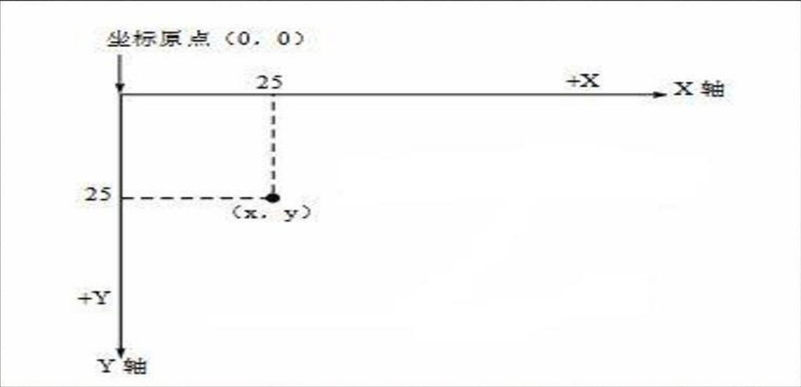
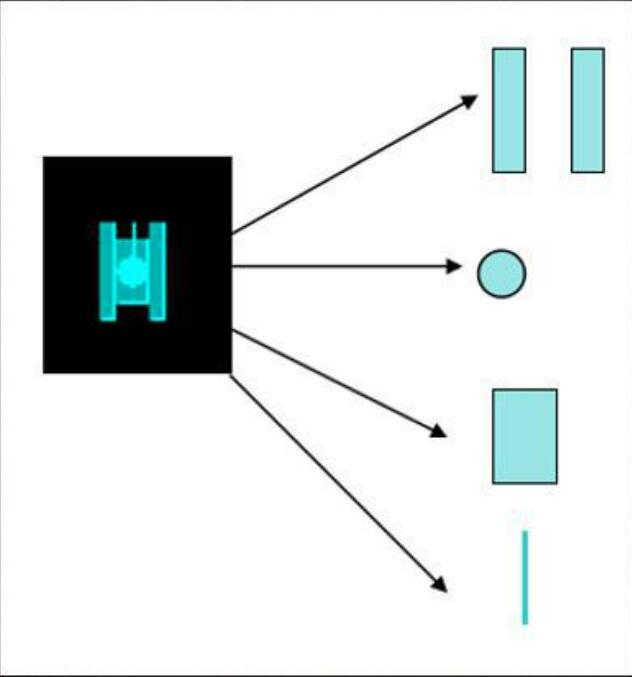
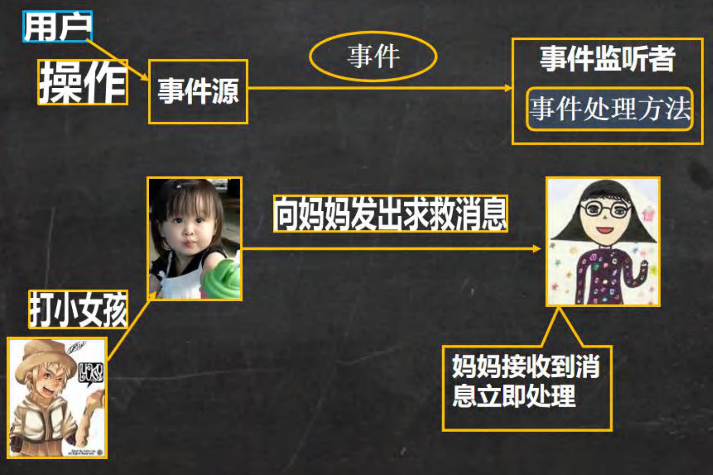
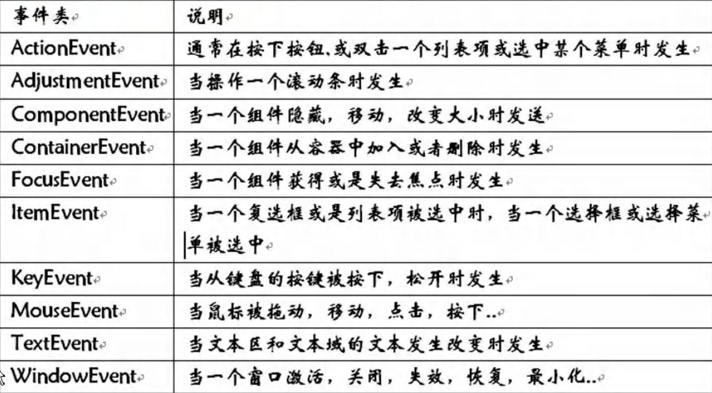

# 坦克大战游戏演示

### 为什么写这个项目

1. 好玩
2. 涉及到 java 各个方面的技术
   - java面向对象
   - 多线程
   - 文件 I/O 操作
   - 数据库
3. 巩固旧知识，学习新知识

### 写项目前的提醒

1. 编写坦克大战游戏，你需要有一定的 java 基础，是完全可以听懂，最核心的部分老韩都会带大家一起完成
2. 记住一点：成为一个编程高手的秘诀就是：思考-----编程-----思考-----编程

# java绘图坐标体系

### 坐标体系-介绍

下图说明了Java坐标系。坐标原点位于左上角，以像素为单位。在Java坐标系中, 第一个是x坐标,表示当前位置为水平方向，距离坐标原点x个像素;第二个是y坐标, 表示当前位置为垂直方向,距离坐标原点y个像素。

### 坐标体系-像素

1. 绘图还必须要搞清一个非常重要的概念 - 像素一个像素等于多少厘米?
2. 计算机在屏幕上显示的内容都是由屏幕上的每一个像素组成的。例如，计算机显示器的分辨率是800×600，表示计算机屏幕上的每一行由800个点组成，共有600行 , 整个计算机屏幕共有480 000个像素。像素是一个**密度单位** , 而厘米是**长度单位 **, 两者无法比较

### 绘图原理

Component类提供了两个和绘图相关最重要的方法:

1. paint(Graphics g)绘制组件的外观
2. repaint()刷新组件的外观。

当组件第一次在屏幕显示的时候,程序会自动的调用paint()方法来绘制组件。

在以下情况paint(0)将会被调用:

1. 窗口最小化再最大化
2. 窗口的大小发生变化
3. repaint方法被调用

思考题：如何证明上面的三种情况，会调用 paint() 方法

### Graphics 类

Graphics 类你可以理解就是画笔 , 为我们提供了各种绘制图形的方法:[参考jdk帮助文档]

1. 画直线 	              drawLine(int x1,int y1,int x2,int y2)
2. 画矩形边框           drawRect(int x, int y, int width, int height)
3. 画椭圆边框           drawOval(int x, int y, int width, int height)
4. 填充矩形               fillRect(int x, int y, int width, int height)
5. 填充椭圆              fillOval(int x, int y, int width, int height)
6. 画图片                  drawlmage(lmage img, int x, int y)
7. 画字符串              drawString(String str, int x, int y)
8. 设置画笔的字体   setFont(Font font)
9. 设置画笔的颜色   setColor(Color c)

### 绘出坦克

坦克大战游戏中，我们会用到坦克，现在我们就利用java绘图技术来画出一个小坦克 , 完成我们的坦克大战游戏1.0版本! 

# java事件处理机制

### 基本说明

java事件处理是采取"委派事件模型"。当事件发生时,产生事件的对象,会把此"信息" 传递给 “事件的监听者" 处理，这里所说的 "信息" 实际上就是 java.awt.event 事件类库里某个类所创建的对象,把它称为 “事件的对象"

### 机制分析

### 事件处理机制深入理解

1. 前面我们提到几个重要的概念事件源 , 事件,事件监听器我们下面来全面的介绍它们

2. **事件源** : 事件源是一个产生事件的对象，比如按钮,窗口等。

3. **事件** : 事件就是承载事件源状态改变时的对象，比如当键盘事件、鼠标事件、窗口事件等等，会生成一个事件对象，该对象保存着当前事件很多信息，比如 KeyEvent 对象有含有被按下键的 Code 值。java.awt.event 包和 javax.swing.enent 包中定义了各种事件类型

4. **事件类型**：查阅 jdk 文档

   

5. **事件监听器接口**：

   1. 当事件源产生一个事件，可以传送给事件监听者处理
   2. 事件监听者实际上就是一个类,该类实现了某个事件监听器接口比如前面我们案例中的 MyPanle 就是一个类,它实现了 KeyListener 接口，它就可以作为一个事件监听者，对接受到的事件进行处理
   3. 事件监听器接口有多种，不同的事件监听器接口可以监听不同的事件，一个类可以实现多个监听接口
   4. 这些接口在 java.awt.event 包和 javax.swing.event 包中定义。列出常用的事件监听器接口,查看 jdk 文档聚集了

# java绘图技术

# 坦克大战游戏（1.0版）