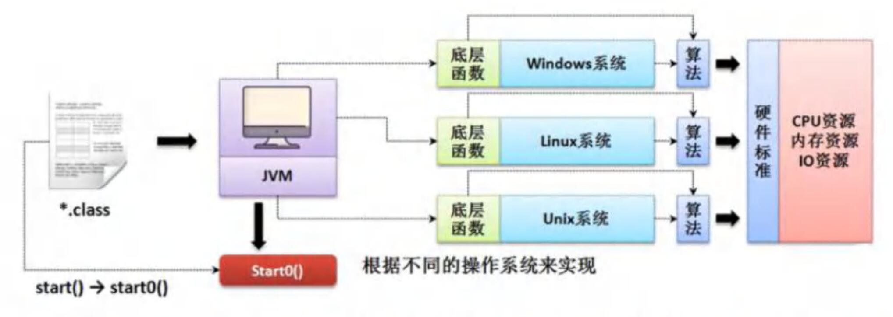

# 线程介绍

### 程序（program）

是为完成特定任务、用某种语言编写的一组指令的集合

简单的说：就是我们写的代码

### 进程

1. 进程是指运行中的程序，比如我们使用 QQ ，就启动了一个进程，操作系统就会为该进程分配内存空间。当我们使用迅雷，又启动了一个进程,操作系统将为迅雷分配新的内存空间。
2. 进程是程序的一次执行过程，或是正在运行的一个程序。是动态过程:有它自身的产生、存在和消亡的过程

### 什么是线程

1. 线程由进程创建的，是进程的一个实体
2. 一个进程可以拥有多个线程

### 其他相关概念

1. 单线程 : 同一个时刻，只允许执行一个线程
2. 多线程 : 同一个时刻 , 可以执行多个线程，比如 : 一个 qq 进程，可以同时打开多个聊天窗口 , 一个迅雷进程 , 可以同时下载多个文件
3. 并发 : 同一个时刻,多个任务交替执行，造成一种 “貌似同时” 的错觉，简单的说单核 cpu 实现的多任务就是并发。
4. 并行 : 同一个时刻 , 多个任务同时执行。多核 cpu 可以实现并行。并发和并行也有可能同时在一台电脑执行

# 线程使用⭐

### 创建线程的两种方式

1. 继承Thread类，重写run方法
2. 实现Runnable接口，重写run方法

### 继承Thread类，重写run方法

#### 快速入门

```java
public class Thread01 {
    public static void main(String[] args) {
        //创建Cat对象，可以当作线程使用
        Cat cat = new Cat();
        cat.start();//启动线程
        System.out.println("程序退出了");
    }
}

//说明
//1.当一个类继承了 Thread 类， 该类就可以当成线程使用
//2.我们会重写 run 方法，写上自己的业务代码
//3.run Thread 类 实现了 Runnable 接口的 run 方法
/*
    @Override
    public void run() {
        if (target != null) {
            target.run();
        }
    }
 */
class Cat extends Thread {
    int times;

    @Override
    public void run() {//重写run方法，写上自己的业务逻辑
        while (true) {
            //该线程每隔一秒，在控制台输出 ”喵喵，我是小猫咪“
            System.out.println("喵喵，我是小猫咪" + (++times));
            //让该线程休眠 1 秒
            try {
                Thread.sleep(1000);
            } catch (InterruptedException e) {
                e.printStackTrace();
            }
            if (times == 8){
                break;//当times 到8，退出while，这时线程也就退出了
            }
        }
    }
}
```

使用JConsole 监控线程执行情况，并画出程序示意图

在 Terminal 里面输入 jconsole ，然后连接该 进程 即可


```java
cat.start();//启动线程 -> 最终会执行 cat 的 run 方法
//老韩解读源码
/*
    (1)
    public synchronized void start() {
        start0();
    }
    (2)
    //start0() 是 native 本地方法，是 JVM 调用，底层是 c/c++ 实现
    //真正实现多线程的效果，是 start0(), 而不是 run
    private native void start0();
 */
```



### 实现Runnable接口，重写run方法

#### 说明

1. java是单继承的,在某些情况下一个类可能已经继承了某个父类,这时在用继承Thread类方法来创建线程显然不可能了。
2. java设计者们提供了另外一个方式创建线程，就是通过实现Runnable接口来创建线程

#### 快速入门

Thread02.java

设计模式  --》 代理模式

```java
//线程代理类，模拟一个极简的 Thread 类
class ThreadProxy implements Runnable{//你可以把 ThreadProxy 当作 Thread
    private Runnable target = null;//属性，类型是 Runnable

    @Override
    public void run() {
        if (target != null){
            target.run();
        }
    }

    public ThreadProxy(Runnable target) {
        this.target = target;
    }

    public void start(){
        start0();//这个方法时候真正实现多线程方法
    }
    public void start0(){
        run();
    }
}
```

### 继承 Thread vs 实现 Runnable 的区别

1. 从java的设计来看，通过继承Thread或者实现Runnable接口来创建线程本质上没有区别 . 从jdk帮助文档我们可以看到Thread类本身就实现了Runnable接口

2. 实现Runnable接口方式更加适合多个线程共享一个资源的情况，并且避免了单继承的限制，建议使用Runnable

   理解多线程共享一个资源

   ```
   T3 t3 = new T3("Hello");
   Thread thread01 = new Thread(T3);
   Thread thread02 = new Thread(T3);
   thread01.start();
   thread02.start();
   ```
   
   
   
3. 【售票系统】变成模拟三个售票窗口售票 100张票，分别使用 继承 Thread 和 实现 Runnable 方式，并分析有什么问题？ SellTicket.java          //会出现 超卖.. 一票多卖..

### 线程终止

#### 基本说明

1. 当线程完成任务后,会自动退出。
2. 还可以通过**使用变量**来控制run方法退出的方式停止线程,即**通知方式**

# 线程方法

### 常用方法第一组

1. setName              //设置线程名称，使之与参数 name 相同
2. getName             //返回该线程的名称
3. start                     //是该线程开始执行；Java 虚拟机底层调用该线程的 start0 方法
4. run                       //调用线程对象 run 方法
5. setPriority           //更改线程的优先级
6. getPriority           //获取线程的优先级
7. sleep                    //在指定的毫秒数内让当前正在执行的线程休眠（暂停执行）
8. interrupt              //中断线程

### 注意事项和细节

1. start底层会创建新的线程，调用run, run就是一个简单的方法调用, 不会启动新线程
2. 线程优先级的范围
3. interrupt，中断线程，但并没有真正的结束线程。所以一般用于中断正在休眠线程
4. sleep : 线程的静态方法，使当前线程休眠

### 常用方法第二组

1. yield : 线程的礼让。让出cpu，让其他线程执行，但礼让的时间不确定 , 所以也不一定礼让成功
2. join : 线程的插队。插队的线程一旦插队成功，则肯定先执行完插入的线程所有的任务

### 用户线程和守护线程

1. 用户线程 : 也叫工作线程，当线程的任务执行完或通知方式结束
2. 守护线程 : 一般是为工作线程服务的，当所有的用户线程结束，守护线程自动结束
3. 常见的守护线程 : 垃圾回收机制

# 线程声明周期

### JDK 中用 Thread.State 枚举表示了线程的几种状态

线程状态。线程可以处于以下状态之一：[官方文档是6种状态]

- new : 尚未启动的线程处于此状态。
- RUNNABLE : 在Java虚拟机中执行的线程处于此状态。  
- BLOCKED : 被阻塞等待监视器锁定的线程处于此状态。 
- WAITING : 正在等待另一个线程执行特定动作的线程处于此状态。  
- TIMED_WAITING : 正在等待另一个线程执行动作达到指定等待时间的线程处于此状态。 
- TERMINATED : 已退出的线程处于此状态。 

### 线程状态转换图


有的会把RUNNABLE里面又分成两种状态：READY 、 RUNNING

所以有的会说是7种状态

# Synchronized⭐

### 线程同步机制

1. 在多线程编程，一些敏感数据不允许被多个线程同时访问，此时就使用同步访问技术，保证数据在任何同一时刻，最多有一个线程访问,以保证数据的完整性。
2. 也可以**这样理解** : 线程同步，即当有个线程在对内存进行操作时，其他线程都不可以对这个内存地址进行操作，直到该线程完成操作，其他线程才能对该内存地址进行操作.

### 同步具体方法 - Synchronized

方法挺多，其中有一个最简单的方式 就是 Synchronized

1. 同步代码块

   synchronized （对象）{//得到对象的锁，才能操作同步代码

   ​		//需要被同步代码；

   }

2. synchronized 还可以放在方法声明种，表示整个方法 - 为同步方法

   public **synchronized** void m(String name){

   ​		//需要被同步的代码

   }

3. 如何理解

   就好像 某小伙伴上厕所前先把门关上（上锁），完事后再出来（解锁），那么其他小伙伴就可再使用厕所了

4. 使用 **synchronized**  解决售票问题

# 互斥锁⭐

### 基本介绍

1. Java语言中，引入了对象互斥锁的概念，来保证共享数据操作的完整性
2. 每个对象都对应于一个可称为 ”互斥锁” 的标记 , 这个标记用来保证在任—时刻，只能有一个线程访问该对象。
3. 关键字 synchronized 来与对象的互斥锁联系。当某个对象用 synchronized 修饰时 , 表明该对象在任一时刻只能由一个线程访问
4. 同步的局限性 : 导致程序的执行效率要降低
5. 同步方法（非静态的）的锁可以是this , 也可以是其他对象(要求是同个对象)
6. 同步方法(静态的)的锁为当前类本身。

### 注意事项和细节

1. 同步方法如果没有使用static修饰 : 默认锁对象为this
2. 如果方法使用static修饰 , 默认锁对象 : 当前类.class
3. 实现的落地步骤:
   - 需要先分析上锁的代码
   - 选择**同步代码块**或同步方法（建议同步代码块，因为锁的范围小）
   - 要求多个线程的锁对象为同一个即可！！！！！

# 死锁

### 基本介绍

多个线程都占用了对方的锁资源,但不肯相让，导致了死锁,在编程是一定要避免死锁的发生

### 快速入门

```java
//线程
class DeadLockDemo extends Thread {
    static Object o1 = new Object();// 保证多线程，共享一个对象,这里使用 static
    static Object o2 = new Object();
    boolean flag;

    public DeadLockDemo(boolean flag) {//构造器
        this.flag = flag;
    }

    @Override
    public void run() {
        //下面业务逻辑的分析
        //1. 如果 flag 为 T, 线程 A 就会先得到/持有 o1 对象锁, 然后尝试去获取 o2 对象锁
        //2. 如果线程 A 得不到 o2 对象锁，就会 Blocked
        //3. 如果 flag 为 F, 线程 B 就会先得到/持有 o2 对象锁, 然后尝试去获取 o1 对象锁
        //4. 如果线程 B 得不到 o1 对象锁，就会 Blocked
        if (flag) {
            synchronized (o1) {//对象互斥锁, 下面就是同步代码
                System.out.println(Thread.currentThread().getName() + " 进入 1");
                synchronized (o2) { // 这里获得 li 对象的监视权
                    System.out.println(Thread.currentThread().getName() + " 进入 2");
                }
            }
        } else {
            synchronized (o2) {
                System.out.println(Thread.currentThread().getName() + " 进入 3");
                synchronized (o1) { // 这里获得 li 对象的监视权
                    System.out.println(Thread.currentThread().getName() + " 进入 4");
                }
            }
        }
    }
}
```

### 释放锁

#### 下面操作会释放锁

1. 当前线程的同步方法、同步代码块执行结束

   案例:上厕所，完事出来

2. 当前线程在同步代码块、同步方法中遇到break、 return

   案例:没有正常的完事，经理叫他修改bug，不得已出来

3. 当前线程在同步代码块、同步方法中出现了未处理的Error或Exception , 导致异常结束

   案例:没有正常的完事，发现忘带纸，不得已出来

4. 当前线程在同步代码块、同步方法中执行了线程对象的wait()方法，当前线程暂停 , 并释放锁。

   案例 : 没有正常完事 , 觉得需要酝酿下 , 所以出来等会再进去

#### 下面操作不会释放锁

1. 线程执行同步代码块或同步方法时，程序调用Thread.sleep()、Thread.yield(）方法暂停当前线程的执行,不会释放锁

   案例:上厕所,太困了，在坑位上眯了一会

2. 线程执行同步代码块时,其他线程调用了该线程的 suspend() 方法将该线程挂起,该线程不会释放锁。

提示:应尽量避免使用 suspend() 和 resume() 来控制线程,方法不再推荐使用