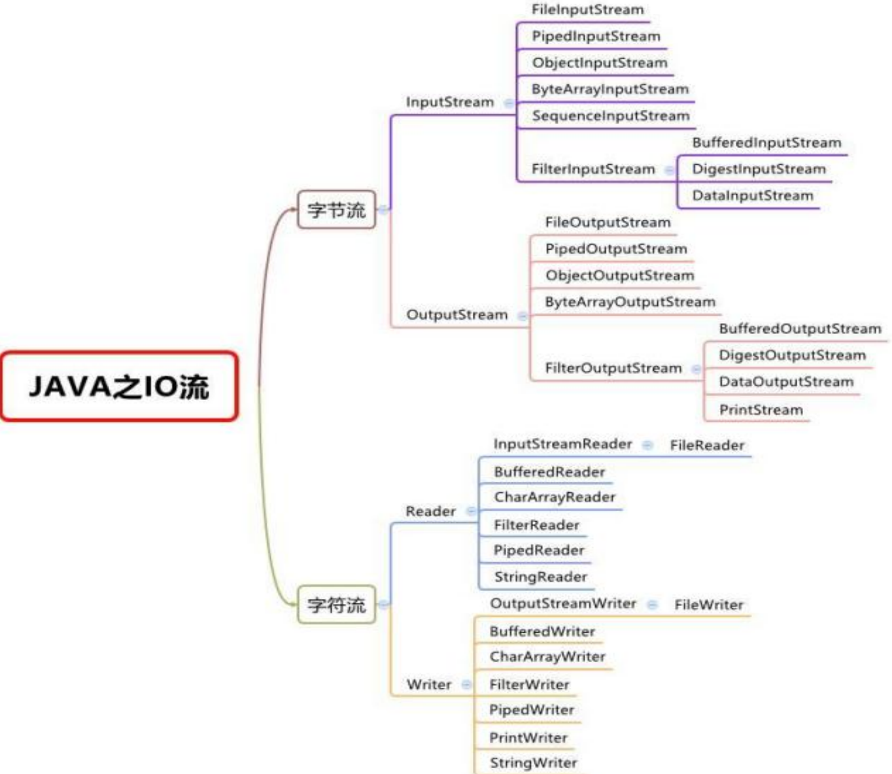
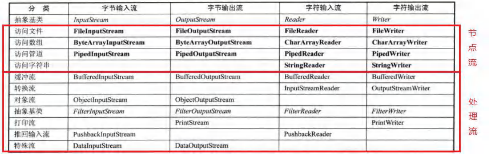

# 文件

## 概念

### 什么是文件

文件,对我们并不陌生,文件是**保存数据的地方** , 比如大家经常使用的word文档 , txt文件 . excel文件.….都是文件。它既可以保存一张图片,也可以保持视频,声音

### 文件流

文件在程序中是以流的形式来操作的

- 流 : 数据在数据源(文件)和程序(内存)之间经历的路径
- 输入流 : 数据从数据源(文件)到程序(内存)的路径
- 输出流 : 数据从程序(内存)到数据源(文件)的路径

## 常用操作

### 创建文件对象相关构造器和方法

```t&#39;x&#39;t
//方式1 new File(String pathname)//根据路径构造一个 File 对象
//方式2 new File(File parent, String child)//根据父目录文件 + 子路径构建
//方式3 new File(String parent, String child)//根据父目录 + 子路径构建
//createNewFile()//创建新文件
```

### 获取文件的相关信息

```txt
//getName()、getAbsolutePath()、getParent()、length()、exists()、isFile()、isDirectory()
```

### 目录的操作和文件删除

mkdir() 创建一级目录、mkdirs() 创建多级目录、delete() 删除空目录或文件

# IO流原理及流的分类

### Java IO 流原理

1. I/O 是 Input/Output的缩写，I/O技术是非常实用的技术，用于处理数据传输。如读/写文件，网络通讯等。
2. Java程序中，对于数据的输入/输出操作以 ”流 (stream)” 的方式进行。
3. java.io包下提供了各种 “流” 类和接口 , 用以获取不同种类的数据,并通过方法输入或输出数据
4. 输入input : 读取外部数据(磁盘、光盘等存储设备的数据)到程序(内存)中。
5. 输出output : 将程序(内存)数据输出到磁盘、光盘等存储设备中

### 流的分类

- 按操作数据单位不同分为 : 字节流(8 bit)二进制文件，字符流(按字符)文本文件
- 按数据流的流向不同分为 : 输入流，输出流
- 按流的角色的不同分为 : 节点流，处理流/包装流


1. Java的IO流共涉及40多个类，实际上非常规则，都是从如上4个抽象基类派生的。
2. 由这四个类派生出来的子类名称都是以其父类名作为子类名后缀。

### IO 流体系图-常用的类

#### IO 流体系图



#### 文件 VS 流

如果拿网购举例，那么文件相当于物品，而流相当于快递小哥

## FileInputStream 和 FileOutputStream

### FileInputStream  - 字节输入流 介绍

构造器

read() 方法使用 读取单个字节

read(byte[] b) 读取多个字节

### FileOutputStream  - 字节输出流 介绍

两个不同的构造器

new FileOutputStream(filePath)      //创建方式，当写入内容时，会覆盖原来的内容
new FileOutputStream(filePath, true)  //创建方式，当写入内容时，是追加到文件后面

注意：如果没有那个文件，会自己创建

write() 写入单个字节

wtite(byte[] b) 写入多个字节//当写到最后，只读取了 15字节，它也给你写入你指定的字节，那么就造成 文件损失

wtite(byte[] b, 0, readLen) 写入从 0 开始到 readLen 的字节//一定要要使用这个

###### 相关API

str.getBytes() 可以把 字符串 -> 字节数组

### 应用案例

#### 编程完成图片/音乐 的拷贝

```java
		//完成 文件拷贝， 将 e:\\workspace\\a\\wife.png 拷贝到 e:\\workspace\\b\\
        //思路分析
        // 1.创建文件的输入流，将文件读入到程序
        // 2.创建文件的输出流，将读取到的文件数据，写入到指定的文件

        String srcFilePath = "d:\\workspace\\a\\wife.png";
        String destFilePath = "d:\\workspace\\b\\abc.png";
        FileInputStream fileInputStream = null;
        FileOutputStream fileOutputStream = null;

        try {
            fileInputStream = new FileInputStream(srcFilePath);
            fileOutputStream = new FileOutputStream(destFilePath);
            //定义一个字节数组，提高读取效果
            byte[] buf = new byte[1024];
            int readLen = 0;
            while ((readLen = fileInputStream.read(buf)) != -1) {
                //读取到后，就写入文件 通过 fileOutputStream
                //即，是一边，一边写
                fileOutputStream.write(buf, 0, readLen);//一定要用这个方法
                //说明
                // 因为当你最后一次读的字节假如为 15字节
                // 那么它也给你存 1024 字节进去，那就麻烦了，会出现文件损失
            }
        } catch (IOException e) {
            e.printStackTrace();
        } finally {
            try {
                //关闭输入流和输出流，释放资源
                if (fileInputStream != null)
                    fileInputStream.close();
                if (fileOutputStream != null)
                    fileOutputStream.close();
            } catch (IOException e) {
                throw new RuntimeException(e);
            }
        }
```

## FileReader 和 FileWriter

### FileReader - 文件字符输入流 介绍

1. new FileReader(File/String)
2. read:每次读取单个字符,返回该字符，如果到文件末尾返回-1
3.  read(char[):批量读取多个字符到数组，返回读取到的字符数，如l果到文件末尾返回-1

相关API:

new String (char[]) : 将char[转换成String

new String(char[], off, len) : 将char[] 的指定部分转换成String

### FileWriter - 文件字符输出流 介绍

1. new FileWriter(File/String) : 覆盖模式，相当于流的指针在首端
2. new FileWriter(File/String, true) : 追加模式 , 相当于流的指针在尾端
3. write(int) : 写入单个字符
4. write(char[]) : 写入指定数组
5. write(char[], off, len) : 写入指定数组的指定部分
6. write (string) : 写入整个字符串
7. write(string, off, len) : 写入字符串的指定部分

相关API: String类:toCharArray : 将String转换成char[]

注意 : FileWriter使用后，必须要关闭(close)或刷新(flush)，否则写入不至指定的文件!

# 节点流和处理流

### 基本介绍

1. 节点流可以从一个特定的数据源**读写数据**，如 FileReader、FileWriter
2. 处理流（也叫**包装流**）是 ”连接“ 已存在的流（节点流或处理流）之上，为程序提供更为强大的读写功能，如 BufferedReader、BufferedWriter

### 节点流和处理流一览图



### 节点流和处理流的区别和联系

1. 节点流是底层流/低级流 , 直接跟数据源相接。
2. 处理流 (**包装流**) 包装节点流,既可以消除不同节点流的实现差异，也可以提供更方便的方法来完成输入输出。[**源码理解**]
3. 处理流(也叫包装流)对节点流进行包装，使用了修饰器设计模式,不会直接与数据源相连[**模拟修饰器设计模式=》小伙伴就会非常清楚**.]

### 处理流的功能主要体现在以下两个方面:

1. 性能的提高:主要以增加缓冲的方式来提高输入输出的效率。
2. 操作的便捷:处理流可能提供了一系列便捷的方法来一次输入输出大批量的数据 , 使用更加灵活方便

## BufferedReader 和 BufferedWriter 字符处理流

BufferedReader 和 BufferedWriter 属于字符处理流，是按照字符来读取数据的。关闭处理流时，只需要关闭外层流即可[**后面看源码**]

## BufferedInputStream 和 BufferedOutputStream 字节处理流

BufferedInputStream 和 BufferedOutputStream 是字节处理流，一样的，按照字节来读取数据。关闭处理流的时候，只需要关闭外层流即可

## ObjectInputStream 和 ObjectOutputStream 对象处理流

### 看一个需求

1. 将int num = 100这个 int数据保存到文件中,注意不是100数字，而是 int 100，并且，能从文件中直接恢复int 100
2. 将Dog dog = new Dog(“小黄”, 3) 这个dog对象保存到文件中 , 并且能够从文件恢复.
3. 上面的要求 , 就是能够将基本数据类型或者对象进行 序列化 和 反序列化操作

序列化和反序列化

1. 序列化就是在保存数据时，保存**数据的值**和**数据类型**.
2. 反序列化就是在恢复数据时,恢复**数据的值**和**数据类型**
3. 需要让某个对象支持序列化机制，则必须让其类是可序列化的，为了让某个类是可序列化的，该类必须实现如下两个接口之一:
   - Serializable               //这是一个标记接口 , 没有方法
   - Externalizable           //该接口有方法需要实现，因此我们一般实现上面的 Serializable接口

### 对象流介绍

功能：提供了对基本类型或对象类型的序列化和反序列化的方法

ObjectOutputStream 提供 序列化功能 

ObjectInputStream 提供 反序列化功能

### 注意事项和细节说明

1. 读写顺序要一致

2. 要求序列化或反序列化对象，需要实现 Serializable

3. 序列化的类中建议添加 SerialVersionUID , 为了提高版本的兼容性

   private static final long serialVersionUID = 1L;

4. 序列化对象时，默认将里面所有属性都进行序列化，但除了 static 或 transient 修饰的成员

5. 序列化对象时，要求**里面属性的类型**也需要实现序列化接口

6. 序列化具备可继承性 , 也就是如果某类已经实现了序列化,则它的所有子类也已经默术认实现了序列化

## 标准输入输出流

```java
		//System 类的 public final static InputStream in = null;
        //System.in 编译类型 InputStream
        //System.in 运行类型 BufferedInputStream
        // 表示的是标准输入 默认设备 键盘
        System.out.println(System.in.getClass());

        //System 类的 public final static PrintStream out = null;
        //System.out 编译类型 PrintStream
        //System.out 运行类型 PrintStream
        // 表示标准输出 默认设别 显示器
        System.out.println(System.out.getClass());
```

## InputStreamReader 和 OutputStreamWriter - 转换流

com.hspedu.transformation   CodeQuestion.java

先看一个文件乱码问题，引出学习转换流必要性

### 介绍

InputStreamReader : Reader的子类 , 可以将InputStream(字节流)包装成 (**转换**) Reader(字符流)

OutputStreamWriter : Writer的子类，实现将OutputStream(字节流)包装成 Writer(字符流)

当处理纯文本数据时，如果使用字符流效率更高，并且可以有效解决中文问题 , 所以建议将字节流转换成字符流

可以在使用时指定编码格式(比如 utf-8 , gbk , gb2312 ,  IS08859-1 等)

## PrintStream 和 PrintWriter - 打印流

## Properties 类

### 基本介绍

1. 专门用于读写配置文件的集合类

   配置文件的格式:

   键=值

   键=值

2. 注意 : 键值对不需要有空格 , 值不需要用引号一起来。默认类型是String

3. Properties的常见方法

   - load : 加载配置文件的键值对到Properties对象
   - list : 将数据显示到指定设备
   - getProperty(key) : 根据键获取值
   - setProperty(key,value) : 设置键值对到Properties对象
   - store : 将Properties中的键值对存储到配置文件 , 在idea中，保存信息到配置文件,如果含有中文，会存储为unicode码

结束光波----------------------------------------------------------------------------------------------------------------------------------------------

# 输入流⭐

## InputStream - 字节输入流

### FileInputStream - 文件字节输入流

### BufferedInputStream - 缓冲字节输入流

### ObjectInputStream - 对象字节输入流

## Reader

### FileReader

### BufferedReader

### InputStreamReader

# 输出流⭐

## OutputStream - 字节输出流

### FileOutputStream - 文件字节输出流

### BufferedOutputStream

### ObjectOutputStream

## Writer

### FileWriter

### BufferedWriter

### OutputStreamWriter

# Properties类
