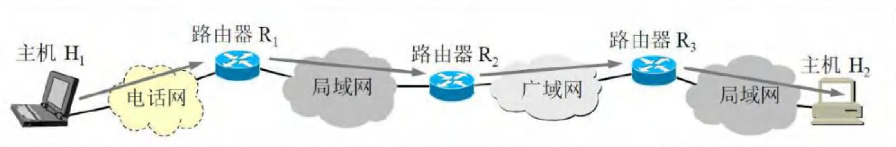
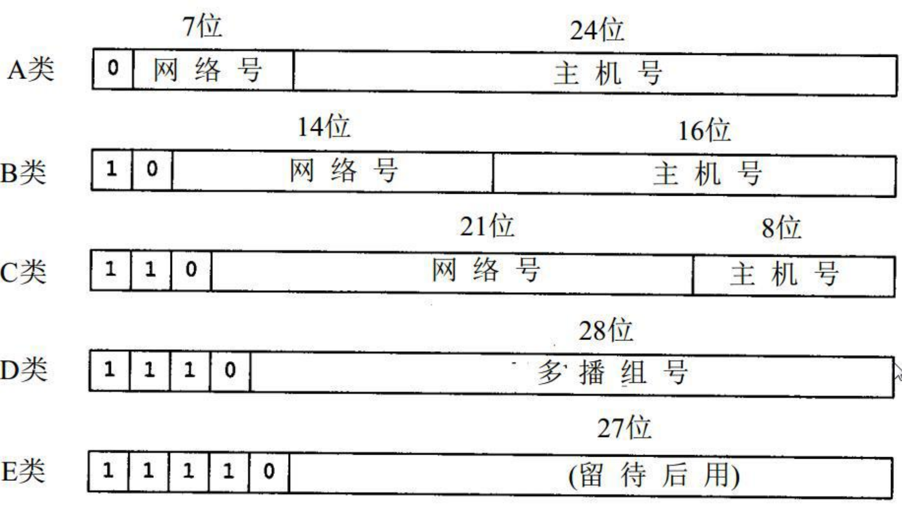
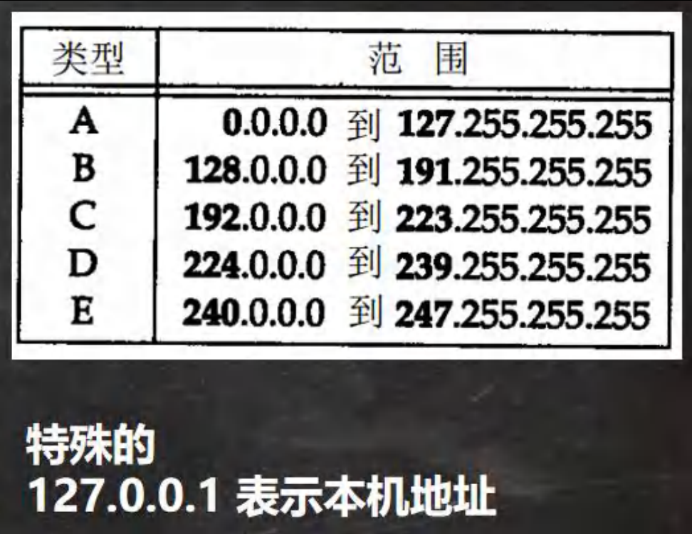
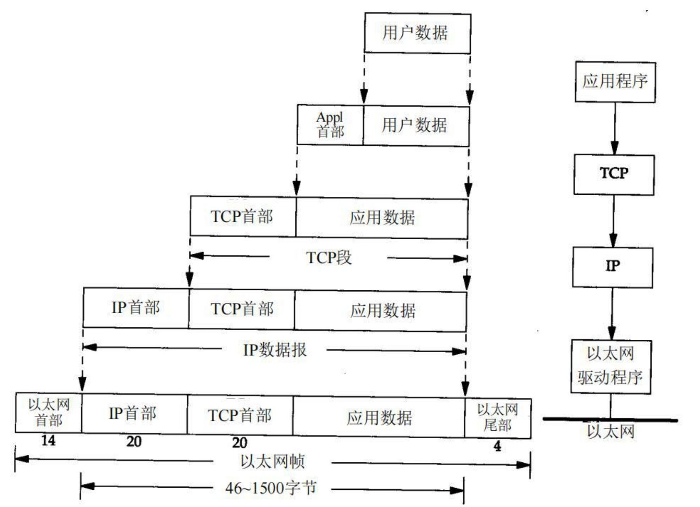
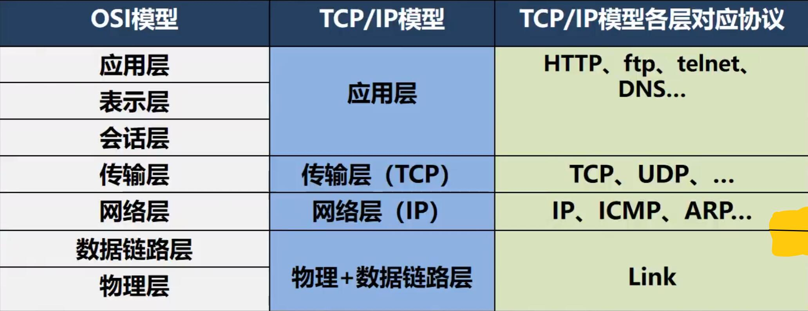
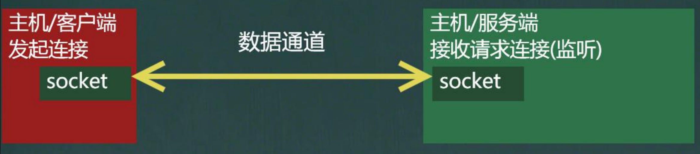
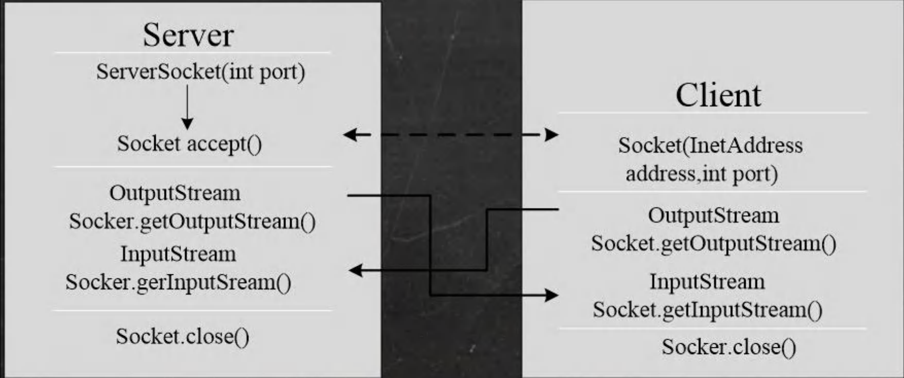

# 网络基础

### 网络通信

1. 概念 : 两台设备之间通过网络实现数据传输
2. 网络通信 : 将数据通过网络从一台设备传输到另一台设备
3. java.net包下提供了一系列的类或接口 , 供程序员使用，完成网络通信

### 网络

1. 概念:两台或多台设备通过一定物理设备连接起来构成了网络
2. 根据网络的覆盖范围不同，对网络进行分类 :
   - 局域网 : 覆盖范围最小,仅仅覆盖一个教室或一个机房
   - 城域网 : 覆盖范围较大，可以覆盖一个城市
   - 广域网 : 覆盖范围最大，可以覆盖全国 , 甚至全球 , 万维网是广域网的代表

### ip 地址

1. 概念 : 用于唯一标识网络中的每台计算机/主机
2. 查看ip地址 :  ipconfig
3. ip地址的表示形式 : 点分十进制 XX.XX.XX.XX
4. 每一个十进制数的范围 : 0~255
5. ip地址的组成 = 网络地址 + 主机地址，比如 : 192.168.16.69
6. lPv6是互联网工程任务组设计的用于替代IPv4的下一代IP协议，其地址数量号称可以为全世界的每一粒沙子编上一个地址[1]。
7. 由于IPv4最大的问题在于网络地址资源有限，严重制约了互联网的应用和发展。IPv6的使用 , 不仅能解决网络地址资源数量的问题 , 而且也解决了多种接入设备连入互联网的障碍

### ipv4 地址分类

### 域名

1. www.baidu.com
2. 好处 : 为了方便记忆，解决记ip的困难
3. 概念 : 将ip地址映射成域名，这里怎么映射上 , HTTP协议

#### 端口号

1. 概念 : 用于标识计算机上某个特定的网络程序
2. 表示形式 : 以整数形式 , 端口范围0~65535 [2个字节表示端口0~2 ^ 16-1]
3. 0~1024已经被占用，比如 ssh 22, ftp 21, smtp 25 http 80
4. 常见的网络程序端口号:
   - tomcat : 8080
   - mysql : 3306
   - oracle : 1521
   - sqlserver : 1433

### 网络通信协议

#### 协议(tcp/ip)

TCP/IP (Transmission Control Protocol/Internet Protocol)的简写 , 中文译名为**传输控制协议**/**因特网互联协议**,又叫网络通讯协议 , 这个协议是lnternet最基本的协议、Internet国际互联网络的基础 , 简单地说 , 就是由网络层的IP协议和传输层的TCP协议组成的。[示意图]

#### 网络通信协议

### TCP 和 UDP

TCP协议 : 传输控制协议

1. 使用TCP协议前,须先建立TCP连接，形成传输数据通道
2. 传输前，采用"三次握手"方式,是**可靠的**
3. TCP协议进行通信的两个应用进程 : 客户端、服务端
4. 在连接中可进行大数据量的传输
5. 传输完毕 , 需释放已建立的连接 , **效率低**

UDP协议 : 用户数据协议

1. 将数据、源、目的封装成数据包，不需要建立连接
2. 每个数据报的大小限制在64K内 , 不适合传输大量数据
3. 因无需连接，故是**不可靠的**
4. 发送数据结束时无需释放资源(因为不是面向连接的),速度快
5. 举例:厕所通知 : 发短信

# InetAddress 类

### 相关方法

1. 获取本机 InetAddress 对象 getLocalHost
2. 根据指定主机名/域名获取ip地址对象 getByName
3. 获取 InetAddress 对象的主机名 getHostName
4. 获取 InetAddress 对象的地址 getHostAddress

# Socket

### 基本介绍

1. 套接字(Socket)开发网络应用程序被广泛采用，以至于成为事实上的标准。
2. 通信的两端都要有 Socket，是两台机器间通信的端点
3. 网络通信其实就是 Socket 间的通信。
4. Socket允许程序把网络连接当成一个流，数据在两个Socket间通过lO传输。
5. 一般主动发起通信的应用程序属客户端,等待通信请求的为服务端

#### 示意图:

# TCP编程⭐

### 基本介绍

1. 基于客户端服务端的网络通信
2. 底层使用的是TCP/IP协议
3. 应用场景举例 : 客户端发送数据，服务端接受并显示控制台
4. 基于Socket的TCP编程

### 应用案例 1(使用字节流)

com.litchi.socket 	SocketTCP01Server.java and SocketTCP01Client.java

1. 编写一个服务器端,和一个客户端
2. 服务器端在9999端口监听
3. 客户端连接到服务器端,发送"hello, server",然后退出
4. 服务器端接收到客户端发送的信息,输出,并退出

### 应用案例 2(使用字节流)

SocketTCP02.java

1. 编写一个服务端,和一个客户端
2. 服务器端在9999端口监听
3. 客户端连接到服务端，发送"hello, server",并接收服务器端回发的"hello,client",再退出
4. 服务器端接收到客户端发送的信息,输出,并发送"hello, client",再退出

### 应用案例 3(使用字符流)

SocketTCP03.java

1. 编写一个服务端,和一个客户端
2. 服务端在9999端口监听
3. 客户端连接到服务端，发送"hello, server",并接收服务端回发的"hello, client" , 再退出
4. 服务端接收到客户端发送的信息 , 输出，并发送"hello, client",再退出

### 应用案例 4

com.litchi.upload	TCPFileUploadServer.java      TCPFileUploadClient.java

1. 编写一个服务端,和一个客户端
2. 服务器端在8888端口监听
3. 客户端连接到服务端，发送一份文件
4. 服务器端接收到客户端发送的文件，保存到指定目录下,发送“收到文件"，再退出
5. 客户端接收到服务端发送的“收到文件”，再退出
6. 该程序要求使用StreamUtils.java , 我们直接使用

### netstat 指令

1. netstat -an可以查看当前主机网络情况，包括**端口监听**情况和**网络连接**情况
2. netstat -an | more可以分页显示
3. netstat -anb 可以查看什么程序执行的监听
4. 要求在dos控制台下执行win + r

说明:

(1) Listening 表示某个端口在监听

(2)如果有一个外部程序(客户端)连接到该端口，就会显示一条连接信息.

(3)可以输入ctrl +c退出指令

### TCP 网络通讯不为人知的秘密

1. 当客户端连接到服务端后，实际上客户端也是通过一个端口和服务端进行通讯的,这个端口是TCP/IP来分配的,是不确定的，是随机的.
2. 示意图
3. 程序验证 + netstat

# UDP编程[了解]

### 基本介绍

1. 类 DatagramSocket 和 DatagramPacket[数据包/数据报]实现了基于UDP协议网络程序。
2. UDP数据报通过数据报套接字 DatagramSocket 发送和接收，系统不保证UDP数据报一定能够安全送到目的地，也不能确定什么时候可以抵达。
3. DatagramPacket 对象封装了UDP数据报，在数据报中包含了发送端的IP地址和端口号以及接收端的IP地址和端口号。
4. UDP协议中每个数据报都给出了完整的地址信息，因此无须建立发送方和接收方的连接

### 基本流程

1. 核心的两个类/对象 DatagramSocket与DatagramPacket
2. 建立发送端,接收端(没有服务端和客户端概念)
3. 发送数据前,建立数据包/报 DatagramPacket对象
4. 调用DatagramSocket的发送、接收方法
5. 关闭DatagramSocket

### 应用案例

1. 编写一个接收端A,和一个发送端B

2. 接收端A在9999端口等待接收数据(receive)

3. 发送端B向接收端A发送数据"hello,明天吃火锅~"

4. 接收端A接收到发送端B发送的数据，回复“好的,明天见",再退

5. 发送端接收回复的数据,再退出

