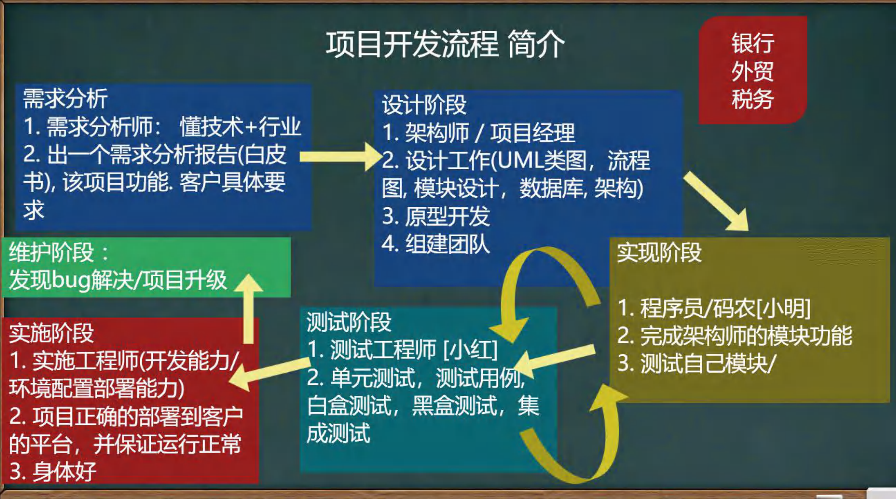
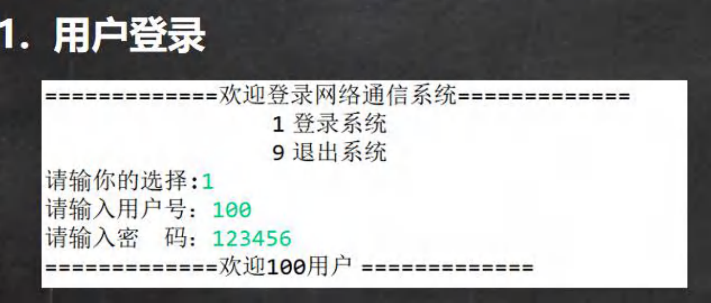
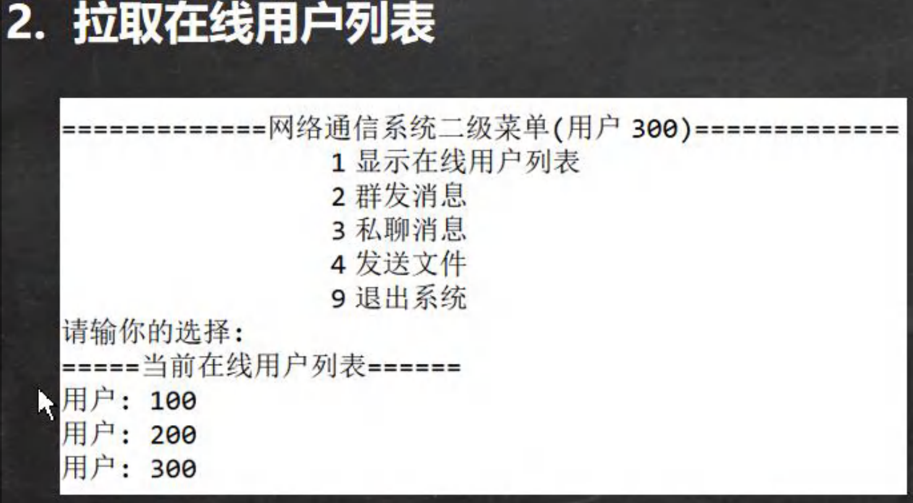
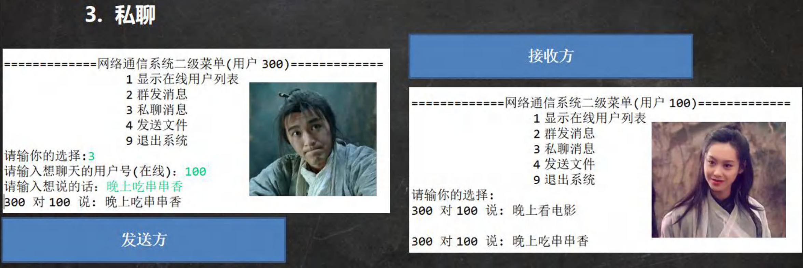
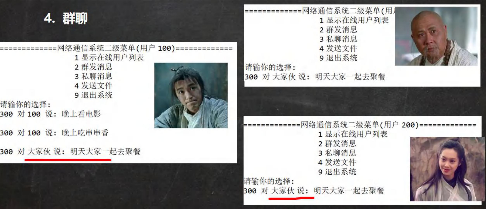
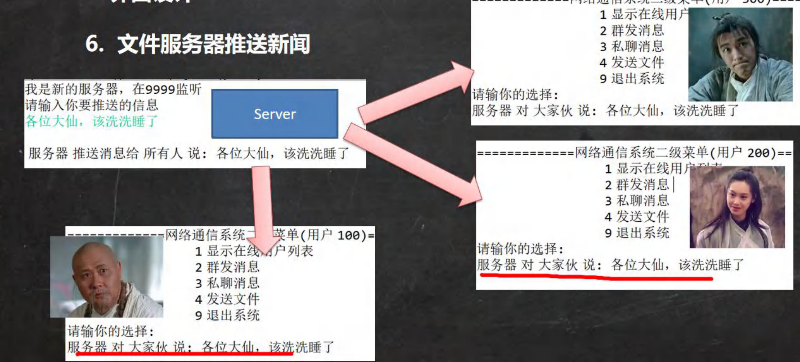

# 多用户即时通信系统

### 为什么选择这个项目

1.有趣

2.涉及到java各个方面的技术

- 项目框架设计
- java面向对象编程
- 网络编程
- IO流
- Mysql / 使用集合充当内存数据库

3.巩固旧知识，学习新知识

### 项目开发流程

需求分析 --> 设计阶段 --> 编程实现 --> 测试阶段 --> 实施阶段

### 需求分析

1. 用户登录
2. 拉取在线用户列表
3. 无异常退出(客户端、服务端)私聊
4. 群聊发文件
5. 服务器推送新闻

### 界面设计

### 功能实现-用户登录

### 功能实现-拉取在线用户列表

### 功能实现-无异常退出

### 功能实现-私聊

### 功能实现-群聊

### 功能说明-发文件

### 功能实现-服务器推送新闻

### 多用户即时通信系统

- 扩展功能-自己是否能独立完成(给出思路)

提示 : 核心技术已经讲过了, 小伙伴认真想想,是完全可以完成的 , 并不难 . 在实际工作中，独立解决问题的能力非常重要，必须有意识培养。

1. 实现离线留言，如果某个用户没有在线，当登录后，可以接受离线的消息
2. 实现离线发文件 , 如果某个用户没有在线，当登录后，可以接受离线的文件

**强烈建议**：一定要写出来 , 一定动脑筋.