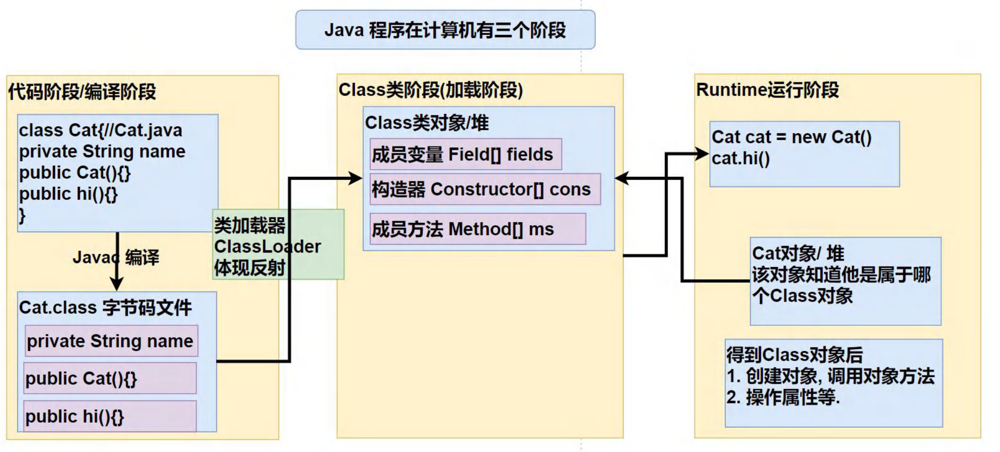
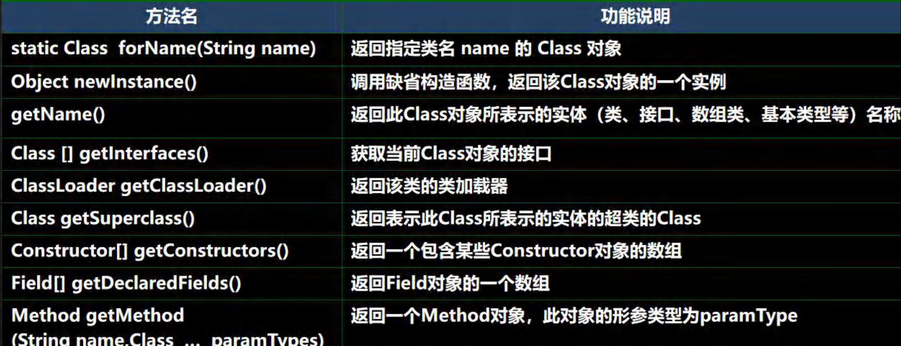
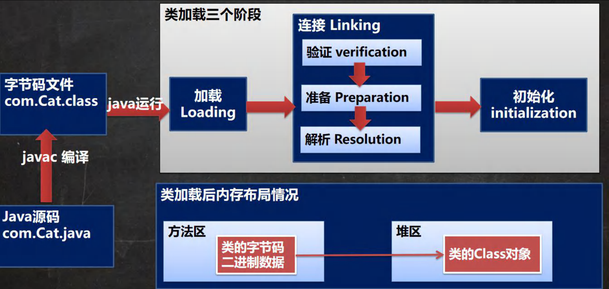
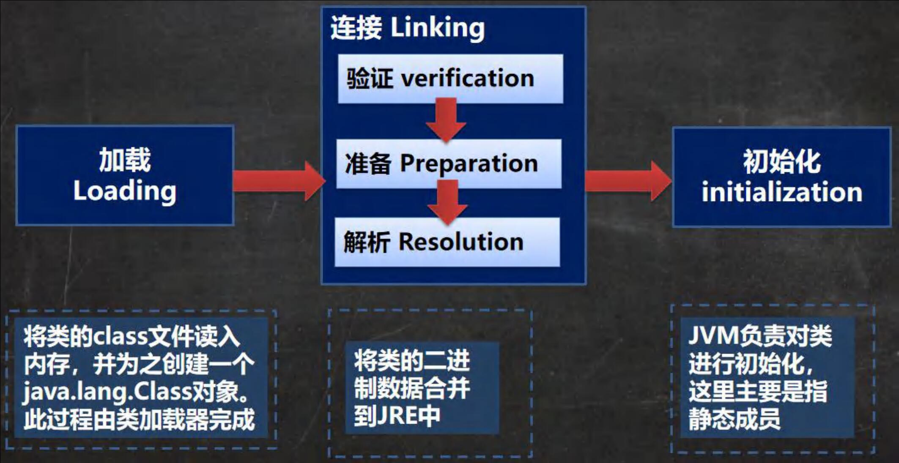

### 一个需求引出反射

1. 根据配置文件 re.properties 指定信息,创建Cat对象并调用方法hi

   ```properties
   classfullpath=com.litchi.reflection.question.Cat
   method=hi
   ```

   思考:使用现有技术，你能做的吗?

2. 这样的需求在学习框架时特别多 , 即通过外部文件配置,在不修改源码情况下，来控制程序,也符合设计模式的ocp原则(开闭原则 : 不修改源码，扩容功能）

# 反射机制

### Java Reflection

1. 反射机制允许程序在执行期借助于ReflectionAPI取得任何类的内部信息(比如成员变量,构造器,成员方法等等),并能操作对象的属性及方法。反射在设计模式和框架底层都会用到
2. 加载完类之后，在堆中就产生了一个Class类型的对象(一个类只有一个Class对象)，这个对象包含了类的完整结构信息。通过这个对象得到类的结构。这个Class对象就像一面镜子，透过这个镜子看到的类的结构，所以，形象的称之为 : 反射

### Java 反射机制原理示意图!!!



### Java 反射机制可以完成

1. 在运行时判断任意一个对象所属的类
2. 在运行时构造任意一个类的对象
3. 在运行时得到任意一个类所具有的成员变量和方法
4. 在运行时调用任意一个对象的成员变量和方法
5. 生成动态代理

### 反射相关的主要类

1. java.lang.Class : 代表一个类， Class对象表示某个类加载后在堆中的对象
2. java.lang.reflect.Method : 代表类的方法, Method对象表示某个类的方法
3. java.lang.reflect.Field : 代表类的成员变量, Field对象表示某个类的成员变量
4. java.lang.reflect.Constructor : 代表类的构造方法, Constructor对象表示构造器

这些类在java.lang.reflect

### 反射优点和缺点

- 优点 : 可以动态的创建和使用对象(也是框架底层核心)，使用灵活 , 没有反射机制 , 框架技术就失去底层支撑
- 缺点 : 使用反射基本是解释执行 , 对执行速度有影响.

### 反射调用优化-关闭访问检查

1. Method和Field、Constructor对象都有setAccessible() 方法
2. setAccessible作用是启动和禁用访问安全检查的开关
3. 参数值为true表示反射的对象在使用时取消访问检查 , 提高反射的效率。参数值为false则表示反射的对象执行访问检查

# Class类

### 基本介绍

1. Class也是类,因此也继承Object类[类图]
2. Class类对象不是new出来的,而是系统创建的[演示]
3. 对于某个类的Class类对象 , 在内存中只有一份，因为类只加载一次
4. 每个类的实例都会记得自己是由哪个 Class 实例所生成
5. 通过Class对象可以完整地得到一个类的完整结构,通过一系列API
6. Class对象是存放在堆的
7. 类的字节码二进制数据，是放在方法区的，有的地方称为类的元数据(包括方法代码,变量名，方法名，访问权限等等)[(30 封私信 / 80 条消息) hotpot java虚拟机Class对象是放在 方法区 还是堆中 ？ - 知乎 (zhihu.com)](https://www.zhihu.com/question/38496907)

### Class 类的常用方法



### 获取Class对象

1. 前提:已知一个类的全类名，且该类在类路径下，可通过Class类的静态方法forName()获取，可能抛出ClassNotFoundException,实例:Class cls1 = Class.forName( "java.lang.Cat");

   应用场景:多用于配置文件,读取类全路径，加载类.

2. 前提:若已知具体的类 , 通过类的class获取 , 该方式最为安全可靠 , 程序性能

   最高实例: Class cls2 = Cat.class;

   应用场景:多用于参数传递，比如通过反射得到对应构造器对象.

3. 前提 : 已知某个类的实例 , 调用该实例的getClass()方法获取Class对象，实例:

   Class clazz=对象.getClass()://运行类型

   应用场景:通过创建好的对象,获取Class对象.

4. 其他方式 通过类加载器得到Class对象[4种]

   ClassLoader cl =对象.getClass().getClassLoader();

   Class clazz4 = cl.loadClass("类的全类名");

5. 基本数据(int，char，boolean，float，double，byte，long，short) 按如下方式得到 Class 类对象

   Class cls = 基本数据类型.class

6. 基本数据类型对应的包装类，可以通过 .TYPE 得到 Class 类对象

   Class cls = 包装类.TYPE

### 哪些类型有 Class 对象

1. 外部类，成员内部类，静态内部类,局部内部类,匿名内部类
2.  interface:接口
3. 数组
4. enum:枚举
5. annotation:注解
6. 基本数据类型
7. void

# 类加载

### 基本说明

反射机制是java实现动态语言的关键，也就是通过反射实现类动态加载。

1. 静态加载 : 编译时加载相关的类,如果没有则报错,依赖性太强
2. 动态加载 : 运行时加载需要的类 , 如果运行时不用该类 , 即使不存在该类，则不报错 , 降低了依赖性

### 类加载时机

1. 当创建对象时 (new) //静态加载
2. 当子类被加载时，父类也被加载 //静态加载
3. 调用类种的静态成员时//静态加载
4. 通过反射 //动态加载

### 类加载过程图



### 类加载各阶段完成任务



### 加载阶段

JVM 在该阶段的主要目的是将字节码从不同的数据源（可能是 class 文件、也可能是 jar 包，甚至网络）**转为二进制字节流加载到内存中**，并生成一个代表该类的 java.lang.Class 对象

### 连接阶段-验证

1. 目的是为了确保 Class文件的字节流中包含的信息符合当前虚拟机的要求 , 并且不会危害虚拟机自身的安全。
2. 包括 : 文件格式验证(是否以魔数oxcafebabe开头)、元数据验证、字节码验证和符号引用验证[举例说明]
3. 可以考虑使用 -Xverify:none 参数来关闭大部分的类验证措施，缩短虚拟机类加载的时间。

### 连接阶段-准备

JVM 会在该阶段对静态变量，分配内存并默认初始化(对应数据类型的默认初始值，如0、0L、null、false等)。这些变量所使用的内存都将在方法区中进行分配

### 连接阶段-解析

虚拟机将常量池内的符号引用替换为直接引用的过程

### Initialization（初始化)

1. 到初始化阶段，才真正开始执行类中定义的 Java程序代码，此阶段是执行<clinit>() 方法的过程。
2. <clinit>() 方法是由编译器按语句在源文件中出现的顺序，依次自动收集类中的所有**静态变量**的赋值动作和**静态代码块**中的语句 , 并进行合并。
3. 虚拟机会保证一个类的<clinit>() 方法在多线程环境中被正确地加锁、同步，如果多个线程同时去初始化一个类，那么只会有一个线程去执行这个类的<clinit>() 方法，其他线程都需要阻塞等待,直到活动线程执行<clinit>() 方法完毕[**debug源码**]

# 反射获取类的结构信息

## 第一组: java.lang.Class 类

1. getName : 获取全类名
2. getSimpleName : 获取简单类名
3. getFields : 获取所有public修饰的属性，包含本类以及父类的
4. getDeclaredFields : 获取本类中所有属性
5. getMethods : 获取所有public修饰的方法，包含本类以及父类的
6. getDeclaredMethods : 获取本类中所有方法
7. getConstructors : 获取本类所有public修饰的构造器
8. getDeclaredConstructors : 获取本类中所有构造器
9. getPackage : 以Package形式返回包信息
10. getSuperClass : 以Class形式返回父类信息
11. getlnterfaces : 以Class[形式返回接口信息
12. getAnnotations : 以Annotation[]形式返回注解信息

## 第二组: java.lang.reflect.Field 类

1. getModifiers : 以int形式返回修饰符

   [**说明** : 默认修饰符是0，public是 1 , private是 2 , protected是 4 ，static是8 , final是16]， public(1) + static (8) = 9

2. getType : 以Class形式返回类型

3. getName : 返回属性名

## 第三组: java.lang.reflect.Method 类

1. getModifiers : 以int形式返回修饰符

   [**说明** : 默认修饰符是0，public是 1 , private是 2 , protected是 4 ，static是8 , final是16]， public(1) + static (8) = 9

2. getReturnType : 以Class形式获取 返回类型

3. getName : 返回方法名

4. getParameterTypes : 以 Class[] 返回参数类型数组

## 第四组: java.lang.reflect.Constructor 类

1. getModifiers : 以int形式返回修饰符
2. getName : 返回构造器名(全类名)
3.  getParameterTypes : 以 Class[] 返回参数类型数组

## 通过反射创建对象

1. 方式一 : 调用类中的public修饰的无参构造器
2. 方式二 : 调用类中的指定构造器
3. Class类相关方法
   - newlnstance : 调用类中的无参构造器,获取对应类的对象
   - getConstructor(Class...clazz) : 根据参数列表，获取对应的public构造器对象
   - getDecalaredConstructor(Class...clazz) : 根据参数列表，获取对应的所有构造器对象
4. Constructor类相关方法
   - setAccessible : 暴破
   - newlnstance(Object...obj) : 调用构造器

### 访问属性

1. 根据属性名获取Field对象

   Field f = clazz对象.getDeclaredField(属性名);

2. 暴破: f.setAccessible(true);//f是Field

3. 访问

   f.set(o,值); //o表示对象

   syso(f.get(o)); //o表示对象

4. **注意** : 如果是静态属性 , 则set和get中的参数o , 可以写成null

### 访问方法

1. 根据方法名和参数列表获取Method方法对象 : Method m = clazz.getDeclaredMethod(方法名，XX.class);//得到本类的所有方法
2. 获取对象 : Object o = class.newlnstance();
3. 暴破 : m.setAccessible(true);
4. 访问 : Object returnValue = m.invoke(o,实参列表); //o就是对象
5. 注意 : 如果是静态方法，则invoke的参数o，可以写成null!

结束光波----------------------------------------------------------------------------------------------------------------------------------------------

# 反射相关类


# 反射调用性能优化


# Class类常用方法