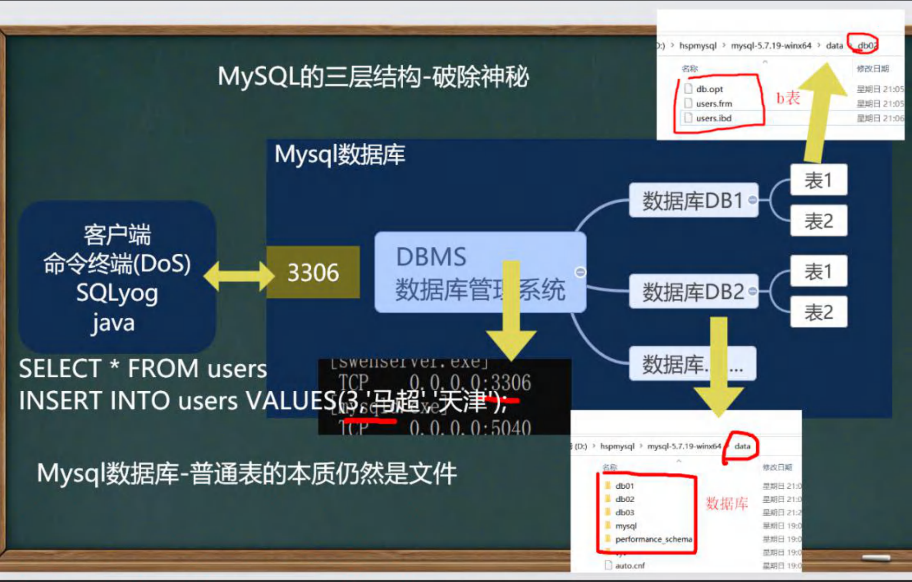
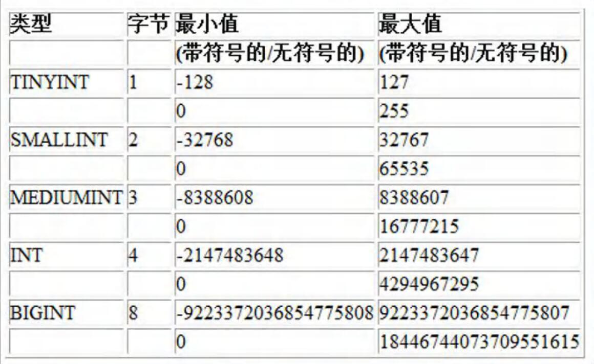

# MySQL

### MySQL安装和配置

略(查看文档)

### 数据库三层结构 - 破除 MySQL 神秘

1. 所谓安装Mysql数据库，就是在主机安装一个数据库管理系统(DBMS),这个管理程序可以管理多个数据库。DBMS(database manage system)
2. 一个数据库中可以创建多个表,以保存数据(信息).
3. 数据库管理系统(DBMS)、数据库和表的关系如图所示:示意图



### SQL 语句分类

- DDL : 数据定义语句[create表，库...]
- DML : 数据操作语句[增加insert,修改update,删除 delete]
- DQL : 数据查询语句[select ]
- DCL : 数据控制语句[管理数据库:比如用户权限grant revoke ]

# 数据库

#### 创建

```sql
CREATE DATABASE [IF NOT EXISTS] db_name [create_specification, create_specification,....]

# create_specification:
# [DEFAULT] CHARACTER SET charset_name
# [DEFAULT] COLLATE collation_name
```

CHARACTER SET : 指定数据库采用的字符集，如果不指定字符集，默认utf8

COLLATE : 指定数据库字符集的校对规则 (常用的utf8 bin[区分大小引]、utf8_general_ci[不区分大小写] 注意默认是 utf8_general_ci）

#### 查看、删除数据库 

```sql
# 查看当前数据库服务器中的所有数据库
SHOW DATABASES
# 查看前面创建的 litchidb01 数据库的定义信息
SHOW CREATE DATABASE `litchidb01` 
# 说明 在创建数据库,表的时候，为了规避关键字，可以使用反引号解决
# 删除前面创建的 litchidb01 数据库
DROP DATABASE litchidb01
```

#### 备份恢复数据库⭐

备份数据库（注意：在**DOS执行**）命令行

```txt
mysqldump -u 用户名 -p -B 数据库1 数据库2 数据库n > 文件名.sql
```

恢复数据库（注意：进入Mysql命令行再执行）

```txt
Source 文件名.sql
```

#### 备份恢复数据库的表

```txt
mysqldump -u 用户名 -p 数据库名 表1 表2 表n > d:\\文件名.sql
```

# 表

#### 创表

```s&#39;q&#39;l
CREATE TABLE table_name
(
	field1 datatype,
	field2 datatype,
	fieldn datatype
)CHARACTER SET 字符集 COLLATE 校队规则 ENGINE 存储引擎

# field: 指定列名
# datatype: 指定列类型（字段类型）
# CHARACTER SET: 如不指定则为所在数据库字符集
# COLLATE 如不指定则为所在数据库校对规则
# ENGINE: 引擎
```

#### 删除表

#### 修改表⭐

# Mysql 数据类型⭐

### 常用数据类型

分类					数据类型											说明

数值类型			

​							BIT(M)												位类型。M指定位数,默认值1，范围1-64

​							TINYINT[UNSIGNED] 占1个字节   带符号的范围是-128到127。无符号0到255。默认是有符号

​							SMALLINT TUNSIGNED] 2个字节 带符号是负的2^15到2^15-1 ,无符号0到2^16 -1

​							MEDIUMINT[UNSIGNED]3个字节 带符号是负的2^23到2^23-1,无符号0到2^24 -1

​							INT [UNSIGNED]4个字节				带符号是负的2^31到2^31-1,无符号0到2^32 -1

​							BIGINT [UNSIGNED]8个字节		  带符号是负的2^63到2^63-1,无符号0到2^64 -1


​							FLOAT [UNSIGNED]						占用空间4个字节

​							DOUBLE [UNSIGNED]					表示比float精度更大的小数,占用空间8个字节

​							DECIMAL(M,D) [UNSIGNED]		 定点数M指定长度,D表示小数点的位数

文本、二进制 类型

​							CHAR(size) char(20)						固定长度字符串最大255

​							VARCHAR(size) varchar(20)			可变长度字符串0~65535 [即:2^16-1]

​							BLOB LONGBLOB							二进制数据BLOB 0~2^16-1 LONGBLOB 0~2^32-1

​							TEXT LONGTEXT							  文本 Text 0~2^16 LONGTEXT 0~2^32

时间日期

​							DATE/DATETIME/TimeStamp		日期类型(YYYY-MM-DD)(YYYY-MM-DD 

​																						HH:MM:SS) , TimeStamp表示时间戳 , 它可用于自动记录

​																						inupdate操作的时间

### 数值型(整数)的基本使用

说明，使用规范：在能够满足需求的情况下，尽量选择占用空间小的



```sql
#说明： 表的字符集，校验规则, 存储引擎，老师使用默认
#1. 如果没有指定 unsinged , 则 TINYINT 就是有符号
#2. 如果指定 unsinged , 则 TINYINT 就是无符号 0-255
#其他一样的
```

### 数值型(bit)的使用

```sql
#说明
#1. bit(m) m 在 1-64
#2. 添加数据 范围 按照你给的位数来确定，比如 m = 8 表示一个字节 0~255
#3. 显示按照 bit
#4. 查询时，仍然可以按照数来查询

# bit 字段显示时，按照 位 的方式显示。查询时候任然可以使用 添加的数值。如果一个值只有 0，1 可以考虑使用
# bit（1），可以节约空间。
# 使用不多
```

### 数值型(小数)的基本使用

1. FLOAT / **DOUBLE** [UNSIGNED]

   FLOAT 单精度， DOUBLE 双精度

2. DECIMAL[M, D] [UNSIGNED]

   可以支持更加精准的小数位。M是小数位数（精度）的总数，D是小数点（标度）后面的位数

   如果D是 0 ，则值没有小数点或分数部分。M最大65。D最大30。如果D被省略，则默认是0。如果M被省略，默认是10

   建议：如果希望小数的精度高，推荐使用DECIMAL

### 字符串的基本使用

CHAR(size)

固定长度字符串最大255字符

VARCHAR(size) 0~65535

可变长度字符串最大65532字节【utf8编码最大21844字符1-3个字节用于记录大小】

### 字符串使用细节

1. 细节1

   char(4) //这个4表示字符数(最大255)，不是字节数不管是中文还是字母都是放四个,按字符计算.

   varchar(4)//这个4表示字符数，不管是字母还是中文都以定义好的表的编码来存放数据

   不管是中文还是英文字母,都是最多存放4个,是按照字符来存放的.

2. 细节2

   char(4)是定长(固定的大小)，就是说，即使你插入'aa'，也会占用分配的 4个字符的空间.

   varchar(4)是变长(**变化的大小**)，就是说，如果你插入了'aa',实际占用空间大小并不是4个字符,而是按照实际占用空间来分配(老韩说明 : varchar本身还需要占用1-3个字节来记录存放内容长度)L(实际数据大小）+(1-3)字节

3. 细节3

   什么时候使用char,什么时候使用varchar

   1.如果数据是定长,推荐使用char, 如md5的密码,邮编,手机号,身份证号码等.char(32)

   2.如果一个字段的长度是不确定, 我们使用varchar,比如留言,文章

   查询速度：char > varchar

4. 细节4

   在存放文本时，也可以使用Text 数据类型.可以将TEXT列视为VARCHAR列,注意Text 不能有默认值.大小0-2^16字节。如果希望存放更多字符，可以选择 MEDIUMTEXT0-2^24 或者 LONGTEXT 0~2^32

### 日期类型的基本使用

DATE 年月日

DATETIME 年月日时分秒

TIMESTAMP 后面得加NOT NULL DEFAULT CURRENT_TIMESTAMP ON UPDATE CURRENT_TIMESTAMP

TIMESTAMP 在INSERT 和 UPDATE 时，自动更新

# CRUD⭐

#### Insert

#### Update

#### Delete

#### Select⭐

##### 单表

##### 多表

# 函数⭐

#### 统计函数

#### 时间日期

#### 字符串函数

#### 数学函数

#### 流程控制

# 内连接

# 外连接⭐

# 约束

#### not null

#### primary key

#### unique

#### foreign key

#### check

#### 自增长

# 索引⭐

#### 主键索引

#### 唯一索引（UNIQUE）

#### 普通索引（INDEX）

#### 全文索引

# 事务